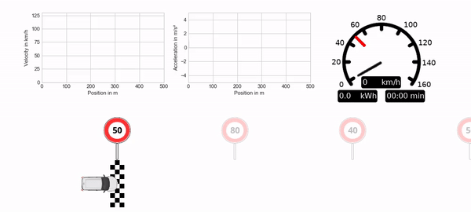

<!-- pandoc program-en.md --pdf-engine=xelatex -o program-en.pdf -V CJKmainfont='Source Han Sans SC' --wrap=preserve -->
<!-- pandoc program-en.md -o program-en.docx -V CJKmainfont='Source Han Sans SC' --wrap=preserve --reference-doc='SAMPLE-proposal.docx' -->
<!-- ---
新能源车最优能效的纵向运动决策
... -->

<!-- markdownlint-disable-file MD013 -->

# Optimal longitudinal motion decision of electric vehicles

<!-- ## Application  -->

<!-- Vehicle energy optimization system -->
## sponsor

 - Company sponsor: Charles Huang (CEO) & Jason Fu (CTO), Newrizon
 - Company mentor: Binjian Xin, Newrizon

## Background

Collaboration between UM-SJTU Joint Institute and Newrizon VerTEx lab.

 - VerTEx proactively joined this program
 - VerTEx will assign dedicated engineer as a mentor
 - Students need to discuss with the mentor on the tasks and deliverables

Newrizon VerTEx lab
 - Newrizon AI lab under Intelligent Technical System
 - A dedicated group at Newrizon working on apply artificial intelligence in vehichle energy optimization systems.

Through well programmed motion planning, the electric power train system can run in highly efficient regime so as to save energy and extend the mileage without intrusive changes in th e battery management or energy storage.

The motion planning of vehicles on public roads needs to consider the following factors

- speed limit on the road segment
- acceleration capabilities of ego vehicles
- dynamic objects emerging on the roads
- driving style of the operators

As the first three factors cannot be changed, the goal of the optimization is to investigate how to adjust the motion planning to increase the energy efficiency. The traditional methode will be to apply optimal control or motion planning, under the assumption of a known road environment, vehicle dynamic model and object detection. Nevertheless, the model of the optimal control has inevitably deviation and it cannot exploit the history data, the result doesn't meet the expected performance in most cases.

With the rapid progress of deep learning, in particular deep reinforcement learning, big-data based modelfree methods and dynamic control methods which make use of big data become state of the art in many complex applications.

## Purpose 

This project aims to model the longtitudinal motion control as Markov Decision Process and investigate the optimal longitudinal motion decision with the objective of optimizing the energy efficiency.

## Expected Deliverables:

1. Contruct Simulation Environment:
  - design test cases with typical speed limits in simulation environment
  - get access of vehicle location, speed, acceleration through simulation interfaces
  - get access of acceleration and braking pedal
  
2. Design algorithms of deep reinforcement learning agent in simulation environment:
  - Select and design reinforcement learning algorithms and data acquisition interface
  - Collect data in simulation environment for deep reinforcement training
  - Improve the adaptability of the deep reinforcement learning agent by taking account of the difference between the simuation environment and real road condition and designing diverse testing conditions in simulation environment
  - fine tune the training and testing

3. Road test
  - Port the algorithms developed in the simulation environment on an actual vehicle
  - road test, applying transfer learning
  - Conduct road tests
  - Compare the difference between the simulation environment and the road test. Analyze the result of the transfer learning

## Team

Students with the following knowledge and skills are encouraged to apply:

- Basic knowledge in vehicle motion control 
- System identification
- Basic knowledge in deep reinforcement learning
- Programming skills
  - Working knowledge in Python
  - Tensorflow or Pytorch is a plus
  - Basic Linux knowledge

## Benefit to Students:

- Access to most up-to-date electric commercial vehicle platform
- Learn state of the art deep learning applications in the EV industry 
- Get in-depth knowledge on deep reinforcement learning
- Gain experience in a fast-growing startup enterprise 
