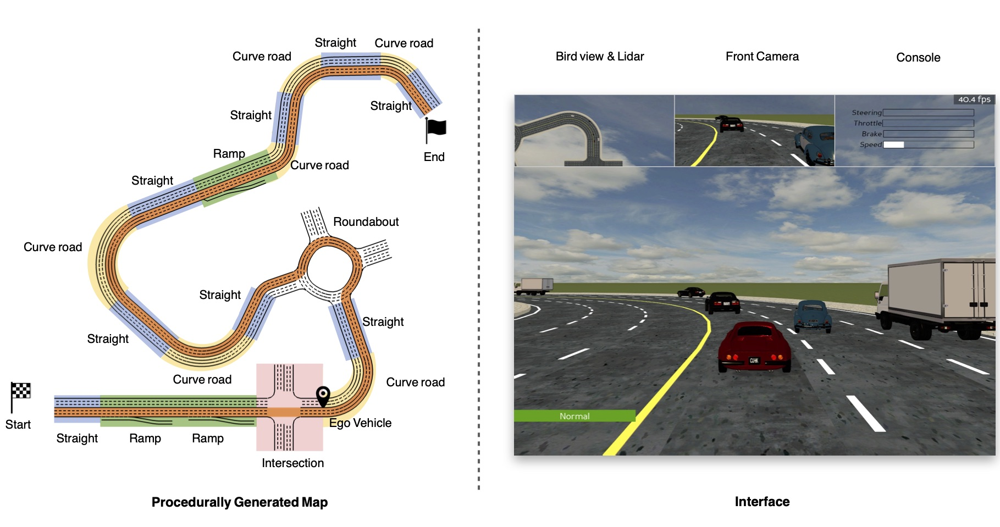

<!-- pandoc program2.md --pdf-engine=xelatex -o program2.docx -V CJKmainfont='Source Han Sans SC' --wrap=preserve -->
<!-- ---
新能源车最优能效的纵向运动决策
... -->

# 开放仿真环境下能效优化系统的评估和改进

## 应用

电动车能效优化问题

## 背景

能效优化系统是在新能源车系统中,根据车辆运动状态和驾驶员输入进行最优运动规划的系统.由于它是根据自车观测得到驾驶策略,在真正的道路应用前对它在实际道路上运行的性能进行评估,并有针对性地进行改进是必不可少的.这一方面是通过投入大量的人力物力进行实际道路测试来达到,另一方面,利用仿真技术在虚拟的计算平台上模拟典型工况,可以以较低的成本提早发现算法的基本问题,进行改进和验证.

另外,能效系统的设计和测试开发通常基于特定几个少数工况,它在偏离设计工况下的功能和性能也需要进行定量的评估.通过仿真平台接口多样化地设置环境,道路静态或动态参数,就可以验证算法的泛化能力.

### 目标

本项目的目标是搭建开放环境的仿真系统,随机生成道路曲率等静态属性和道路多目标车辆等动态属性,考察能效优化系统的泛化性能,过拟合特性,安全性能和多智能体行为特性.

### 内容

1. 搭建开放环境的道路仿真系统:

- 可随机生成曲率和拓扑连接关系的道路网络
- 生成按确定性运动规划的车辆
- 按基准强化学习智能体生成自动驾驶车辆
- 在地图上随机孵化两种目标车辆
- 生成带能效优化系统的自车智能驾驶车辆
  
2. 通过仿真实验评估能效优化系统的性能指标

- 通过仿真收集大量数据进行训练
- 评估多种道路环境下能效的泛化性能
- 评估受能效优化系统影响的车辆安全性能,比如碰撞,违反交通规则情况
- 评估共享控制策略下多智能体的竞争和协作特性

3. 就仿真的评估结果提出改进方法,利用仿真环境对能效优化系统进行改进设计和训练和验证

- 收集仿真数据,分析实验结果
- 收集小规模道路试验结果,进行比对

|{width=400pix}|
|:--:|
|<b>开放环境的仿真系统</b>|

## 方法

- 车辆控制
- 强化学习
  - 标准强化学习算法如PPO, SAC等
  - 多目标协作方法MARL

## 平台

- Open AI Gym, PGDrive
- Baseline
- Python

