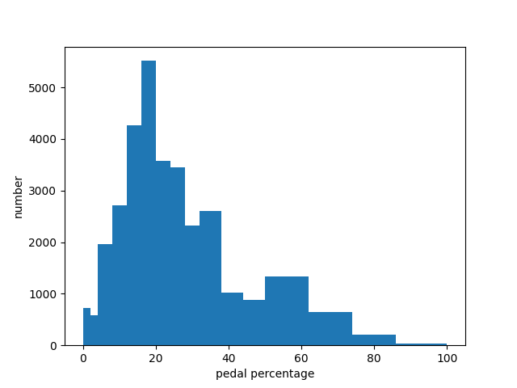

---
@import "newrizon.less"

id: "newrizon-id"
# class: "my-class1 my-class2"
title: "veos system assessment"
author: 
- Binjian Xin 
date: "Sep. 16, 2021"

presentation:
  enableSpeakerNotes: true
  # width: 800px
  # height: 450px
  width: 1600
  height: 900
  shoNotes: true
  output: 
    beamer_presetnation:
      path: ./Exports/veos system assessment.pdf
      toc: true
toc:
  depth_from: 1
  depth_to: 1
  ordered: false
---

<!-- slide data-background-image="./Horizontal-Sea.jpg" -->

深度学习极简介绍
---
[ &nbsp; &emsp; 忻斌健](#VEOS系统评估)
 2021年09月29日 

<!-- #+title: dl intro -->

<!-- slide id="newrizon-id" -->
[TOC]

<!-- slide id="newrizon-id"　style="text-align: left;" class="my-class1 my-class2" -->

@import "newrizon.less"

<figure class="video_container">
  <video controls="true" allowfullscreen="true" poster="fig/dotcat.png">
    <source src="fig/dotcat.mp4" type="video/mp4">
  </video>
</figure>

<!-- slide id="newrizon-id"　style="text-align: left;" class="my-class1 my-class2" -->
[手势识别与跟踪]https://loicmagne.github.io/air-drawing/
<!-- slide id="newrizon-id"　style="text-align: left;" class="my-class1 my-class2" -->
> **Gradient descent can write code better than you. I'm sorry**
>                                             -- Andrey  Karpathy

<!-- slide id="newrizon-id"　style="text-align: left;" class="my-class1 my-class2" -->
# 基本原理

目标识别

imagenet 2009: 22000个类, 1400万样本 
alexnet: subset: 1000个类, 120万训练样本, 5万验证样本, 15万测试样本
5个卷积层,3个全连接层
[AlexNet](https://en.wikipedia.org/wiki/AlexNet)
[LeNet 可视化](https://www.cs.ryerson.ca/~aharley/vis/conv/)

<!-- slide id="newrizon-id"　style="text-align: left;" class="my-class1 my-class2" -->
需要知识:

 - 线性代数
   - 矩阵运算
 - 微积分
   - 微分,梯度
 - 概率论
   - 熵
   - KL散度

<!-- slide id="newrizon-id"　style="text-align: left;" class="my-class1 my-class2" -->
# 计算机视觉
分类
分割
追踪 (硬注意力,软注意力)

<!-- slide id="newrizon-id"　style="text-align: left;" class="my-class1 my-class2" -->
# Transformer 变形金刚GPT 语言模型
Codex 
Controversial
RNN LSTM Transformer

<!-- slide id="newrizon-id"　style="text-align: left;" class="my-class1 my-class2" -->
# 生成模型
GAN与VAE

<!-- slide id="newrizon-id"　style="text-align: left;" class="my-class1 my-class2" -->
# 强化学习

Dynamic Programming
Game Theory

AlphaGo
OpenAI 5 Dota2

<!-- slide id="newrizon-id"　style="text-align: left;" class="my-class1 my-class2" -->

<!-- slide id="newrizon-id"　style="text-align: left;" class="my-class1 my-class2" -->
# 图神经网络

PageRank

物理定律发现
Google地图 ETA估计

<!-- slide id="newrizon-id"　style="text-align: left;" class="my-class1 my-class2" -->
# NERF

# 图像编码和语言模型的结合
CLIP, DALL-E 
[DALL-E](https://openai.com/blog/dall-e/)

clip
https://clip.backprop.co/
https://www.clipplayground.co/

<!-- slide id="newrizon-id"　style="text-align: left;" class="my-class1 my-class2" -->
# 

## 无AI和带AI的基准驾驶风格比较
  
|{width=200px}|{width=200px}|
|:--:|:--:|
|<b> 图1.1 无AI的基准风格分布</b>|<b>图1.2 带AI的基准风格总平均分布</b>|

<!-- slide id="newrizon-id"　style="text-align: left;" class="my-class1 my-class2" -->
## 不同驾驶员风格以及统一驾驶员在应用不同算法后风格的定量比较

| |SAC|DDPG-CD|SAC-CD|Driver 2-no CD|
|:--:|:--:|:--:|:--:|:--:|
|KLD|0 |0.234|0.311 | 0.334|

- 不同驾驶风格与SAC下驾驶风格总体比较:
  - KLD 可用于定量评估不同驾驶风格之间的差异
  - KLD 可用于监控训练过程中驾驶员风格和自己基准风格相比的变化

<!-- slide id="newrizon-id"　style="text-align: left;" class="my-class1 my-class2" -->

- SAC Pedal Map持续模式(resume):  
  - 每个epoch使用之前的模型
  - 开始pedal map用上一个epoch最后一个episode的表
  - 模型继承之前经验,且使用前一个训练周期的结果,能耗结果趋近稳定
  
|{width=200px}|{width=200px}|
|:--:|:--:|
|<b>图8.1 SAC持续模式下能耗变化,后面打开coastdown, 原始数据</b>|<b>图8.2 相同数据加平滑滤波</b>|

<!-- slide id="newrizon-id"　style="text-align: left;" class="my-class1 my-class2" -->
# 总结与展望

学习为基本机制
大数据驱动
数据分布为对象(大数据)
实践驱动

LeCake

  - 图神经网络
  - 无监督(自监督)学写
  - 通用强化学习(通用任务)
  - 终身学习(lifelong learning)
  - catastrophic forgetting