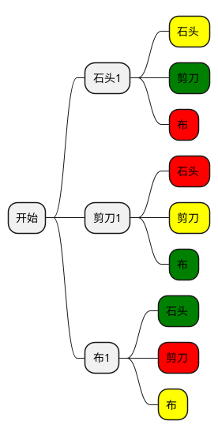
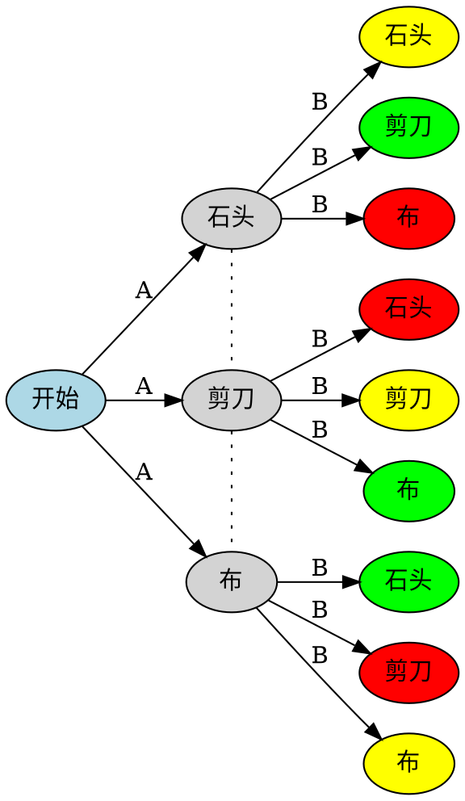
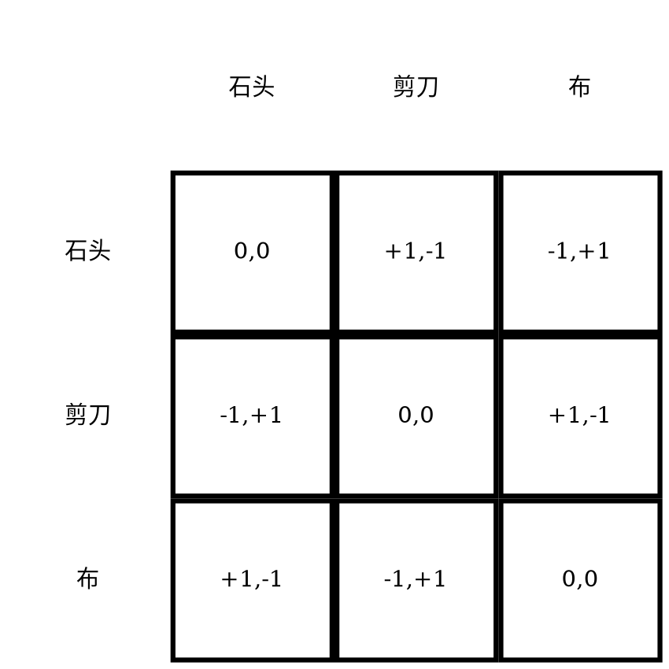
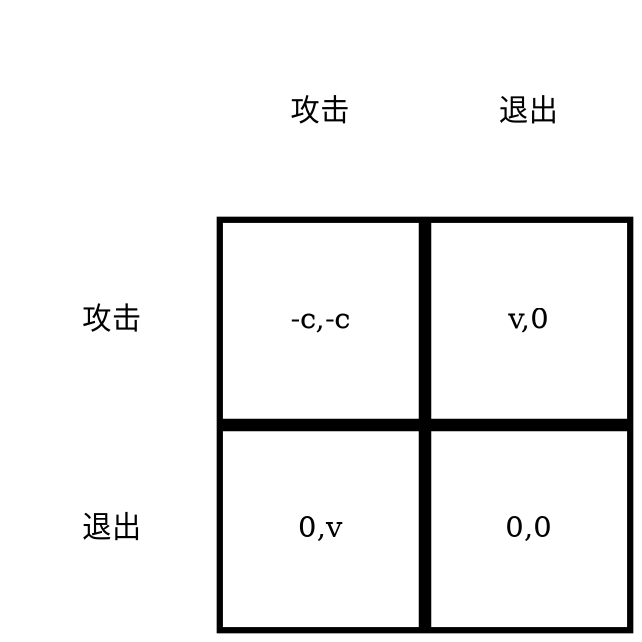
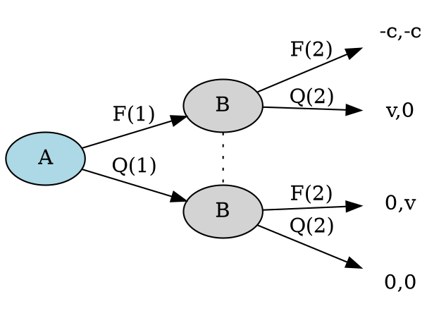

# mindmap

```plantuml
@startmindmap
<style>
mindmapDiagram {
  .green {
    BackgroundColor green
  }
  .red {
    BackgroundColor red
  }
  .yellow {
    BackgroundColor yellow
  }
}
</style>
 * 开始
 ** 石头1
 *** 石头 <<yellow>>
 *** 剪刀 <<green>>
 *** 布 <<red>>
 ** 剪刀1
 *** 石头 <<red>>
 *** 剪刀 <<yellow>>
 *** 布 <<green>>
 ** 布1
 *** 石头 <<green>>
 *** 剪刀 <<red>>
 *** 布 <<yellow>>

 ' Add dotted line between 石头 and 剪刀
@endmindmap
```

# graphviz chart: 石头剪刀布

```dot
digraph G {
    rankdir=LR;

    start[label=开始,style=filled, fillcolor=lightblue]
    stone1[label=石头,style=filled, fillcolor=lightgrey]
    scissors1[label=剪刀,style=filled, fillcolor=lightgrey]
    paper1[label=布,style=filled, fillcolor=lightgrey]
    start->stone1[label=A]
    start->scissors1[label=A]
    start->paper1[label=A]
    stone11[label=石头,style=filled, fillcolor=yellow]
    scissors12[label=剪刀,style=filled, fillcolor=green]
    paper13[label=布,style=filled, fillcolor=red]
    stone1->stone11[label=B]
    stone1->scissors12[label=B]
    stone1->paper13[label=B]
    stone21[label=石头,style=filled, fillcolor=red]
    scissors22[label=剪刀,style=filled, fillcolor=yellow]
    paper23[label=布,style=filled, fillcolor=green]
    scissors1->stone21[label=B]
    scissors1->scissors22[label=B]
    scissors1->paper23[label=B]
    stone31[label=石头,style=filled, fillcolor=green]
    scissors32[label=剪刀,style=filled, fillcolor=red]
    paper33[label=布,style=filled, fillcolor=yellow]
    paper1->stone31[label=B]
    paper1->scissors32[label=B]
    paper1->paper33[label=B]
    stone1 -> scissors1 [style="dotted", dir=none]
    scissors1 -> paper1 [style="dotted", dir=none]
    {rank=same; stone1,scissors1,paper1}

}
```

# graphviz table rock-paper-scissors

```dot
digraph G {
    node1 [shape=none, margin=0, label=<
        <TABLE BORDER="0" CELLBORDER="0" CELLSPACING="0" CELLPADDING="0" WIDTH="400" HEIGHT="400">
            <TR>
                <TD WIDTH="100" HEIGHT="100" BGCOLOR="None"></TD>
                <TD WIDTH="100" HEIGHT="100" BGCOLOR="None">石头</TD>
                <TD WIDTH="100" HEIGHT="100" BGCOLOR="None">剪刀</TD>
                <TD WIDTH="100" HEIGHT="100" BGCOLOR="None">布</TD>
            </TR>
            <TR>
                <TD WIDTH="100" HEIGHT="100" BGCOLOR="None">石头</TD>
                <TD WIDTH="100" HEIGHT="100" BORDER="3">0,0</TD>
                <TD WIDTH="100" HEIGHT="100" BORDER="3">+1,-1</TD>
                <TD WIDTH="100" HEIGHT="100" BORDER="3">-1,+1</TD>
            </TR>
            <TR>
                <TD WIDTH="100" HEIGHT="100" BGCOLOR="None">剪刀</TD>
                <TD WIDTH="100" HEIGHT="100" BORDER="3">-1,+1</TD>
                <TD WIDTH="100" HEIGHT="100" BORDER="3">0,0</TD>
                <TD WIDTH="100" HEIGHT="100" BORDER="3">+1,-1</TD>
            </TR>
            <TR>
                <TD WIDTH="100" HEIGHT="100" BGCOLOR="None">布</TD>
                <TD WIDTH="100" HEIGHT="100" BORDER="3">+1,-1</TD>
                <TD WIDTH="100" HEIGHT="100" BORDER="3">-1,+1</TD>
                <TD WIDTH="100" HEIGHT="100" BORDER="3">0,0</TD>
            </TR>
        </TABLE>
    >];
}
```

# graphviz table: 斗争

```dot
digraph G {
    node1 [shape=none, margin=0, label=<
        <TABLE BORDER="0" CELLBORDER="0" CELLSPACING="0" CELLPADDING="0" WIDTH="300" HEIGHT="300">
            <TR>
                <TD WIDTH="100" HEIGHT="100" BGCOLOR="None"></TD>
                <TD WIDTH="100" HEIGHT="100" BGCOLOR="None">攻击</TD>
                <TD WIDTH="100" HEIGHT="100" BGCOLOR="None">退出</TD>
            </TR>
            <TR>
                <TD WIDTH="100" HEIGHT="100" BGCOLOR="None">攻击</TD>
                <TD WIDTH="100" HEIGHT="100" BORDER="3">-c,-c</TD>
                <TD WIDTH="100" HEIGHT="100" BORDER="3">v,0</TD>
            </TR>
            <TR>
                <TD WIDTH="100" HEIGHT="100" BGCOLOR="None">退出</TD>
                <TD WIDTH="100" HEIGHT="100" BORDER="3">0,v</TD>
                <TD WIDTH="100" HEIGHT="100" BORDER="3">0,0</TD>
            </TR>
        </TABLE>
    >];
}
```

# graphviz chart: 斗争 

```dot
digraph G {
    rankdir=LR;

    A11[label=A,style=filled, fillcolor=lightblue]
    B1[label=B,style=filled, fillcolor=lightgrey]
    B2[label=B,style=filled, fillcolor=lightgrey]
    A11->B1[label="F(1)"]
    A11->B2[label="Q(1)"]

    B1 -> B2 [style="dotted", dir=none]

    P11[label="-c,-c",shape=rect,color=none]
    P12[label="v,0",shape=rect,color=none]
    B1->P11[label="F(2)"]
    B1->P12[label="Q(2)"]

    P21[label="0,v",shape=rect,color=none]
    P22[label="0,0",shape=rect,color=none]
    B2->P21[label="F(2)"]
    B2->P22[label="Q(2)"]
    {rank=same; B1,B2}
}
```
