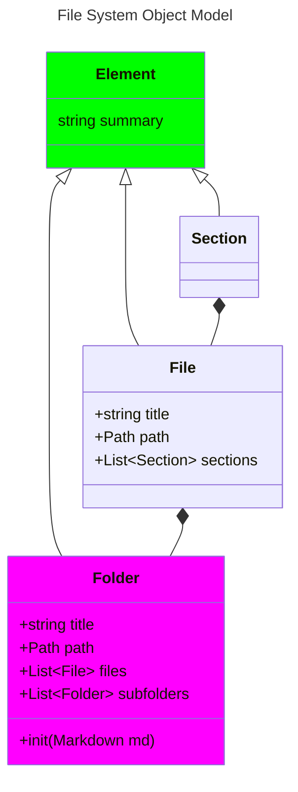
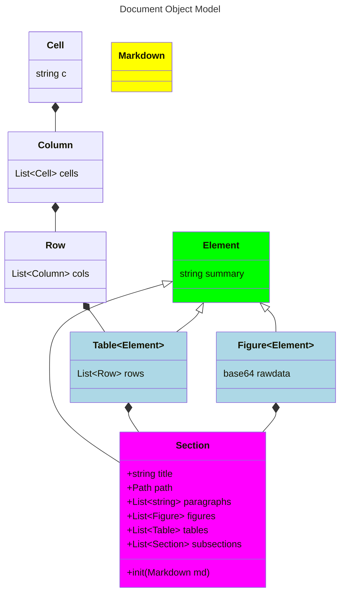
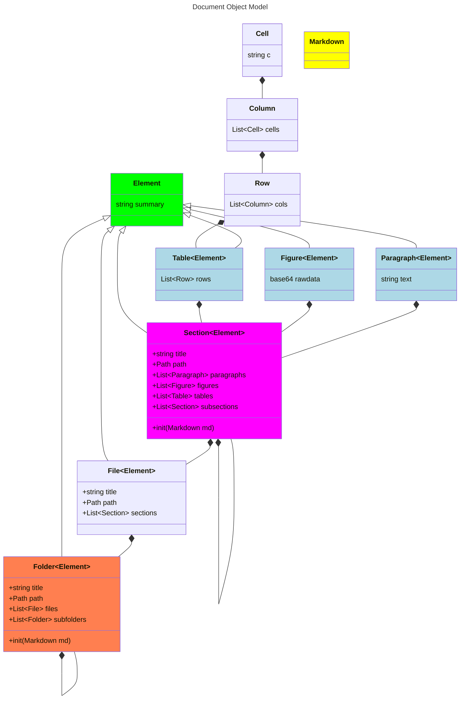
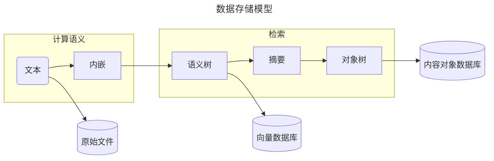
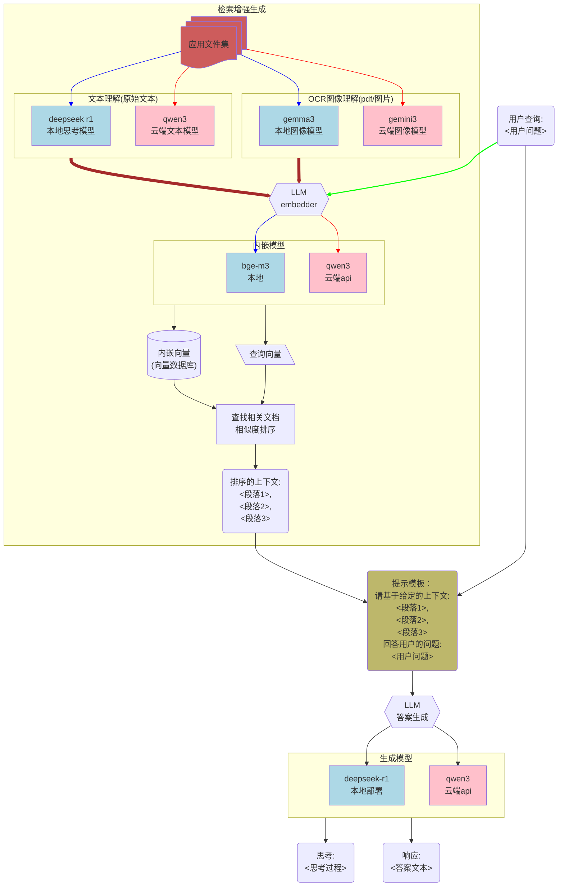
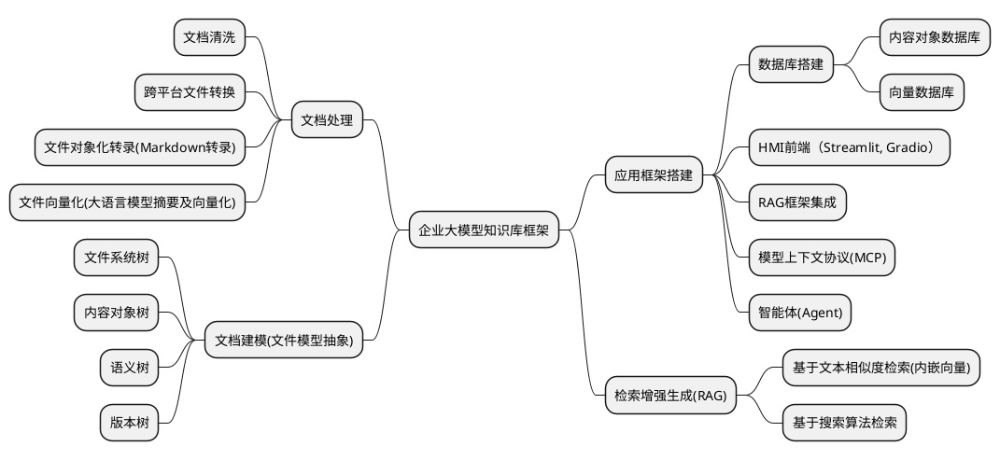

# 文件系统对象模型

# 文件对象模型

# 统一文件对象模型

# 数据存储模型

# 自然语言接口

- 利用小语言模型(SLM)深度思索模式进行文本的高质量总结
- 利用多模态小语言模型对图像进行分析和总结
- 利用OCR进行图像内容分析
- 利用多模态大语言模型(LLM)进行图像分析和总结

# 文件系统和内容管理系统

文件模型：

- 文件系统树
- 文件对象树
- 版本树

# Markdown转录

- Marker
- MarkitDown
- Pandoc

# 强化学习改进

## MCTS

例子：multihop question: 哪个型号的六轴机器人需要对磨抛死锁后触发的紧急按钮进行复位？

多路径推理和综合
推理时结合搜索算法是小型LM RAG的关键
Inference-time scaling 推理时计算扩展

## DPO在线强化学习训练

利用用户评价构造在线强化学习改进Agent

# 智能体系统，MCP和工具使用

- 公司自有工具
- 数据库分析工具
- 机器人专有工具
- 提示词
- 多轮交互Agent

外部数据源，工具，环境，粘合不同的AI系统

# RAG

# 需求

