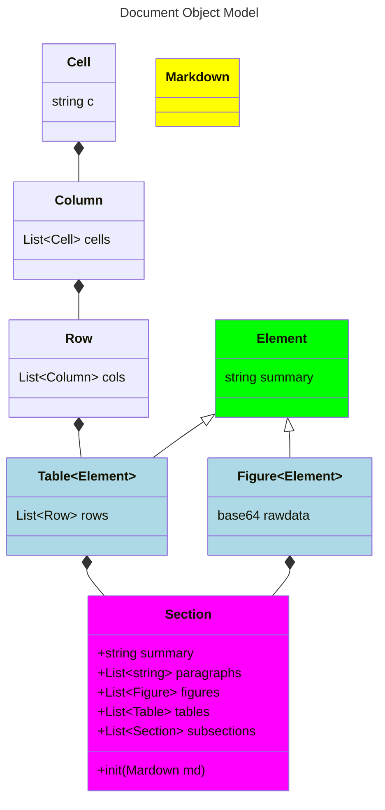

# DOM model

```mermaid
---
title: Document Object Model
---

classDiagram
class Element{
    string summary
}
class Figure~Element~{
    base64 rawdata
}
style Element fill:lime
style Figure fill:lightblue
Element <|-- Figure
class Cell {
    string c
}
class Column {
    List~Cell~ cells
}
class Row {
    List~Column~ cols
}
class Table~Element~ {
    List~Row~ rows
}
Cell *-- Column
Column *-- Row
Row *-- Table
Element <|-- Table
style Table fill:lightblue

class Markdown
style Markdown fill:yellow

class Section{
    +string summary
    +List~string~ paragraphs
    +List~Figure~ figures
    +List~Table~ tables
    +List~Section~ subsections
    +init(Mardown md)
}
style Section fill:fuchsia

Table *-- Section 
Figure *-- Section 
```