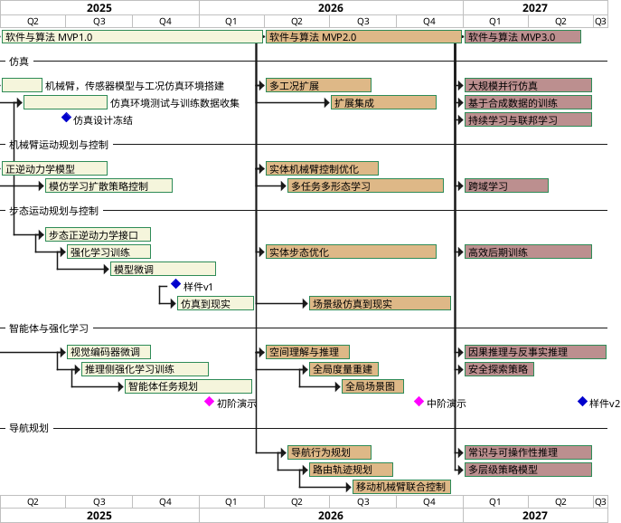

```plantuml
@startgantt
printscale quarterly zoom 2

Project starts the 1st of April 2025
[软件与算法 MVP1.0] as [TASK1] starts the 1st of january 2025
[TASK1] ends on the 31st of march 2026
' [TASK1] requires 350 days 
[TASK1] is colored in Beige/SeaGreen
-- 仿真  --
[机械臂，传感器模型与工况仿真环境搭建] as [sim-setup] requires 60 days
[sim-setup] is colored in Beige/SeaGreen
[sim-setup] starts at [TASK1]'s start
[仿真环境测试与训练数据收集] as [sim-test] requires 120 days
[sim-test] is colored in Beige/SeaGreen
[sim-test] starts 30 days after [sim-setup]'s start
[仿真设计冻结] as [design] happens at 2025-06-31
[design] is colored in MediumBlue
-- 机械臂运动规划与控制 --
[正逆动力学模型] as [manip-dynamics] requires 150 days
[manip-dynamics] is colored in Beige/SeaGreen
[manip-dynamics] starts at [TASK1]'s start
[模仿学习扩散策略控制] as [rl] requires 180 days
[rl] is colored in Beige/SeaGreen
[rl] starts 60 days after [manip-dynamics]'s start
-- 步态运动规划与控制 --
[步态正逆动力学接口] as [dynamics model] requires 150 days
[dynamics model] is colored in Beige/SeaGreen
[dynamics model] starts 30 days after [sim-test]'s start
[强化学习训练] as [generative policy] requires 120 days
[generative policy] is colored in Beige/SeaGreen
[generative policy] starts 30 days after [dynamics model]'s start
[模型微调] as [fine-tuning] requires 150 days
[fine-tuning] is colored in Beige/SeaGreen
[fine-tuning] starts 60 days after [generative policy]'s start
[样件v1] as [samplev1] happens at 2025-11-30
[samplev1] is colored in MediumBlue
[仿真到现实] as [sim2real] requires 110 days
[sim2real] is colored in Beige/SeaGreen
[sim2real] starts at [samplev1]'s start
-- 智能体与强化学习 --
[视觉编码器微调] as [pose] requires 120 days
[pose] is colored in Beige/SeaGreen
[pose] starts 90 days after [TASK1]'s start
[推理侧强化学习训练] as [manip-dynamics metrics] requires 180 days
[manip-dynamics metrics] is colored in Beige/SeaGreen
[manip-dynamics metrics] starts 20 days after [pose]'s start
[智能体任务规划] as [agentic] requires 180 days
[agentic] is colored in Beige/SeaGreen
[agentic] starts 60 days after [manip-dynamics metrics]'s start

[初阶演示] as [pwee] happens at 2026-01-15
[pwee] lasts 5 days
[pwee] is colored in Magenta 

[软件与算法 MVP2.0] as [TASK2] starts the 1st of April 2026
' [TASK2] requires 180 days
[TASK2] ends on the 31st of December, 2026
[TASK2] is colored in BurlyWood/SeaGreen
[TASK1]->[TASK2]
[TASK2] displays on same row as [TASK1]

[多工况扩展] as [sim-extension] requires 150 days
[sim-extension] is colored in BurlyWood/SeaGreen
[sim-extension] starts at [TASK2]'s start
[sim-extension] displays on same row as [sim-setup]
[扩展集成] as [sim-extension-test] requires 150 days
[sim-extension-test] is colored in BurlyWood/SeaGreen
[sim-extension-test] starts 90 days after [sim-extension]'s start
[sim-extension-test] displays on same row as [sim-test]

[空间理解与推理] as [semantics] requires 120 days
[semantics] is colored in BurlyWood/SeaGreen
[semantics] starts at [TASK2]'s start
[semantics] displays on same row as [pose]
[全局度量重建] as [global metrics] requires 100 days
[global metrics] is colored in BurlyWood/SeaGreen
[global metrics] starts 60 days after [semantics]'s start
[global metrics] displays on same row as [manip-dynamics metrics]
[全局场景图] as [global scene] requires 90 days
[global scene] is colored in BurlyWood/SeaGreen
[global scene] starts 45 days after [global metrics]'s start
[global scene] displays on same row as [agentic]

[实体步态优化] as [real-trajectory] requires 240 days
[real-trajectory] is colored in BurlyWood/SeaGreen
[real-trajectory] starts at [TASK2]'s start
[real-trajectory] displays on same row as [generative policy]

[实体机械臂控制优化] as [real-control] requires 160 days
[real-control] is colored in BurlyWood/SeaGreen
[real-control] displays on same row as [manip-dynamics]
[real-control] starts at [TASK2]'s start
[多任务多形态学习] as [multi-tasking] requires 220 days
[multi-tasking] is colored in BurlyWood/SeaGreen
[multi-tasking] starts 30 days after [real-control]'s start
[multi-tasking] displays on same row as [rl]

[场景级仿真到现实] as [sim-scene] requires 200 days
[sim-scene] is colored in BurlyWood/SeaGreen
[sim-scene] starts 60 days after [real-control]'s start
[sim-scene] displays on same row as [sim2real]

-- 导航规划 --
[导航行为规划] as [navigation] requires 120 days
[navigation] is colored in BurlyWood/SeaGreen
[navigation] starts 30 days after [semantics]'s start
[路由轨迹规划] as [trajectory] requires 120 days
[trajectory] is colored in  BurlyWood/SeaGreen
[trajectory] starts 30 days after [navigation]'s start
[移动机械臂联合控制] as [control] requires 140 days
[control] is colored in BurlyWood/SeaGreen
[control] starts 60 days after [trajectory]'s start

[中阶演示] as [pwee26] happens at 2026-11-01
[pwee26] lasts 5 days
[pwee26] is colored in Magenta 
[pwee26] displays on same row as [pwee]

[软件与算法 MVP3.0] as [TASK3] starts the 20th of july 2026
[TASK3] ends the 15th of june 2027
[TASK3] is colored in RosyBrown/SeaGreen
[TASK2]->[TASK3]
[TASK3] displays on same row as [TASK2]

[大规模并行仿真] as [sim-parallel] requires 180 days
[sim-parallel] is colored in RosyBrown/SeaGreen
[sim-parallel] starts at [TASK3]'s start
[sim-parallel] displays on same row as [sim-setup]

[基于合成数据的训练] as [sim-synthesis] requires 180 days
[sim-synthesis] is colored in RosyBrown/SeaGreen
[sim-synthesis] starts at [TASK3]'s start
[sim-synthesis] displays on same row as [sim-test]

[持续学习与联邦学习] as [sim-federated] requires 180 days
[sim-federated] is colored in RosyBrown/SeaGreen
[sim-federated] starts at [TASK3]'s start
[sim-federated] displays on same row as [design]

[跨域学习] as [cross-domain] requires 120 days
[cross-domain] is colored in RosyBrown/SeaGreen
[cross-domain] starts at [TASK3]'s start
[cross-domain] displays on same row as [rl]

[样件v2] as [samplev2] happens at 2027-06-15
[samplev2] is colored in MediumBlue
[samplev2] displays on same row as [pwee26]

[高效后期训练] as [post-training] requires 180 days
[post-training] is colored in RosyBrown/SeaGreen
[post-training] starts at [TASK3]'s start 
[post-training] displays on same row as [generative policy]

[因果推理与反事实推理] as [causal] requires 200 days
[causal] is colored in RosyBrown/SeaGreen
[causal] starts at [TASK3]'s start
[causal] displays on same row as [semantics]


[安全探索策略] as [safe exploration] requires 100 days
[safe exploration] is colored in RosyBrown/SeaGreen
[safe exploration] starts at [TASK3]'s start
[safe exploration] displays on same row as [global metrics]

[常识与可操作性推理] as [common-sense] requires 180 days
[common-sense] is colored in RosyBrown/SeaGreen
[common-sense] starts at [TASK3]'s start 
[common-sense] displays on same row as [navigation]
[多层级策略模型] as [hierarchical] requires 180 days
[hierarchical] is colored in RosyBrown/SeaGreen
[hierarchical] starts at [TASK3]'s start 
[hierarchical] displays on same row as [trajectory]
@endgantt
```
