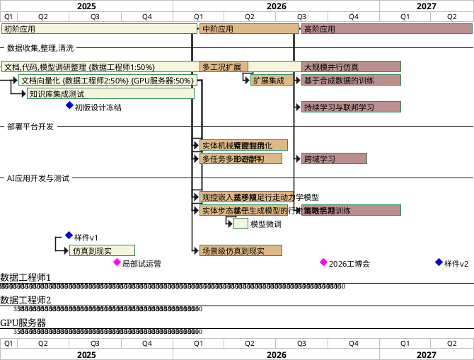

```plantuml
@startgantt
printscale quarterly zoom 2

Project starts the 1st of march 2025
[初阶应用] as [TASK1] starts the 1st of march 2025
' [TASK1] ends the 31st of december 2025
[TASK1] requires 350 days 
[TASK1] is colored in Beige/SeaGreen
-- 数据收集,整理,清洗  --
[文档,代码,模型调研整理] as [doc-investigation] on {数据工程师1:50%} requires 300 days
[doc-investigation] is colored in Beige/SeaGreen
[doc-investigation] starts at [TASK1]'s start
[文档向量化] as [vectorization] on {数据工程师2:50%} {GPU服务器:50%} requires 320 days
[vectorization] is colored in Beige/SeaGreen
[vectorization] starts 30 days after [doc-investigation]'s start
[知识库集成测试] as [knowledge-base] requires 300 days
[knowledge-base] is colored in Beige/SeaGreen
[knowledge-base] starts 15 days after [vectorization]'s start
[初版设计冻结] as [design] happens at 2025-06-31
[design] is colored in MediumBlue
-- 部署平台开发 --
[桌面应用] as [desktop] requires 60 days
[desktop] is colored in Beige/SeaGreen
[desktop] starts at [vectorization]'s end
[IDE插件] as [ide] requires 60 days
[ide] is colored in Beige/SeaGreen
[ide] starts at [vectorization]'s end
-- AI应用开发与测试 --
[基于双足行走动力学模型] as [dynamics model] requires 60 days
[dynamics model] is colored in Beige/SeaGreen
[dynamics model] starts at [vectorization]'s end
[基于生成模型的行走策略学习] as [generative policy] requires 60 days
[generative policy] is colored in Beige/SeaGreen
[generative policy] starts at [vectorization]'s end
[模型微调] as [fine-tuning] requires 30 days
[fine-tuning] is colored in Beige/SeaGreen
[fine-tuning] starts at [generative policy]'s end
[样件v1] as [samplev1] happens at 2025-06-30
[samplev1] is colored in MediumBlue
[仿真到现实] as [sim2real] requires 120 days
[sim2real] is colored in Beige/SeaGreen
[sim2real] starts at [samplev1]'s start

[局部试运营] as [operation-kickoff] happens at 2025-09-23
[operation-kickoff] lasts 5 days
[operation-kickoff] is colored in Magenta 

' 2025-01-18 to 2025-08-22 are named [Pilot Project]
' 2025-01-18 to 2025-08-22 are colored in salmon 

[中阶应用] as [TASK2] starts the 1st of january 2026
' [TASK2] ends the 31st of may 2026
[TASK2] requires 180 days
[TASK2] is colored in BurlyWood/SeaGreen
[TASK1]->[TASK2]
[TASK2] displays on same row as [TASK1]

[多工况扩展] as [sim-extension] requires 90 days
[sim-extension] is colored in BurlyWood/SeaGreen
[sim-extension] starts at [TASK2]'s start
[sim-extension] displays on same row as [doc-investigation]
[扩展集成] as [sim-extension-test] requires 80 days
[sim-extension-test] is colored in BurlyWood/SeaGreen
[sim-extension-test] starts at [sim-extension]'s end
[sim-extension-test] displays on same row as [vectorization]


[规控嵌入式移植] as [embedded control] requires 170 days
[embedded control] is colored in BurlyWood/SeaGreen
[embedded control] starts at [TASK2]'s start
[embedded control] displays on same row as [dynamics model]
[实体步态优化] as [real-trajectory] requires 160 days
[real-trajectory] is colored in BurlyWood/SeaGreen
[real-trajectory] starts at [TASK2]'s start
[real-trajectory] displays on same row as [generative policy]
[实体机械臂控制优化] as [real-control] requires 160 days
[real-control] is colored in BurlyWood/SeaGreen
[real-control] displays on same row as [desktop]
[real-control] starts at [TASK2]'s start

[多任务多形态学习] as [multi-tasking] requires 150 days
[multi-tasking] is colored in BurlyWood/SeaGreen
[multi-tasking] starts at [TASK2]'s start
[multi-tasking] displays on same row as [ide]
[场景级仿真到现实] as [sim-scene] requires 150 days
[sim-scene] is colored in BurlyWood/SeaGreen
[sim-scene] starts at [TASK2]'s start
[sim-scene] displays on same row as [sim2real]

[2026工博会] as [operation-kickoff26] happens at 2026-09-23
[operation-kickoff26] lasts 5 days
[operation-kickoff26] is colored in Magenta 
[operation-kickoff26] displays on same row as [operation-kickoff]

[高阶应用] as [TASK3] starts the 20th of july 2026
[TASK3] ends the 15th of june 2027
[TASK3] is colored in RosyBrown/SeaGreen
[TASK2]->[TASK3]
[TASK3] displays on same row as [TASK2]

[大规模并行仿真] as [sim-parallel] requires 180 days
[sim-parallel] is colored in RosyBrown/SeaGreen
[sim-parallel] starts at [TASK3]'s start
[sim-parallel] displays on same row as [doc-investigation]

[基于合成数据的训练] as [sim-synthesis] requires 180 days
[sim-synthesis] is colored in RosyBrown/SeaGreen
[sim-synthesis] starts at [TASK3]'s start
[sim-synthesis] displays on same row as [vectorization]

[持续学习与联邦学习] as [sim-federated] requires 180 days
[sim-federated] is colored in RosyBrown/SeaGreen
[sim-federated] starts at [TASK3]'s start
[sim-federated] displays on same row as [design]

[跨域学习] as [cross-domain] requires 120 days
[cross-domain] is colored in RosyBrown/SeaGreen
[cross-domain] starts at [TASK3]'s start
[cross-domain] displays on same row as [ide]

[样件v2] as [samplev2] happens at 2027-04-15
[samplev2] is colored in MediumBlue
[samplev2] displays on same row as [operation-kickoff26]

[高效后期训练] as [post-training] requires 180 days
[post-training] is colored in RosyBrown/SeaGreen
[post-training] starts at [TASK3]'s start 
[post-training] displays on same row as [generative policy]

@endgantt
```

## 企业大脑

初阶应用

中阶应用
应用方案规划
工艺参数优化
智能分拣
智能调度

高阶应用
