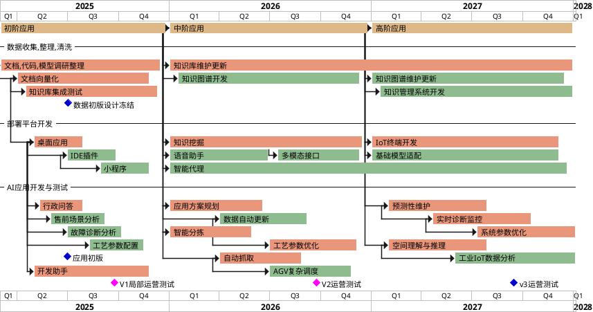

```plantuml
@startgantt
printscale quarterly zoom 2

Project starts the 1st of march 2025
[初阶应用] as [TASK1] starts the 1st of march 2025
' [TASK1] ends the 31st of december 2025
[TASK1] requires 300 days 
[TASK1] is colored in burlywood
-- 数据收集,整理,清洗  --
[文档,代码,模型调研整理] as [doc-investigation] requires 290 days
[doc-investigation] is colored in darksalmon
[doc-investigation] starts at [TASK1]'s start
[文档向量化] as [vectorization] requires 240 days
[vectorization] is colored in darksalmon
[vectorization] starts 30 days after [doc-investigation]'s start
[知识库集成测试] as [knowledge-base] requires 240 days
[knowledge-base] is colored in darksalmon
[knowledge-base] starts 15 days after [vectorization]'s start
[数据初版设计冻结] as [design] happens at 2025-06-31
[design] is colored in MediumBlue
-- 部署平台开发 --
[桌面应用] as [desktop] requires 90 days
[desktop] is colored in darksalmon
[desktop] starts 30 days after [vectorization]'s start
[IDE插件] as [ide] requires 90 days
[ide] is colored in darkseagreen
[ide] starts 60 days after [desktop]'s start
[小程序] as [miniprogram] requires 90 days
[miniprogram] is colored in darkseagreen
[miniprogram] starts 60 days after [ide]'s start
-- AI应用开发与测试 --
[行政问答] as [qa] requires 80 days
[qa] is colored in darksalmon
[qa] starts 10 days after [desktop]'s start
[售前场景分析] as [pre-sale] requires 100 days
[pre-sale] is colored in darkseagreen 
[pre-sale] starts 30 days after [desktop]'s start
[故障诊断分析] as [diagnostics] requires 100 days
[diagnostics] is colored in darkseagreen
[diagnostics] starts 60 days after [desktop]'s start 
[工艺参数配置] as [technical-parameter] requires 100 days
[technical-parameter] is colored in darkseagreen
[technical-parameter] starts 100 days after [desktop]'s start
[应用初版] as [swv1] happens at 2025-06-30
[swv1] is colored in MediumBlue
[开发助手] as [assistant] requires 210 days
[assistant] is colored in darksalmon
[assistant] starts at [desktop]'s start

[V1局部运营测试] as [operation-kickoff] happens at 2025-09-23
[operation-kickoff] lasts 5 days
[operation-kickoff] is colored in Magenta 

' 2025-01-18 to 2025-08-22 are named [Pilot Project]
' 2025-01-18 to 2025-08-22 are colored in salmon 

[中阶应用] as [TASK2] starts the 1st of january 2026
' [TASK2] ends the 31st of may 2026
[TASK2] requires 360 days
[TASK2] is colored in burlywood
[TASK1]->[TASK2]
[TASK2] displays on same row as [TASK1]

[知识库维护更新] as [vectordb-maintain] requires 730 days
[vectordb-maintain] is colored in darksalmon
[vectordb-maintain] starts at [TASK2]'s start
[vectordb-maintain] displays on same row as [doc-investigation]

[知识图谱开发] as [KG] requires 330 days
[KG] is colored in darkseagreen
[KG] starts 15 days after [TASK2]'s start
[KG] displays on same row as [vectorization]

[知识挖掘] as [mining] requires 350 days
[mining] is colored in darksalmon
[mining] displays on same row as [desktop]
[mining] starts at [TASK2]'s start
[语音助手] as [voice] requires 180 days
[voice] is colored in darkseagreen
[voice] starts at [TASK2]'s start
[voice] displays on same row as [ide]
[多模态接口] as [multimodal] requires 150 days
[multimodal] is colored in darkseagreen
[multimodal] starts 15 days after [voice]'s end
[multimodal] displays on same row as [ide]
[智能代理] as [agent] requires 720 days
[agent] is colored in darkseagreen
[agent] starts at [TASK2]'s start
[agent] displays on same row as [miniprogram]

[应用方案规划] as [planning] requires 170 days
[planning] is colored in darksalmon
[planning] starts at [TASK2]'s start
[planning] displays on same row as [qa]
[数据自动更新] as [self-update] requires 160 days
[self-update] is colored in darkseagreen
[self-update] starts 90 days after [planning]'s start
[self-update] displays on same row as [pre-sale]
[工艺参数优化] as [parameter-optimization] requires 160 days
[parameter-optimization] is colored in darksalmon
[parameter-optimization] starts 90 days after [self-update]'s start
[parameter-optimization] displays on same row as [technical-parameter]

[智能分拣] as [sorting] requires 150 days
[sorting] is colored in darksalmon
[sorting] starts at [TASK2]'s start
[sorting] displays on same row as [diagnostics]

[自动抓取] as [grasping] requires 150 days
[grasping] is colored in darksalmon
[grasping] starts 90 days after [sorting]'s start
[grasping] displays on same row as [swv1]

[AGV复杂调度] as [scheduling] requires 150 days
[scheduling] is colored in darkseagreen
[scheduling] starts 90 days after [grasping]'s start
[scheduling] displays on same row as [assistant]

[V2运营测试] as [operation-kickoff26] happens at 2026-09-23
[operation-kickoff26] lasts 5 days
[operation-kickoff26] is colored in Magenta 
[operation-kickoff26] displays on same row as [operation-kickoff]

[高阶应用] as [TASK3] starts the 1st of january 2027
[TASK3] ends the 31st of december 2027
[TASK3] is colored in burlywood
[TASK2]->[TASK3]
[TASK3] displays on same row as [TASK2]

[知识图谱维护更新] as [KG-maintain] requires 350 days
[KG-maintain] is colored in darkseagreen
[KG-maintain] starts at [TASK3]'s start
[KG-maintain] displays on same row as [vectorization]

[知识管理系统开发] as [kms] requires 350 days
[kms] is colored in darkseagreen
[kms] starts 15 days after [TASK3]'s start
[kms] displays on same row as [knowledge-base]

[IoT终端开发] as [iot] requires 340 days
[iot] is colored in darksalmon
[iot] starts at [TASK3]'s start
[iot] displays on same row as [desktop]

[基础模型适配] as [foundation] requires 340 days
[foundation] is colored in darkseagreen
[foundation] starts at [TASK3]'s start
[foundation] displays on same row as [ide]

[预测性维护] as [predictive-maintainence] requires 180 days
[predictive-maintainence] is colored in darksalmon
[predictive-maintainence] starts 30 days after [iot]'s start 
[predictive-maintainence] displays on same row as [qa]

[实时诊断监控] as [monitoring] requires 180 days
[monitoring] is colored in darksalmon
[monitoring] starts 80 days after [predictive-maintainence]'s start 
[monitoring] displays on same row as [pre-sale]

[系统参数优化] as [sys-parameter-optimization] requires 180 days
[sys-parameter-optimization] is colored in darksalmon
[sys-parameter-optimization] starts 80 days after [monitoring]'s start 
[sys-parameter-optimization] displays on same row as [sorting]

[空间理解与推理] as [spatial-intelligence] requires 180 days
[spatial-intelligence] is colored in darksalmon
[spatial-intelligence] starts 30 days after [TASK3]'s start 
[spatial-intelligence] displays on same row as [parameter-optimization]

[工业IoT数据分析] as [iot-analysis] requires 220 days
[iot-analysis] is colored in darkseagreen
[iot-analysis] starts 120 days after [spatial-intelligence]'s start
[iot-analysis] displays on same row as [grasping]

[v3运营测试] as [swv3] happens at 2027-09-15
[swv3] is colored in MediumBlue
[swv3] displays on same row as [operation-kickoff]


@endgantt
```
