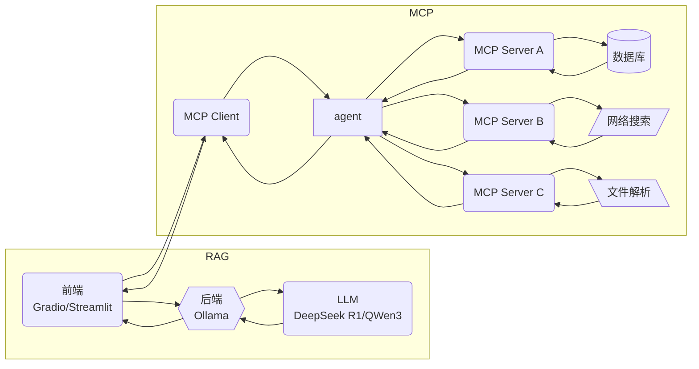

# MCP

```mermaid
graph LR;
	subgraph RAG
		fe(前端<br>Gradio/Streamlit) --> be{{后端<br>Ollama}} --> llm(LLM<br>DeepSeek R1/QWen3);
        	llm --> be --> fe;
   
	end

	subgraph MCP
		agent --> client(MCP Client) --> fe
		fe --> client --> agent
		agent --> ServerA(MCP Server A) --> resourceA[(数据库)]
 		resourceA-->ServerA-->agent 
        	agent --> ServerB(MCP Server B) --> resourceB[/网络搜索/]
		resourceB-->ServerB-->agent
 		agent --> ServerC(MCP Server C) --> resourceC[\文件解析\]
		resourceC --> ServerC --> agent

	end
```