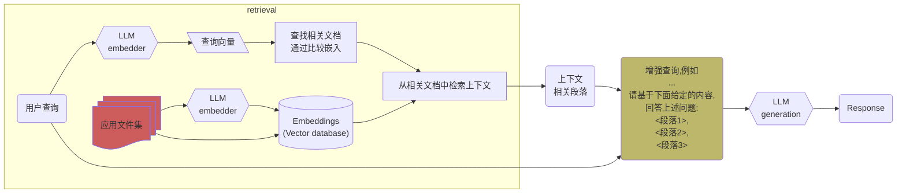

<!-- 
```plantuml
@startuml RAG流程图
!theme plain

skinparam ActivityBackgroundColor white
skinparam ActivityBorderColor black
skinparam ArrowColor black

partition "检索(Retrieval)" {
  :"应用文件集" as ref_docs #indianred;
  :LLM Embedder (嵌入器) 1;
  :Embeddings (向量数据库) #lightgreen;
  
  ref_docs -down-> :LLM Embedder (嵌入器) 1;
  :LLM Embedder (嵌入器) 1; -down-> :Embeddings (向量数据库);
  ref_docs -right-> :Embeddings (向量数据库);
}

:"用户查询" as user_query;
:LLM Embedder (嵌入器) 2;
:"查询向量";
:"查找相关文档\n通过比较嵌入";
:"从相关文档中检索上下文";
:"上下文\n相关段落" as context_chunks;

user_query -down-> :LLM Embedder (嵌入器) 2;
:LLM Embedder (嵌入器) 2; -down-> :"查询向量";
:"查询向量"; -down-> :"查找相关文档\n通过比较嵌入";
:"查找相关文档\n通过比较嵌入"; -down-> :"从相关文档中检索上下文";
:Embeddings (向量数据库); -right-> :"从相关文档中检索上下文";
:"从相关文档中检索上下文"; -down-> context_chunks;

:"增强查询,例如\n...\n请基于下面给定的内容,\n回答上述问题:\n <段落1>,\n<段落2>,\n<段落3>" as aug_query #darkkhaki;
context_chunks -down-> aug_query;
user_query -right-> aug_query;

:LLM Generation;
:"Response";

aug_query -down-> :LLM Generation;
:LLM Generation; -down-> :"Response";

@enduml

``` -->