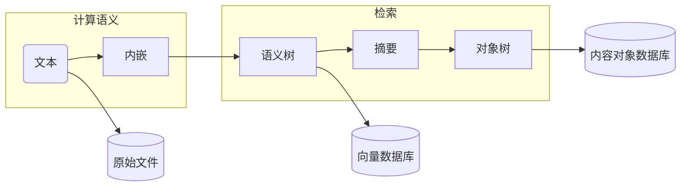

```mermaid
graph LR;
    subgraph 计算语义
                text(文本) --> 内嵌
    end
        内嵌 --> 语义树
    subgraph 检索
        语义树 --> 摘要 --> 对象树
    end

    text --> raw[(原始文件)]
    语义树 --> embedding[(向量数据库)]
    对象树 --> markdown[(内容对象数据库)]
```