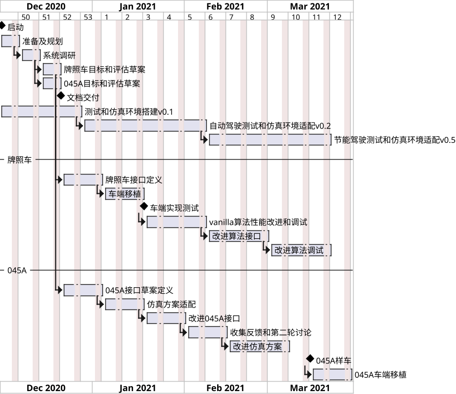

---
@import "newrizon.less"

id: "newrizon-id"
# class: "my-class1 my-class2"
title: "freight-data-analysis-optimization"
author: 
- Binjian Xin 
date: "Nov 28, 2020"

presentation:
  enableSpeakerNotes: true
  # width: 800px
  # height: 450px
  width: 1600
  height: 900
  shoNotes: true
  output: 
    beamer_presetnation:
      path: ./Exports/freight-data-analysis-optimization.pdf
      toc: true
toc:
  depth_from: 1
  depth_to: 1
  ordered: false
---

<!-- slide data-background-image="./Horizontal-Sea.jpg" -->

货运数据分析及优化
---
[ &nbsp; &emsp; 忻斌健](#货运数据分析及优化)
 2020年11月26日 

<!-- slide id="newrizon-id" -->
[TOC]

<!-- slide id="newrizon-id"　style="text-align: left;" class="my-class1 my-class2" -->

@import "newrizon.less"
# 货运规划场景
|卡车|路线|
|--|--|
|||
- 单车将货物从 A --> B（旅程Trip有始有终的事件episodic, 有途经点） 
- 目标：快，经济（节能），安全
- 导航规划（高速，高架，城区道路，郊区道路）
    - 道路长度
    - 高速收费
    - 交通实况
- 特点（图商提供）：
    - 与车辆状态无关（续航里程，诊断状态）
    - 按交通实况导航（不是真正的路况预测）

<!-- slide id="newrizon-id"　style="text-align: left;" class="my-class1 my-class2" -->
# 单车动态场景
|||||
|--|--|--|--|
|||||
- 其他交通参与者：其他车辆，行人 
- 实时路况：拥堵，交通灯，潮汐车道
- 道路属性：长度，曲率，坡度（地面/高架）
- 实时位置，住所，服务时长，危险品属性，设备特性，驾驶员特性，货物属性
单车 $\longrightarrow$ 十几~几十维状态向量
环境 $\longrightarrow$ 上万维状态向量
决策 $\longrightarrow$ 十几维决策向量
- 车辆控制：加速，刹车，转向（连续）
- 行为决策：变道，跟车，转向（离散）
- 导航决策：途径点位置顺序实时动态选择（离散）
任务 $\longrightarrow$ $10^{20}$属性组合，（全场景）
> 关于动态资源分配的优化问题

<!-- slide id="newrizon-id"　style="text-align: left;" class="my-class1 my-class2" -->

# 大数据与深度学习

## 大数据的成功案例：深度卷积网络
ImageNet状态空间：
224*224 RGB图像：$2^{{256^{3^{224x224}}}}$ **极其稀疏！**
- CNN高效利用特征可分解，顺序致密卷积
- 高维参数的非线性函数逼近
- 利用大量实际数据逼近真实的数据分布
- 分类，检测应用，监督学习，**i.i.d.** $\longrightarrow$ 极大似然估计
- 解决了代表学习的问题：
    - 确定了深度结构 (Darknet, Transformer)
    - 提供了优化算法（随机梯度下降Adam）

<!-- slide id="newrizon-id"　style="text-align: left;" class="my-class1 my-class2" -->

# 货运优化问题难点

> - **随机**过程：
    - 状态，决策都是随机分布
    - 随机分布通常未知 (如分布已知可使用动态规划求解)
> - 非平稳过程：
    - 环境非平稳，有突发事件
    - 策略优化过程导致策略非平稳
> - 时间序列：非 iid 分布，前后帧高度相关（数据方差大，学习收敛慢）
> - 环境部分可观测：
    - 感知有盲区
    - 感知模式有限（雨雪，夜晚，失效/故障）
> - 高维度环境状态和决策空间

高维度环境$\rightarrow$无法使用基于规则方法：无法建模或者建模精度不够
非稳态随机过程$\rightarrow$不能使用模仿学习/监督学习

<!-- slide id="newrizon-id"　 class="my-class1 my-class2" -->
# 强化学习的特点
- 通过与环境交互学习最优策略（基于大数据）
- 积累经验（缓存在状态/行动价值函数中）
- 可以是无模型或动态建模
- 可以是在线算法
- 动态调整策略
- 适应部分可观测环境
- 适用非平稳随机过程
- 适应高维度环境，连续状态空间

<!-- slide id="newrizon-id" class="my-class1 my-class2" -->

# 强化学习建模

<ul><li>Agent: 主体，智能体/控制器,<b>系统</b></li><li>环境：客体，交互对象（产生观测量和奖励，接收行动）</li><li>信号：观测，行动，奖励</li></ul>

$\Rightarrow$ **SARP**$\gamma$模型

<!-- slide id="newrizon-id"　style="text-align: left;" class="my-class1 my-class2" -->

## MDP求解
**SARP$\gamma$**
- **S**tate: 系统状态，对观测的最小充分描述（马尔可夫决策过程,当前的状态描述），环境状态（真实环境的全知模型）
- **A**ction: 行动 （加速度，刹车，转向，导航决策...)
- **R**eward：即时奖励（到达目的地+1，用时t，能耗e；可正可负，必须是一个标量，可通过加权转换成标量）
- **P**robability： （Transition Probabiltiy）状态迁移概率，描述系统动态
- $\gamma$：即时奖励的时间折扣系数

> 给定环境：$P$ $R$ 
通过采样环境 $P$和$R$ 得到系统状态$S$与即时奖励$R$
选择最优策略（Policy）： 确定性的 $\pi_{\theta}(S)=a$或者随机的 $\pi_{\theta}(a|S)=\mathbb{P}[A_t=a|S_t = s]$
时间折扣系数$\gamma$是超参数

<!-- slide id="newrizon-id"　 class="my-class1 my-class2" -->
## Mountain Car

<!-- slide id="newrizon-id"　 class="my-class1 my-class2" -->
## AlphaGo

完全可观测MDP
高复杂度

<!-- slide id="newrizon-id" style="text-align: left;"  class="my-class1 my-class2" -->
## Learning to Drive in a day (2018)

<iframe width="500" height="300" src="https://www.youtube.com/embed/eRwTbRtnT1I" frameborder="0" allow="accelerometer; autoplay; clipboard-write; encrypted-media; gyroscope; picture-in-picture" allowfullscreen></iframe>

<!-- slide id="newrizon-id" class="my-class1 my-class2" -->

# 货运模型

<ul><li>Agent: 主体, 系统 ,<b>卡车</b></li><li>环境：客体，<b>道路+车辆状态</b></li><li>信号：观测，行动，奖励</li></ul>

$\Rightarrow$ **SARP**$\gamma$模型?

<!-- slide id="newrizon-id" style="text-align: left;"  class="my-class1 my-class2" -->
# 概念验证方案
## 模型
**SARP$\gamma$**
- **S**tate: 系统状态（车辆状态+道路状况）对观测的最小充分描述（马尔可夫决策过程,当前的状态描述），环境状态（真实环境的全知模型）
- **A**ction: 行动 （加速度，刹车，转向，导航决策...)，**策略参数化**（初始化可以是随机选定）
- **R**eward：即时奖励（到达目的地+1，用时t，能耗e；可正可负，必须是一个标量，可通过加权转换成标量）**通过采样得到即时奖励**
- **P**robability： （Transition Probabiltiy）状态迁移概率，描述系统动态 **通过采样得到下一个状态**
- $\gamma$：即时奖励的时间折扣系数

<!-- slide id="newrizon-id" style="text-align: left;"  class="my-class1 my-class2" -->

## 求解
> 给定环境：$P$ $R$ 
通过采样环境 $P$和$R$ 得到系统状态$S$与即时奖励$R$
选择最优策略（Policy）： 确定性的 $\pi_{\theta}(S)=a$或者随机的 $\pi_{\theta}(a|S)=\mathbb{P}[A_t=a|S_t = s]$
时间折扣系数$\gamma$是超参数
***需要很多数据***

<!-- slide id="newrizon-id" style="text-align: left;"  class="my-class1 my-class2" --> 

## 数据接口
系统状态：
- 自车状态：车速，位置，航向，诊断信号
- 道路状态：曲率，高程，俯仰
- 动态目标状态：其他车辆，行人

决策:
- 控制：加速度，刹车，航向 (连续)
- 导航决策：
    - 结合车辆状态的路线选择
    - 途径点选择

**单一**即时奖励：
- 能耗
- 成本 （能耗+时间成本+）
- 体验 （急刹少，平稳）

ETA预测数据要准确（-->图商） 

<!-- slide id="newrizon-id" style="text-align: center;" class="my-class1 my-class2" --> 

# 概念验证方案

<ul>
<li>替换奖励为能耗</li>
<li>道路+车辆状态, 编码<b></b></li>
<li>道路，城市，天气，相对稳定</li>
</ul>

<!-- slide id="newrizon-id" style="text-align: left;" class="my-class1 my-class2" --> 
# 挑战
- 高维连续状态特征：选择和压缩？ （**知识梯度**）
    - 特征状态的动态调整？
- 人机结合策略？
- 部分可观测过程（POMDP)：有些关键特征不可观测
- 不违反安全约束：风险/安全-->价值函数评估
- 可解释性
- 动作：只控制纵向加速度/横纵向联合控制
- 连续+离散输入信号是否可以同时编码
    - 连续与离散决策分开
- 离线训练 （**大数据**基于离线真实驾驶数据建模，基于模型的仿真规划）
    - 样本不够
    - 在统计意义上评价系统也需要较多的数据
- 多目标的奖励系统（知识梯度）
- benchmark 数据少， 未看到参考案例
- V2V, V2I
- 第一步静态：velocity profile
- 第二部动态：感知内容
- 结合静态和**动态车辆决策**的能量管理系统
<!-- slide id="newrizon-id"  style="text-align: left;" class="my-class1 my-class2" --> 

# 计划

## 基于价值函数

## 基于近似MDP模型

## Vanilla RL模型
2-3个最主要的标定量？
其余如何保证稳定
连续变量，box2d

十几个变量一起输入

Vanilla RL方案：
- 有瞬时电耗，每个轮子功耗等内部信号
- 只用力矩或油门踏板进行节油方案
力矩接口的节能控制方案
- 耗尽放电+充电模式/最优充放电模式？
<!-- slide id="newrizon-id"  class="my-class1 my-class2" --> 

<!-- slide data-background-image="./Horizontal-Sunrise.jpg" -->
谢谢！
