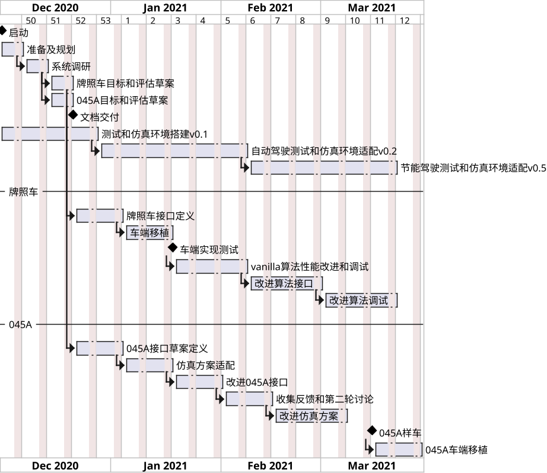

```plantuml
@startgantt
scale 1.5
printscale weekly
Project starts the 1st of december 2020
saturday are closed
sunday are closed
2020/12/31 to 2020/01/01 is closed
2021/01/24 to 2020/01/30 is closed
2020/05/01 to 2020/05/03 is closed

[启动] happens at 2020/12/01
[准备及规划] lasts 5 days
then [系统调研] lasts 5 days
then [牌照车目标和评估草案] lasts 5 days
[045A目标和评估草案] lasts 5 days
[045A目标和评估草案] starts at [系统调研]'s end
[文档交付] happens at [045A目标和评估草案]'s end
[测试和仿真环境搭建v0.1] lasts 20 days
then [自动驾驶测试和仿真环境适配v0.2] lasts 30 days
then [节能驾驶测试和仿真环境适配v0.5] lasts 30 days

--牌照车--
[牌照车接口定义] lasts 10 days
[牌照车接口定义] starts at [牌照车目标和评估草案]'s end
then [车端移植] lasts 10 days
[车端实现测试] happens at [车端移植]'s end
then [vanilla算法性能改进和调试] lasts 15 days
then [改进算法接口] lasts 15 days
then [改进算法调试] lasts 15 days
--045A--
[045A接口草案定义] lasts 10 days
[045A接口草案定义] starts at [045A目标和评估草案]'s end
then [仿真方案适配] lasts 10 days
then [改进045A接口] lasts 10 days
then [收集反馈和第二轮讨论] lasts 10 days
then [改进仿真方案] lasts 15 days
[045A样车] happens at 2021-03-15
then [045A车端移植] lasts 10 days
@endgantt

```

