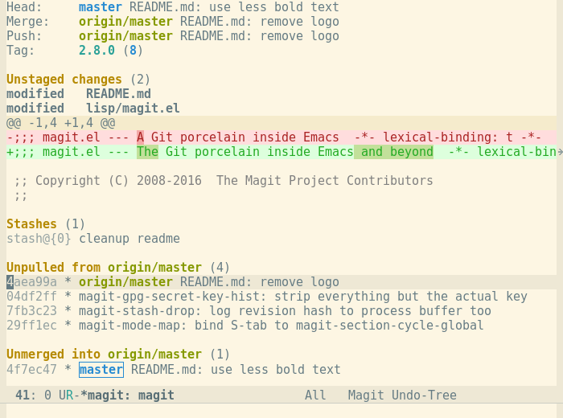

---
@import "newrizon.less"

id: "newrizon-id"
# class: "my-class1 my-class2"
title: "veos system assessment"
author: 
- Binjian Xin 
date: "Sep. 16, 2021"

presentation:
  enableSpeakerNotes: true
  # width: 800px
  # height: 450px
  width: 1600
  height: 900
  shoNotes: true
  output: 
    beamer_presetnation:
      path: ./Exports/veos system assessment.pdf
      toc: true
toc:
  depth_from: 1
  depth_to: 1
  ordered: false
---

<!-- slide data-background-image="./Horizontal-Sea.jpg" -->

Git101管道，台盆和房子

 Git 101 -- Plumbing, Porcelain and Building   Git Internals
---
[ &nbsp; &emsp; 忻斌健](#Git)

 2021年12月16日 

<!-- #+title: dl intro -->

<!-- slide id="newrizon-id" -->
[TOC]

<!-- slide id="newrizon-id"　style="text-align: left;" class="my-class1 my-class2" -->

@import "newrizon.less"

# 动机
- 目标听众：有一定使用经验
- 简单介绍内部机制
- 复习基本知识
- Git使用交流
- 目标
  - 理解Git，避免一些显而易见的错误
  - 遇到问题能理解问题属于哪一类

<!-- slide id="newrizon-id"　style="text-align: center;" class="my-class1 my-class2" -->

Knowledge is free.  But you have to pay attention.

-- Prof. Feynman 

<!-- slide id="newrizon-id"　style="text-align: center;" class="my-class1 my-class2" -->

Nothing in life is to be feared , it is only to be understood.  Now is the time to understand more, so that we may fear less. 

-- Marie Curie

<!-- slide id="newrizon-id"　style="text-align: left;" class="my-class1 my-class2" -->
## Git概要

 

 git  - the stupid content tracker

- Git历史
  - CVS (Concurrent Version System), SVN, Perforce, Mercurial, Hg
  - Linux内核开发，
    - diff & patch
    - BitKeeper(私有)
  - Git /'git/ 而非 /'jit/
- 特点 (man page)
  - 内容可编址文件系统 content addressable file system
  - fast快速, scalable可规模化, distributed分布式
  - 快照而非补丁（snapshots not patches）
  - Cooperative? 不一定！

<!-- slide id="newrizon-id"　style="text-align: left;" class="my-class1 my-class2" -->
- [墨克树Merkle Tree (哈希树/散列树/hash tree)](https://stackoverflow.com/questions/46192377/why-is-git-not-considered-a-block-chain)
  - 树
    - 节点：文件/文件夹的变更(是diff, 非文件/文件夹本身）
    - 边：变更的逻辑关系
  - 视图(View): 完整的快照，而非变更本身
  - 区块链是更复杂的墨克树（每个节点/区块包含哈希，时间戳，内容变更可追溯）

<!-- slide id="newrizon-id"　style="text-align: left;" class="my-class1 my-class2" -->
## 问题

- HEAD, detached HEAD?
- git diff / --cached
- git reset --soft / --hard?
- git fetch/pull?
- merge/rebase?
- Staging? Index?
- Plumbing and Procelain 水管和台盆
- Git的房子 Git Flow

<!-- slide id="newrizon-id"　style="text-align: left;" class="my-class1 my-class2" -->

# Git Plumbing （水管：内部工作原理）

## SHA-1
- 散列函数：将任意尺寸的数据映射到固定宽度的比特数组
  - 通常用于加密
- SHA-1：160bit, 20字节
  - dea5cb812bf79fc587c1012c2ec915245fae29fb
- Git中的功能
  - 用于编址
  - 非安全功能，安全功能是副产品
- SHAttered attack 2017
  - 自V2.29(Oct. 2020) 开始尝试SHA-256（SHA-2,32字节)
- 数据库： SHA-1是地址，也是检索用的索引

<!-- slide id="newrizon-id"　style="text-align: left;" class="my-class1 my-class2" -->
## objects
- 四类对象
  - blob
  - tree
  - commit
  - tag
- 文件模式
  - 100644普通文件
  - 100755可执行文件
  - 120000符号链接
  - ...
- 水管命令
  - git hash-object -w;
  - git cat-file -p/-t; 
  - git update-index --add --cacheinfo
  - git write-tree

<!-- slide id="newrizon-id"　style="text-align: left;" class="my-class1 my-class2" -->
## references/refs引用

name for the SHA-1 Value

 
- Branches
  - 代码变更流上最顶端的commit对象
  - 水管命令：git update-ref refs/heads/master
- Tags
- Remotes
- HEAD
  - symbolic ref（指向引用的指针）
  - Detached HEAD： 某个git对象的SHA-1值
    - commit
    - tag
    - submodule update
    - 补救措施： git checkout -b foo/ git branch foo/ git tag foo

<!-- slide id="newrizon-id"　style="text-align: center;" class="my-class1 my-class2" -->
## 基本工作流

[BasicGitTalk 170-199](fig/BasicGitTalk.pdf)

- edit
- stage (add)
- review (git status)
- commit
- push

<!-- slide id="newrizon-id"　style="text-align: left;" class="my-class1 my-class2" -->
# 基本台盆
## 常用命令
- branch
- git reset 
  - --soft HEAD~ 移动HEAD = uncommit (amend)
  - --mixed 更新Index (uncommit & unstage, 本地不变default)
  - --hard 更新Index和本地文件
- merge: fast-forward, 三方合并；
- rebase
- stash
- log
- commit amend
- rename
- gitignore

<!-- slide id="newrizon-id"　style="text-align: left;" class="my-class1 my-class2" -->
## submodule

### 仅同步跟踪子模块，不推送
- 手工 : git fetch
- 自动: git submodule update --remote
  - 设置远端分支：.gitmodules submodule.submudle_name.branch stable
  - 追踪子模块(协助模式): git config **-f** submodule 
  - 显示子模块状态：git config status.submodulesummary 1
  - 拉取子模块变更后需要提交变更到主项目，推送到远端服务器

### 子模块协作开发模式
- git submodule update： 本地无分支，detached HEAD
- 需要拉取分支到本地：从上游拉取（合并/）git submodule update --remote --rebase/--merge
- 发布子模块变更: git push --recurse-submodules=check/on-demand
- 注意事项Caveats:
  - 偶尔会篡改上游项目: git submodule update --remote to update .gitmodule
  - 子模块切换分支

<!-- slide id="newrizon-id"　style="text-align: left;" class="my-class1 my-class2" -->
# 高级台盆[Magit](https://magit.vc/)

||
|:--:|
|<b>Magit Status</b>|
<!-- slide id="newrizon-id"　style="text-align: left;" class="my-class1 my-class2" -->
# 房子（最佳实践)
## [开发范式](https://nvie.com/posts/a-successful-git-branching-model/)

||
|:--:|
|<b>Git最佳实践2010</b>|

<!-- slide id="newrizon-id"　style="text-align: left;" class="my-class1 my-class2" -->
## 工具
[git-flow](https://danielkummer.github.io/git-flow-cheatsheet/index.zh_CN.html)

[github-flow](https://docs.github.com/en/get-started/quickstart/github-flow)

[magit-gitflow](https://github.com/jtatarik/magit-gitflow)
<!-- slide id="newrizon-id"　style="text-align: left;" class="my-class1 my-class2" -->
# 总结与展望

总结:

  - 内部机制的基本介绍
  - 基本台盆使用
  - 高级台盆
  - 房子
  - **不好用的原因通常是需求没有理清楚**
  - 发生问题时能知道问题属于哪一类

<!-- slide id="newrizon-id"　style="text-align: center;" class="my-class1 my-class2" -->
<!-- 
 May The Source Be With You!  祝源力与你同在!
 -->

 May The Source Be With You!
