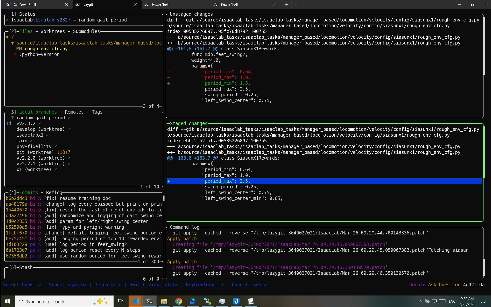

---
@import "newrizon.less"

id: "newrizon-id"
# class: "my-class1 my-class2"
title: "git minimal mental model"
author: 
- Binjian Xin 
date: "Sep. 16, 2021"

presentation:
  enableSpeakerNotes: true
  # width: 800px
  # height: 450px
  width: 1600
  height: 900
  shoNotes: true
  output: 
    beamer_presetnation:
      path: ./Exports/git_minimal_mental_model.pdf
      toc: true
toc:
  depth_from: 1
  depth_to: 1
  ordered: false
---

<!-- slide data-background-image="./Horizontal-Sea.jpg" -->

<!--  -->

Git使用的最小心理模型

 基础和日常使用 
---
[ &nbsp; &emsp; 忻斌健](#Git)

 2026年03月27日

<!-- #+title: dl intro -->

<!-- slide id="newrizon-id" -->
[TOC]

@import "newrizon.less"

<!-- slide id="newrizon-id"　style="text-align: left;" class="my-class1 my-class2" -->

问题？

- checkout branch detached —> 怎么救回来?
- pull为什么会失败
- diff为什么经常看不懂，反直觉？
- Git 和 GitHub/Gitlab 有什么区别？
- 为什么我保存了文件，但在远程仓库里看不到？
- 如何撤销刚刚写错的 Commit？
- **遇到“Merge Conflict（合并冲突）”？**
- fetch和pull 有什么区别？
- **代码写到一半，突然发现一直在错误的分支(Release)上工作怎么办？**
- 终端提示“Detached HEAD（游离的 HEAD 指针）”是什么意思？
- 把代码改乱了，如何放弃本地所有未提交的修改？
- 为什么 Push 的时候报错“failed to push some refs”或“non-fast-forward”？
- 如何防止密码配置文件或庞大的编译文件夹被提交上去？

<!-- slide id="newrizon-id"　style="text-align: left;" class="my-class1 my-class2" -->

提纲

- 使用的心理模型
  - 版本存储-->版本管理
- 基础
  - 变更
  - 基本结构
- 个人使用
  - 日常
  - 特定需求

<!-- slide id="newrizon-id"　style="text-align: left;" class="my-class1 my-class2" -->
# 基础

 

Linux手册的定义

- 内容可编址文件系统
- fast快速, scalable可规模化, distributed分布式
- 快照（非补丁）
- 合作开发方式

<!-- slide id="newrizon-id"　style="text-align: left;" class="my-class1 my-class2" -->

## 变更

变更的模式

- 文件变更（源文件）
  - 字符：ASCII,换行符,回车
  - 检测和发现
  - 标志(id)
  - 存储和检索

- 文件系统变更
  - 逻辑上变更 -> 文件集合的变更

- 变更逻辑关系
  - 树型结构

<!-- slide id="newrizon-id"　style="text-align: left;" class="my-class1 my-class2" -->

## 基本结构

树

- 树[(墨克树/哈希树/散列树)](https://stackoverflow.com/questions/46192377/why-is-git-not-considered-a-block-chain)
  - 节点：文件/文件夹的变更(是diff, 非文件/文件夹本身）
  - 边：变更的逻辑关系
- 视图(View): 完整的快照，而非变更本身

<!-- slide id="newrizon-id"　style="text-align: left;" class="my-class1 my-class2" -->

哈希

- 散列函数：将任意尺寸的数据映射到固定宽度的比特数组
  - 通常用于加密
- SHA-1：160bit, 20字节
  - dea5cb812bf79fc587c1012c2ec915245fae29fb
- Git中的功能
  - 用于编址
  - **由内容决定唯一识别号**
  - 数据库： SHA-1是地址，也是检索用的索引
- 哈希冲突
  - 哈希冲突概率(以Linux内核代码库为例)
    - $3.4\times10^{-35}$
  - SHAttered attack 2017  
  - 自V2.29(Oct. 2020) 兼容SHA-256（SHA-2,32字节) 
    - $2^{256}\approx \frac{1}{1000}\cdot10^{80}$
    - 哈希冲突概率 $\searrow 4.3\times10^{-64}$
  - log中的短哈希"dea5cb8"?

<!-- slide id="newrizon-id"　style="text-align: left;" class="my-class1 my-class2" -->
## 底层对象，属性和操作
- 四类对象
  - blob
  - tree
  - commit
  - tag
- 文件模式
  - 100644普通文件
  - 100755可执行文件
  - 120000符号链接
  - ...
- 水管命令
  - git hash-object -w
  - git cat-file -p/-t
  - git update-index --add --cacheinfo
  - git write-tree

<!-- slide id="newrizon-id"　style="text-align: left;" class="my-class1 my-class2" -->
# 使用 

## 三个区域

- 变更数据库 (".git/objects" 文件夹)
- 工作区 (本地文件夹)
- 缓冲区 (Index, git add / git restore --staged)
  - git commit: 缓冲区-->变更数据库
  - git reset --soft: 变更数据库(HEAD)
  - git reset --hard: 变更数据库(HEAD)-->缓冲区-->工作区
  - git reset --mixed: 变更数据库(HEAD)-->缓冲区(默认)
  - git diff --cached: 比较缓冲区与变更数据库的差异

总能执行的命令大致是安全的, 但可能是危险的

<!-- slide id="newrizon-id"　style="text-align: left;" class="my-class1 my-class2" -->

## 第四个区域 暂存区

- git stash
- git stash apply stash@{0} 
- LIFO堆栈缓存
  - git stash pop

<!-- slide id="newrizon-id"　style="text-align: left;" class="my-class1 my-class2" -->

## 更多区域 远端仓库

不一定能执行的命令总是安全的, 但通常是麻烦的

- 远端仓库：远端的数据库
- git fetch: 拉取远端仓库 -?-> 变更数据库
- git pull: 拉取远端仓库 -?-> 变更数据库 -?-> **合并**到本地分支
- git push: 本地变更数据库 -?-> 远端仓库
<!-- slide id="newrizon-id"　style="text-align: left;" class="my-class1 my-class2" -->
## references/refs引用

所有引用都是SHA-1的假名

- branch
  - 分支上最顶端的commit对象
- remote
- HEAD
  - symbolic ref（指向引用的指针）
  - Detached HEAD： 某个git对象的SHA-1值
    - commit
    - tag
    - submodule update
    - 补救措施： git branch foo / git tag foo
- tag
  - 可作为特殊的HEAD，比如Latest-Release

<!-- slide id="newrizon-id"　style="text-align: center;" class="my-class1 my-class2" -->
## 基本工作流

- edit
- stage (add)
- review (git status)
- commit
- push

<!-- slide id="newrizon-id"　style="text-align: left;" class="my-class1 my-class2" -->
## 常用命令

- log
- merge：代码合并
- rebase：变基
- .gitignore

<!-- slide id="newrizon-id"　style="text-align: left;" class="my-class1 my-class2" -->
## 一些有用的命令

- commit --amend
- revert
- cherry-pick
- stash：临时缓存
- reflog
- worktree
- mv (rename)
- git config --global diff.algorithm histogram
- lfs
- 代码风格和格式自动化!

<!-- slide id="newrizon-id"　style="text-align: left;" class="my-class1 my-class2" -->
## submodule

### 仅同步跟踪子模块，不推送
- 手工 : git fetch
- 自动: git submodule update --remote
  - 设置远端分支：.gitmodules submodule.submudle_name.branch stable
  - 追踪子模块(协助模式): git config **-f** submodule 
  - 显示子模块状态：git config status.submodulesummary 1
  - 拉取子模块变更后需要提交变更到主项目，推送到远端服务器

### 子模块协作开发模式
- git submodule update： 本地无分支，detached HEAD
- 需要拉取分支到本地：从上游拉取（合并/）git submodule update --remote --rebase/--merge
- 发布子模块变更: git push --recurse-submodules=check/on-demand
- 注意事项:
  - 偶尔会篡改上游项目: git submodule update --remote to update .gitmodule
  - 子模块切换分支

<!-- slide id="newrizon-id"　style="text-align: left;" class="my-class1 my-class2" -->

总结

  - 变更的树形结构
  - 基本命令使用

<!-- slide id="newrizon-id"　style="text-align: left;" class="my-class1 my-class2" -->

# 现场演示

任何git现场演示？

  
