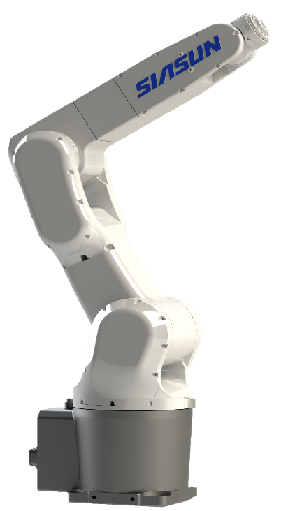
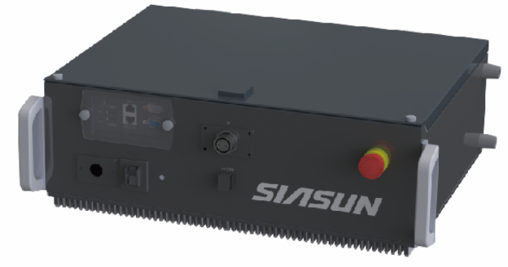
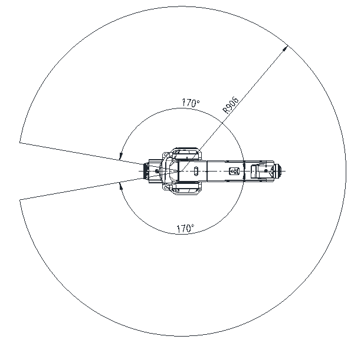
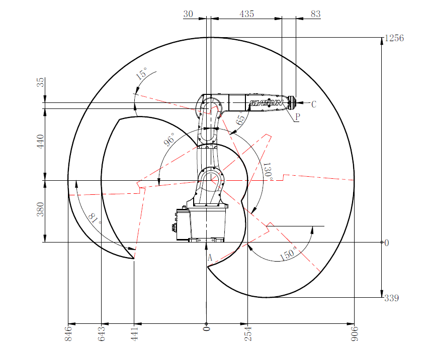
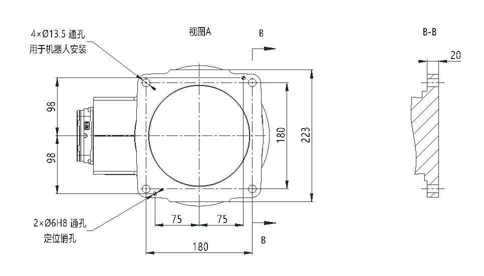
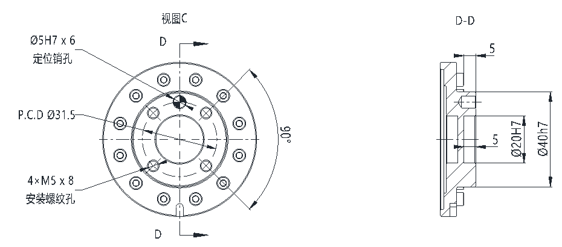
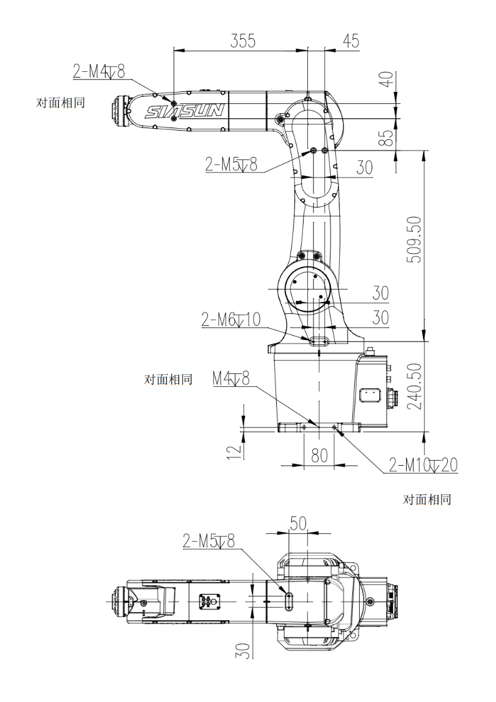
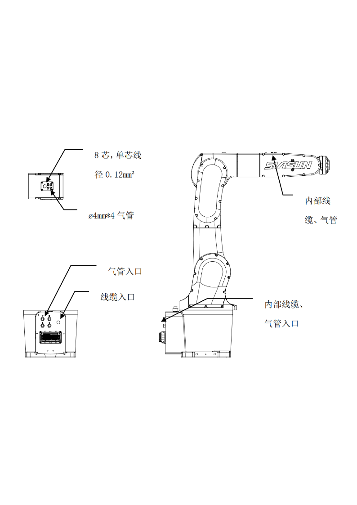
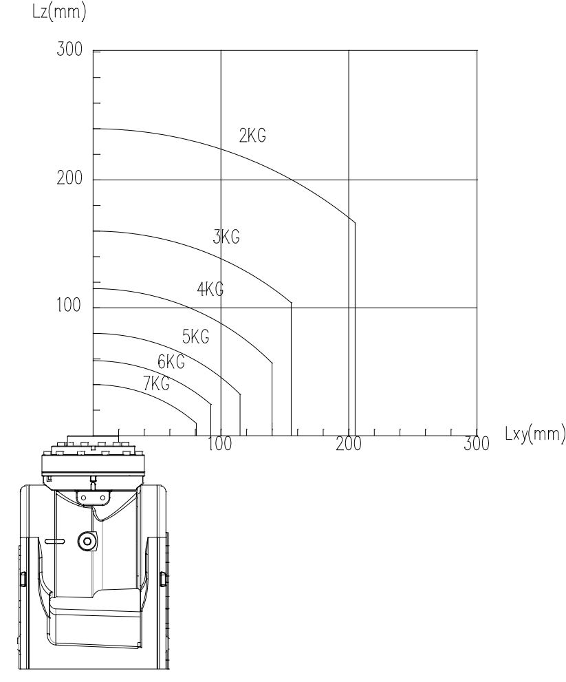
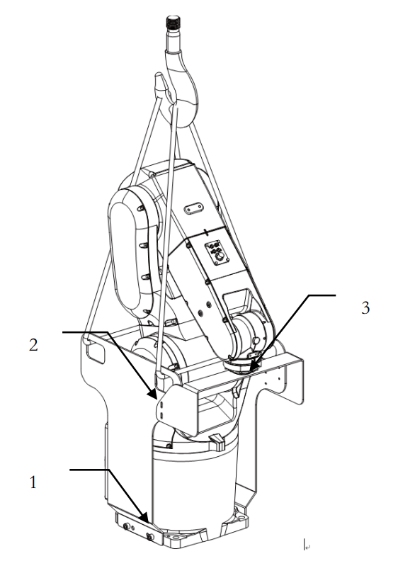

# SN7B-7/0.90 规格参数介绍

{width=300px}
## 机器人规格

| 型号                 | SN7B\-7/0\.90  |
| -------------------- | -------------- |
| 机器人类型           | 多关节型机器人 |
| 控制轴数             | 6轴            |
| 安装形式             | 地面、倒装     |
| 可搬运重量（手腕部） | 7kg            |
| 重复定位精度         | ±0\.02mm       |
| 最大臂展             | 906mm          |
| 机器人质量           | 52kg           |
| 防护等级             | IP67（手腕）   |

## 关节规格

|  转轴 | 动作范围 (°)                           | 最大动作速度 | 手腕部允许 负载转动惯量 | 手腕部允许 转矩 |
|  ---- | -------------------------------------- | ------------ | ----------------------- | --------------- |
|  J1轴 | ±170                                   | 267/s        | N/A                     | N/A             |
|  J2轴 | ＋96,－130                             | 223/s        | N/A                     | N/A             |
|  J3轴 | 联合：＋291，－150,  单轴：\+165，\-65 | 315/s        | N/A                     | N/A             |
| J4轴 | ±170                                  | 400/s        | 0.75kg·m²               | 24N·m           |
| J5轴 | ±120                                  | 400/s        | 0.26kg·m²               | 15.2N·m         |
| J6轴 | ±360                                  | 600/s        | 0.067kg·m²              | 9.7N·m          |

## SN7B-7/0.90 控制柜规格

{width=300px}

| 机型                | SN7B\-7/0\.90                                                                 |                                                                               |
|---------------------|-------------------------------------------------------------------------------|-------------------------------------------------------------------------------|
| 控制器型号          | SRC C5                                                                        | SRC C6                                                                        |
| 示教盒              | STBT5A                                                                        | STB2A\-H                                                                      |
| 输入功率            | 350W                                                                          | 600W                                                                          |
| 电柜体积 （宽×深×高） | 505mm×385mm×216mm                                                             | 430mm×400mm×255mm                                                             |
| 输入电源            | 单相 AC220V 50/60Hz                                                           |                                                                               |
| 总线通信            | 支持RS232,DeviceNet主站、PROFINET从站或Modbus\-TCP（主/从站）、TCP/IP（离线接口库） | 支持RS485,DeviceNet主站、PROFINET从站或Modbus\-TCP（主/从站）、TCP/IP（离线接口库） |
| 电柜I/O接口         | 标准NPN型16DI/16DO，可选配PNP型，最高可扩展至64DI/64DO                          | 标准NPN型16DI/16DO，可选配PNP型                                                |
| 工作环境温度        | 0°\~45°（工作环境温度超过 45°需加冷却设备）                                     |                                                                               |
| 电柜防护等级        | IP32                                                                          | IP20                                                                          |

### SRC C5

{width=300px}
    
### SRC C6

{width=300px}

{width=300px}

### 机器人互联电缆

动力电缆、码盘线缆

| 配置 | 长度 | 拖链/非拖链 |
|------|------|-------------|
| 标配 | 3m   | 拖链        |
| 选配 | 7m   | 拖链        |

## 工作范围

{width=500px}

{width=500px}

## 接口
### 底座安装接口

{width=800px}

| 名称和型号                         | 数量 |
|------------------------------------|------|
| 固定螺钉：M12ⅹ40(GB/T70\.1 12\.9级） | 4    |
| 弹簧垫片：弹簧垫圈12（GB/T93\)       | 4    |
| 定位销：圆柱销6ⅹ40（GB/T120\.2\)     | 2    |

### 末端法兰接口

{width=800px}

### 其它接口

{width=600px}

{width=600px}

## 负载曲线

{width=600px}

## 起重机搬运

{width=400px}

- 机器人本体重量是52kg
- 使用承受力100kg以上的吊绳。

| 各轴关节值 | 1轴 | 2轴 | 3轴   | 4轴 | 5轴   | 6轴 |
|------------|-----|-----|-------|-----|-------|-----|
| 关节值     | 0°  | 15° | \-60° | 0°  | \-45° | 0°  |
