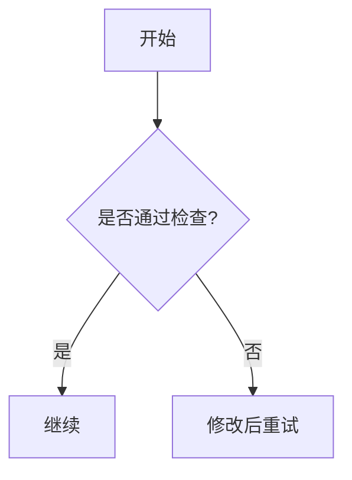
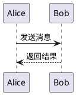
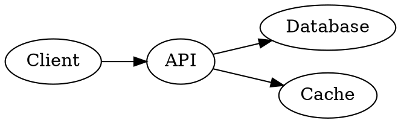

<!-- slide -->

# Markdown 基础与写作流程

### 一个实用的 20 分钟教程

**目标：** 学会 Markdown 的核心规则、如何组织 `.md` 文件，以及哪些工具能帮助你更高效地编写 Markdown。

<!-- slide -->

## 你将学到什么

- 什么是 Markdown，以及为什么大家都在使用它
- 日常最常用的 **基础语法规则**
- 如何组织一份清晰、规范的 Markdown 文档
- 编写、预览、检查与发布 Markdown 的 **关键工具**
- 常见错误以及避免方法

<!-- slide -->

## 为什么选择 Markdown？

- **纯文本优先**：即使还没渲染，也很容易阅读
- **可移植性强**：适用于不同编辑器、平台和工具
- **适合版本控制**：非常适合 Git 工作流
- **编写速度快**：格式简单，负担小
- **便于转换**：可导出为 HTML、PDF、幻灯片、文档等多种格式

<!-- slide -->

## Markdown 的基本规则

Markdown 本质上就是通过 **简单的文本标记模式** 来表达结构。

- `#` 用于标题
- `-` 或 `1.` 用于列表
- `>` 用于引用
- 反引号用于标记 `代码`
- 空行用于分隔主要内容块

### 最好的习惯
先保证 **表达清晰**，再添加轻量格式。

<!-- slide -->

## 标题

使用标题来建立内容结构。

```md
# 标题
## 章节
### 小节
```

### 建议

- 文档标题通常只使用 **一个** `#`
- 标题层级要按顺序使用
- 标题尽量简洁明确

<!-- slide -->

## 段落、换行与空行

### 段落
空一行就会开始一个新段落。

```md
这是第一段。

这是第二段。
```

### 重要习惯
不要依赖随意换行来组织结构，要有意识地使用 **空行**。

<!-- slide -->

## 列表

### 无序列表

```md
- 项目一
- 项目二
  - 子项目
```

### 有序列表

```md
1. 第一步
2. 第二步
3. 第三步
```

### 经验法则
嵌套列表的缩进要保持一致。

<!-- slide -->

## 强调与行内元素

```md
*斜体* 或 _斜体_
**粗体** 或 __粗体__
`行内代码`
[OpenAI](https://openai.com)

```

### 这些语法适合用于

- 强调关键词
- 标记文件名、命令和代码片段
- 添加文档链接和参考资料
- 插入带有清晰替代文字的图片

<!-- slide -->

## 在 Markdown 中插入图片

最基本的写法是：

```md

```

### 建议

- `[]` 里写清楚图片说明，便于无障碍访问
- 优先使用 **相对路径**
- 给文件起容易理解的名字
- 把图片集中放在如 `images/`、`assets/` 目录中

### 远程图片也可以

```md

```

<!-- slide -->

## 图片的常见实践

### 推荐目录结构

```md
project/
├─ docs/
│  └─ notes.md
└─ images/
   └─ architecture.png
```

如果 `notes.md` 位于 `docs/` 下，那么常见写法可能是：

```md

```

### 补充说明

- 图片过大时，可考虑压缩后再提交到仓库
- 想精细控制宽高时，很多环境会直接使用 HTML：

```html

```

<!-- slide -->

## 引用块与分隔线

### 引用块

```md
> 当源文件保持简洁时，Markdown 最容易维护。
```

### 水平分隔线

```md
---
```

这些元素适合少量使用，用来分隔内容或突出重要提示。

<!-- slide -->

## 代码块

示例代码最好使用围栏代码块。

````md
```bash
npm install markdownlint-cli
```
````

### 为什么推荐围栏代码块

- 比行内代码更容易阅读
- 通常可以自动启用语法高亮
- 对大多数团队来说，比缩进式代码块更稳妥

<!-- slide -->

## 表格与任务列表

### 表格

```md
| 工具 | 用途 |
| --- | --- |
| VS Code | 编辑 |
| Pandoc | 转换 |
```

### 任务列表

```md
- [x] 完成初稿
- [ ] 检查链接
- [ ] 发布文件
```

### 提醒
表格和任务列表是否可用，取决于你使用的 Markdown 方言。

<!-- slide -->

## 一个良好的 Markdown 文件骨架

```md
# 文档标题

简短介绍。

## 第一部分
主要内容。

## 第二部分
- 关键点
- 关键点

## 参考资料
- 链接或来源
```

### 好文档通常具备这些特点

- 易于快速浏览
- 结构分组清晰
- 段落简短
- 风格一致

<!-- slide -->

## 推荐的写作流程

1. 用纯文本先写出 **初稿**
2. 用标题和列表整理 **结构**
3. **预览** 渲染结果
4. 用检查工具进行 **规范校验**
5. 如果内容重要，用 Git 进行 **版本管理**
6. 准备好后再 **发布或导出**

<!-- slide -->

## 编写 Markdown 的关键工具

### 编辑器

- **VS Code**：扩展生态丰富
- **Obsidian**：适合笔记和知识链接
- **Typora**：提供流畅的所见即所得式写作体验

### 预览与演示

- **Markdown Preview Enhanced**：适合高级预览与 Reveal.js 演示

### 质量检查工具

- **markdownlint**：检查风格与格式问题
- 拼写检查扩展：用于发现错别字

### 发布与导出

- **Pandoc**：可导出为 HTML、PDF、DOCX 等多种格式

<!-- slide -->

## Markdown 方言很重要

并不是每个渲染器都支持完全相同的功能。

### 常见示例

- **CommonMark**：更标准、更基础的核心行为
- **GitHub Flavored Markdown**：增加了表格、任务列表等实用功能
- **Pandoc Markdown**：特别适合出版与导出流程

### 结论
要在最终使用的环境里测试你的文件。

<!-- slide -->

## 用 Mermaid 在 Markdown 中画图

在支持 Mermaid 的环境里，可以直接写：

````md

````

### 适合场景

- 流程图
- 时序图
- 简单关系图
- 状态图与甘特图（取决于渲染器支持）

### 提示
Mermaid 很适合把“文字流程”快速变成图。

<!-- slide -->

## 用 PlantUML 在 Markdown 中画图

在 Markdown Preview Enhanced 中，常见写法是 `puml` 或 `plantuml` 代码块。

````md

````

### 适合场景

- UML 类图
- 时序图
- 用例图
- 活动图

### 实用提醒

- PlantUML 通常依赖 Java
- 安装 Graphviz 后，可生成更多图类型

<!-- slide -->

## 用 DOT / Graphviz 在 Markdown 中画图

DOT 语法适合表达“节点 + 连线”关系。

````md

````

### 适合场景

- 依赖关系图
- 模块调用图
- 简单架构图
- 有向图与无向图

### 补充
有些环境也支持 `viz` 作为代码块标识。

<!-- slide -->

## 图表写作建议：Mermaid、PlantUML、DOT 怎么选？

### 选 Mermaid
- 想快速画流程图
- 团队成员更偏前端或文档协作
- 希望语法上手快

### 选 PlantUML
- 需要更完整的 UML 表达
- 面向软件设计说明和工程文档

### 选 DOT / Graphviz
- 重点在“节点关系”和布局控制
- 要画依赖图、架构连接图、调用图

### 一条经验
先选 **最容易维护** 的方案，不要为了“更复杂”而复杂。

<!-- slide -->

## 关于图表渲染与导出的提醒

- 不是所有 Markdown 渲染器都支持 Mermaid、PlantUML、DOT
- 同一份 `.md` 文件，在预览、导出 PDF、导出 Pandoc 时效果可能不同
- 团队协作时，最好统一编辑器和预览方式
- 重要文档发布前，务必做一次最终环境测试

<!-- slide -->

## 常见错误

- 代码块、列表、引用前后缺少空行
- 代码围栏没有正确闭合
- 列表缩进不一致
- 使用了与本机绑定的绝对路径
- 误以为所有渲染器都支持同样的扩展语法
- 段落过长，阅读时难以快速扫描

<!-- slide -->

## 小示例：把零散笔记整理成可用的 Markdown

### 原始笔记

```md
meeting notes api changes auth issue fix later docs update
```

### 改进后

```md
# API 会议记录

## 行动项
- 修复认证问题
- 更新文档
- 检查部署时间安排
```

### 改进效果
第二种写法更容易阅读、审阅和分享。

<!-- slide -->

## 立刻就能提升质量的写作规则

- 标题尽量 **简短明确**
- 段落尽量 **简洁**
- 适合扫描的信息尽量写成列表
- 代码统一放入围栏代码块
- 项目文件尽量使用相对路径
- 图片要补充替代文字
- 分享前先预览

<!-- slide -->

## 在 Markdown Preview Enhanced 中使用本文件

### 幻灯片分隔符
本演示文稿使用：

```md
<!-- slide -->
```

### 演示设置
通过 YAML front matter 中的以下配置启用：

```md
presentation:
  theme: white.css
  transition: slide
```

### 实用建议
打开 Markdown Preview Enhanced 的预览，然后切换到演示模式。

<!-- slide -->

## 练习

创建一个名为 `notes.md` 的文件，并包含：

- 一个标题
- 一个段落
- 一个列表
- 一个链接
- 一个围栏代码块

然后预览它，并修正所有看起来不对的地方。

<!-- slide -->

## 最后总结

- Markdown **简单、可移植、实用**
- 基础语法已经足够覆盖大多数真实场景
- 好的 Markdown 依赖于 **清晰的结构**
- 在目标渲染器里进行预览、检查和测试
- 一小套合适的工具就能明显提升文档质量

### 谢谢
欢迎提问
