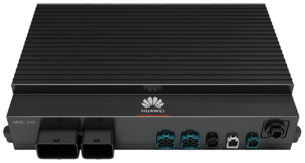
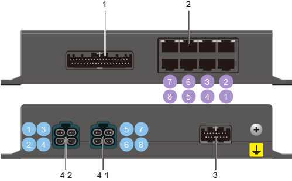
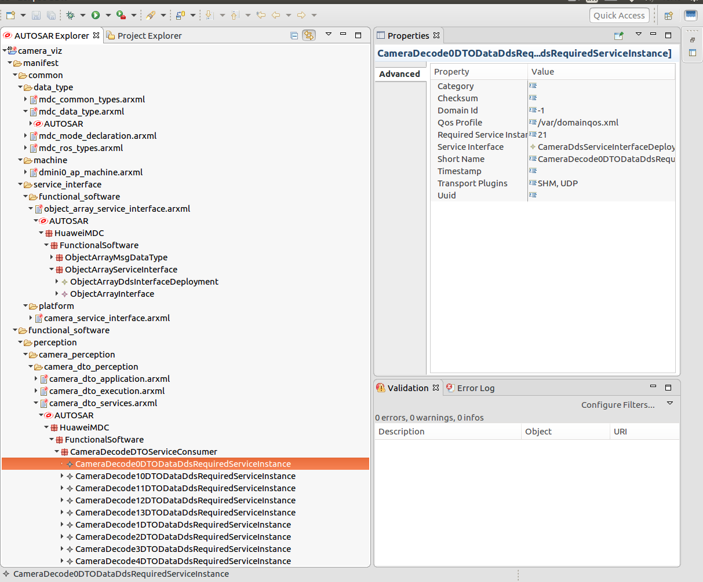
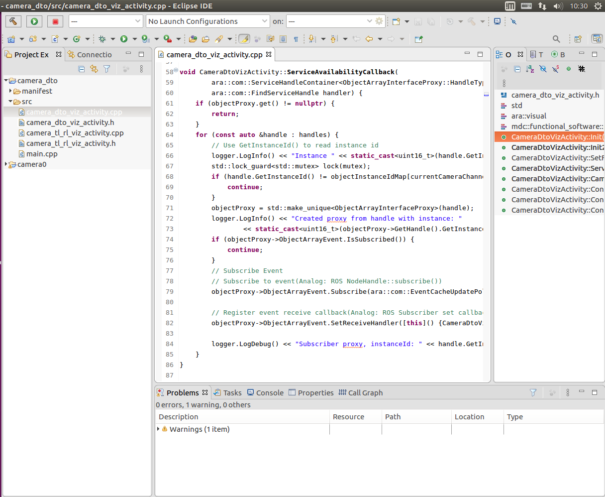
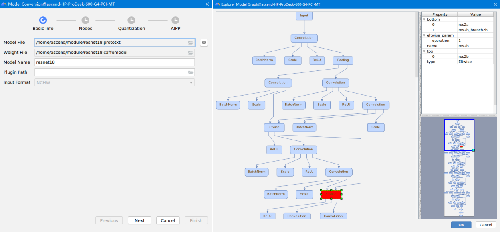

---
@import "nio.less"

id: "nio-id"
# class: "my-class1 my-class2"
title: "passenger-car-ads-api"
author: 
- Binjian Xin 
date: "August 20, 2020"

presentation:
  enableSpeakerNotes: true
  # width: 800px
  # height: 450px
  width: 1600
  height: 900
  shoNotes: true
  output: 
    beamer_presetnation:
      path: ./Exports/autosemo-passenger-car-ads-api.pdf
      toc: true
toc:
  depth_from: 1
  depth_to: 1
  ordered: false
---

<!-- slide data-background-image="./Horizontal-Sea.jpg" -->

华为MDC平台 自动驾驶应用评估
---
[ &nbsp; &emsp; 忻斌健　王凯](#乘用车自动驾驶应用程序接口)
 2020年08月20日 

<!-- slide id="nio-id" -->
[TOC]

<!-- slide id="nio-id"　style="text-align: left;" class="my-class1 my-class2" -->

@import "nio.less"
# 评估目的
- 评估分三个层次
  - 硬件系统：压力测试下芯片负载变化，温度
  - 软件开发集成：软件运行效率和性能，接口可移植性
  - 工具链的使用：易用性，灵活，方便
- 评价芯片性能为主
  - 以深度学习部署为主
  - 使用尽量最新最多样化的网络模型
    - 视觉：
      - 检测(2d, 3d)
      - 语义(分割)
      - 几何(深度)
    - 激光雷达：
      - 检测（点云，禾赛40P）
  - 结合华为标准算法模型和蔚来提供的标准模型（EfficientNet B2, 大尺寸Darknet53模型)
- 实验分台架测试（压力测试）和道路测试两种

<!-- slide id="nio-id" style="text-align: left;" 　data-notes＝"实验证明" class="my-class1 my-class2" -->

# 概要结论－综述
> 通用型深度开发平台，适用处理架构：
> - **感知+融合+追踪**
> - 加速的预处理算子（自带ISP，类OpenCV算子）
> - 可做基于原始数据的（视觉＋点云）前融合 
> - 使用的深度学习模型是2018之前, 最新的深度学习架构是否支持有待研究和实践（注意力层？稀疏算子？）

<!-- slide id="nio-id" style="text-align: left;" 　data-notes＝"实验证明" class="my-class1 my-class2" -->

#　概要结论－优点

- 算力大(16TOPs@INT8 vs. TDA4 8TOPs@INT8; MDC1.0总共64TOPs)
  - 可满负荷稳定**14路视频**同时处理
  - 可同时进行**点云和多路视频**处理
- 主芯片满足高功能安全等级（CPU可锁步执行）
- 成熟的应用开发工具
  - 系统应用集成开发环境易用性好,数据流水搭建较快
  - 符合AP Autosar标准,完整的车规体系认证,接口可移植性高
  - 深度学习开发环境具备方便的导入方式，丰富的调试和诊断工具
  - 提供类似ROS环境的开发调试工具，便于快速入手
- 系统压力测试下稳定输出 (满载情况下负载稳定，处理帧率稳定，温度稳定)
- 通用性好，能支持绝大部分目前成熟的网络类型和应用
- 响应快，FAE支持充分，驱动修改快
  - **蔚来提供的基准模型移植到发现瓶颈算子到提供补丁总共３天（端到端从84ms降低到15ms)**
- 调试工具链较成熟，能较快发现深度神经网络的性能瓶颈

<!-- slide id="nio-id" style="text-align: left;" 　data-notes＝"实验证明" class="my-class1 my-class2" -->
#　概要结论－不足
- 对高分辨率的处理算力有些不够（相对TDA4还是要好很多）
  - 推理的常规分辨率需要把2M输入降采样为640x480
  - 对于1280x960输入图像，需要分两个昇腾处理器，定点化后能运行
  - 现在评估的模型大多是2018年前的，对较新出现的模型和技巧，比如注意力层，稀疏计算等原理上应该支持，移植和优化需要再考察
- 目前尚不直接支持Pytorch模型，对ONNX模型的支持还不完整(更新中)，主要支持Tensorflow 1.x 和Caffe 1.x算子
- ARM主芯片和４片昇腾分立式的结构
  - 不利于数据高速传输和共享
  - MDC2.0的高集成度会解决这个问题
<!-- slide id="nio-id" class="my-class1 my-class2" -->
#　概要结论－建议
- 前期开发可在MDC1.0, 量产建议用MDC2.0, 平台迁移需要适当调整和优化，工作量应该不大;
- MDC适合作为ADAS域控制器芯片，可以容纳感知，融合（包括部分前融合），控制的常规自动驾驶协议栈;
- 可以作为量产项目开发平台，具备比较丰富的开发工具链;平缓的学习曲线，具备一定基础（Tensorflow/Caffe/ONNX, ROS, Autosar)的工程师可以迅速熟悉和掌握;

<!-- slide id="nio-id" -->
[TOC]

<!-- slide id="nio-id" -->
# 硬件和系统 - MDC芯片规格

<!-- 

 -->
|正面|背面|
|--|--|
|||

|鲲鹏920s|昇腾310×４|
|-------|---------|
|核数：12 | 架构：达芬奇|
|主频：2.0GHz|**算力:16TOPS@INT8; 总共64TOPs (vs. TDA4 8TOPs)**|
|制程:7nm FFC|制程:12nm FFC|
|最大功耗: 55w|最大功耗: **8w**|
<!-- slide id="nio-id" font-size=10pt -->
# 硬件和系统 - MDC接口规格

|规格项目 | 参数描述| 备注　|
|--------|---|---|
|车载以太接口	| 提供**8路**车载以太网口100BASE-T1/**1000BASE-T1**  可以根据系统需求配置为   <ul><li>激光雷达</li><li>HMI</li><li>TBOX</li><li>车控信号等接口</li></ul>	|通用以太接口的激光雷达建议通过转接盒进行接口转换 通过普通以太转接盒接入Pandar40p，进行NN推理验证,见路测视频|
|CAN接口|提供12路CAN/CAN-FD接口  可以根据系统需求配置为<ul><li>毫米波雷达</li><li>车控信号（其中1路支持唤醒）</li><li>组合定位等接口</li></ul>| |
|摄像头接口|<ul><li>**提供11路GMSL2的摄像头接口**</li><li>ISP能力可处理**4路4K视频**</li><li>支持Raw Data输入</li></ul>|11路1080p满配接入 实验室内和路测都已验证|
|RS232串口|提供2路RS232串口<ul><li>GPS/IMU/组合定位解算数据接入</li><li>输出给激光雷达（或者转接盒）的时间同步信号</li><ul>|	|
|PPS输入|<ul><li>支持1路PPS信号</li><li>可接受电平范围为3.3V~12V</ul></li>||
|PPS输出|提供1路12V的PPS信号输出||

<!-- slide id="nio-id" -->
[TOC]

<!-- slide id="nio-id" class="my-class1 my-class2" -->
# 软件运行性能和效率

<!-- slide id="nio-id" class="my-class1 my-class2" -->
# 工具链评估 - AP Autosar 配置环境　  MDC Manifest Configurator
<!-- |工具|评价|
|--|--| -->
 <ul><li>需要了解AP/CP AutoSAR知识</li><li>界面化操作相对容易，接口定义和维护难度低</li><li>依赖界面操作，接口的代码转换比较固化</li><li>版本维护和协同开发操作难度相对高一些</li></ul>

<!-- slide id="nio-id" class="my-class1 my-class2" -->
# 工具链评估 - AP Autosar 开发环境　  MDC Development Studio
<!-- |工具|评价|
|--|--| -->
<ul><li>工程项目化管理，支持界面维护操作</li><li>界面化操作相对容易，接口定义和维护难度低</li><li>支持打印输出与单步断点运行，调试方式友好</li><li>依赖界面，远程调试与协同调试难度较高</li></ul>

<!-- slide id="nio-id" class="my-class1 my-class2" -->
# 工具链评估 - 深度学习开发环境 Mind Studio
<!-- |工具|评价|
|--|--| -->
<ul><li>提供模型的分析与转换，将现有模型转换为MDC支持的模型</li><li>提供算子比对工具是为了定位模型的精度问题，比对华为自有模型算子的运算结果与Caffe标准算子的运算结果，以便确认误差发生的原因</li><li>Lower Bound比对，华为自主研发的算法比对</li><li>Vector比对，包含余弦相似度、最大绝对误差、累积相对误差、欧氏相对距离的算法比对
</li></ul>

<!-- slide id="nio-id" class="my-class1 my-class2" -->
# 道路测试
- 安装在蔚来ES8上,原则上替代工控机
  - 11路摄像头安装在前挡风玻璃后
  - 输入禾赛Pandar 40P
  - RTK
- 选择NIO_CAB测试道路，涵盖常见场景
- 多任务并行
  - 视觉检测
  - 视觉语义分割
  - 激光雷达点云检测
  - 视觉检测11路接口满负荷运行

<!-- slide id="nio-id" class="my-class1 my-class2" -->
# 并行视频与激光雷达深度学习推理
<!-- 
!video[点云与图像处理](001.mp4) -->
<!--  -->

<!-- slide id="nio-id" class="my-class1 my-class2" -->
# 并行11路视频满载深度学习推理－白天

(**显示帧率低是因上位机解码能力不够造成,与MDC处理能力无关，MDC内部满负荷时处理帧率稳定实时，参见性能评估)

<!-- slide id="nio-id" class="my-class1 my-class2" -->
# 并行11路视频满载深度学习推理－夜晚

(**显示帧率低是因上位机解码能力不够造成,与MDC处理能力无关，MDC内部满负荷帧率稳定实时，参见性能评估)

<!-- slide data-background-image="./Horizontal-Sunrise.jpg" -->
谢谢！