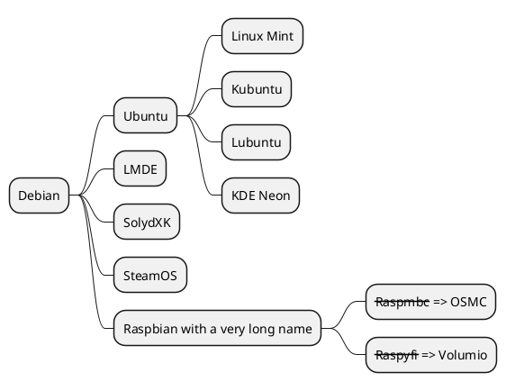
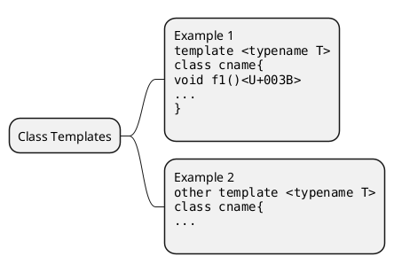
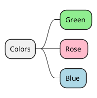
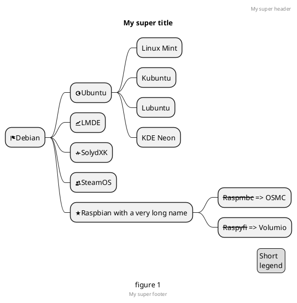

```plantuml
@startmindmap
* Debian
** Ubuntu
*** Linux Mint
*** Kubuntu
*** Lubuntu
*** KDE Neon
** LMDE
** SolydXK
** SteamOS
** Raspbian with a very long name
*** <s>Raspmbc</s> => OSMC
*** <s>Raspyfi</s> => Volumio
@endmindmap
```

```plantuml
@startmindmap
* Class Templates
**:Example 1
<code>
template <typename T>
class cname{
void f1()<U+003B>
...
}
</code>
;
**:Example 2
<code>
other template <typename T>
class cname{
...
</code>
;
@endmindmap
```

```plantuml
@startmindmap
<style>
mindmapDiagram {
  .green {
    BackgroundColor lightgreen
  }
  .rose {
    BackgroundColor #FFBBCC
  }
  .your_style_name {
    BackgroundColor lightblue
  }
}
</style>
* Colors
** Green <<green>>
** Rose <<rose>>
** Blue <<your_style_name>>
@endmindmap

```

```plantuml

@startmindmap
caption figure 1
title My super title

* <&flag>Debian
** <&globe>Ubuntu
*** Linux Mint
*** Kubuntu
*** Lubuntu
*** KDE Neon
** <&graph>LMDE
** <&pulse>SolydXK
** <&people>SteamOS
** <&star>Raspbian with a very long name
*** <s>Raspmbc</s> => OSMC
*** <s>Raspyfi</s> => Volumio

header
My super header
endheader

center footer My super footer

legend right
  Short
  legend
endlegend

@endmindmap

```