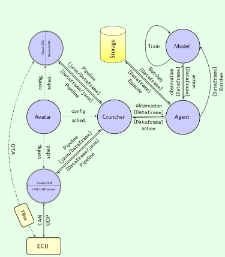

# neuro-r 机器人深度强化学习计算框架

<!-- WARNING: THIS FILE WAS AUTOGENERATED! DO NOT EDIT! -->

# 概述

**neuro-r** 是一个用于机器人深度强化学习的数据管道框架，具有IO接口、处理和配置功能。当前的代码库描述了一个机器人系统的实现。系统的目标是通过基于对环境，自身运动和位姿状态的观察（状态），即速度、加速度、自身位姿，机器人特定任务规划，运动规划，以完成特定任务。主要功能包括：

- 支持训练和推理模式，支持
  - 协调的[ETL](https://en.wikipedia.org/wiki/Extract,_transform,_load)和ML管道，
  - 在线和离线训练，
  - 本地和分布式训练；
- 支持多种模型：
  - 使用DDPG,TD3,SAC等强化学习模型和
  - 用于任意长度时间序列的递归模型（RDPG等）；
  - 使用“隐式扩散Q学习”（IDQ）的离线强化学习；
- 数据管道兼容ETL和ML数据流，支持
  - 多种数据源（本地CAN或远程云对象存储），
  - 使用序列模型的有状态时间序列处理和
  - 支持NoSQL数据库、本地和云数据存储。

该图显示了**neuro-r**的基本架构。

# [`Avatar`](https://Binjian.github.io/tspace/00.avatar.html#avatar)

它是`neuro-r`的入口点。它协调整个ETL和ML工作流。

- 它配置KvaserCAN、RemoteCAN、Cruncher、Agent、Model、Database、Pipeline。
- 它管理在[`tspace.avatar.main`](https://Binjian.github.io/tspace/00.avatar.html#main)中级联线程池第一层的两个主要线程的调度。
- 它选择**KvaserCAN**或**RemoteCAN**作为车辆接口以读取观察数据并应用动作。

# KvaserCAN

它通过[`Kvaser`](https://Binjian.github.io/tspace/06.dataflow.kvaser.html#kvaser)实现，提供了

- 一个本地接口，通过Kvaser使用[`udp_context`](https://Binjian.github.io/tspace/04.conn.udp.html#udp_context)读取观察数据（车辆状态的CAN消息），从本地udp服务器获取CAN消息作为json数据。然后它将原始json数据编码为[pandas.DataFrame](https://pandas.pydata.org/docs/reference/api/pandas.DataFrame.html)，以便通过数据管道转发到[`Cruncher`](https://Binjian.github.io/tspace/06.dataflow.cruncher.html#cruncher)。

- 它提供了一个本地接口，用于将动作（闪存参数）应用到车辆ECU（VCU）上。在发送动作之前，它将动作从[pandas.DataFrame](https://pandas.pydata.org/docs/reference/api/pandas.DataFrame.html)解码为打包的字符串缓冲区，然后通过调用[`VehicleInterface.consume`](https://Binjian.github.io/tspace/06.dataflow.vehicle_interface.html#vehicleinterface.consume)中的[`send_float_array`](https://Binjian.github.io/tspace/04.conn.tbox.html#send_float_array)将其发送到ECU。

- 训练HMI的控制消息通过相同的UDP端口。它们用于修改线程事件，以控制带有[`VehicleInterface.hmi_control`](https://Binjian.github.io/tspace/06.dataflow.vehicle_interface.html#vehicleinterface.hmi_control)的情节训练过程。

# RemoteCAN

它通过云上的对象存储系统提供了一个远程接口给车辆，由车载TBox发送。它通过[`Cloud`](https://Binjian.github.io/tspace/06.dataflow.cloud.html#cloud)实现：

- 它通过[`RemoteCanClient.get_signals`](https://Binjian.github.io/tspace/04.conn.remote_can_client.html#remotecanclient.get_signals)从云对象存储系统读取观察数据（车辆状态的CAN消息）。然后它将原始json数据编码为[pandas.DataFrame](https://pandas.pydata.org/docs/reference/api/pandas.DataFrame.html)，并通过数据管道转发到[`Cruncher`](https://Binjian.github.io/tspace/06.dataflow.cruncher.html#cruncher)。

- 它通过调用[`RemoteCanClient.send_torque_map`](https://Binjian.github.io/tspace/04.conn.remote_can_client.html#remotecanclient.send_torque_map)将动作（闪存参数）发送到车辆ECU（VCU）中，该方法将动作从[pandas.DataFrame](https://pandas.pydata.org/docs/reference/api/pandas.DataFrame.html)解码为原始json字符串。

- 它选择训练HMI以获取车辆和驾驶员信息作为配置，使用[`Cloud.hmi_capture_from_udp`](https://Binjian.github.io/tspace/06.dataflow.cloud.html#cloud.hmi_capture_from_udp)用于本地udp服务器，使用[`Cloud.hmi_capture_from_rmq`](https://Binjian.github.io/tspace/06.dataflow.cloud.html#cloud.hmi_capture_from_rmq)用于远程RocketMQ服务器，使用[`Cloud.hmi_capture_from_dummy`](https://Binjian.github.io/tspace/06.dataflow.cloud.html#cloud.hmi_capture_from_dummy)用于纯推理模式而不进行训练或更新模型。它与**KvaserCAN**共享相同的控制逻辑[`VehicleInterface.hmi_control`](https://Binjian.github.io/tspace/06.dataflow.vehicle_interface.html#vehicleinterface.hmi_control)。

# Cruncher

它是数据管道的主要枢纽，用于预处理观察和后处理动作：

- [`Cruncher.filter`](https://Binjian.github.io/tspace/06.dataflow.cruncher.html#cruncher.filter)通过数据管道从**KvaserCAN**或**RemoteCAN**接收观察数据。它将输入数据预处理为带有时间戳的四元组$(timestamp, state, action, reward, state')$，并将其提供给强化**Agent**[`DPG`](https://Binjian.github.io/tspace/07.agent.dpg.html#dpg)，随后是其子类[`DDPG`](https://Binjian.github.io/tspace/07.agent.ddpg.html#ddpg)或[`RDPG`](https://Binjian.github.io/tspace/07.agent.rdpg.rdpg.html#rdpg)，以推断由其当前策略确定的最佳动作。在获得代理的预测后，它将预测结果编码为动作对象并转发给[`VehicleInterface.consume`](https://Binjian.github.io/tspace/06.dataflow.vehicle_interface.html#vehicleinterface.consume)以闪存到VCU上。

- 它收集每个情节的评论家、演员损失、总奖励、运行奖励和动作。在情节结束时。它还会在本地保存模型检查点和训练日志。

# Agent

它为强化学习模型提供了一个[`DPG`](https://Binjian.github.io/tspace/07.agent.dpg.html#dpg)的包装器：

- 它有一个数据存储接口：

  - 从[`Avatar`](https://Binjian.github.io/tspace/00.avatar.html#avatar)检索观察元信息和数据库配置，

  - 初始化仓库接口[`Buffer`](https://Binjian.github.io/tspace/05.storage.buffer.buffer.html#buffer)，随后是[`MongoBuffer`](https://Binjian.github.io/tspace/05.storage.buffer.mongo.html#mongobuffer)或[`DaskBuffer`](https://Binjian.github.io/tspace/05.storage.buffer.dask.html#daskbuffer)，然后分别通过[`MongoPool`](https://Binjian.github.io/tspace/05.storage.pool.mongo.html#mongopool)或[`DaskPool`](https://Binjian.github.io/tspace/05.storage.pool.dask.html#daskpool)初始化数据库连接。

- 它将观察数据传输到神经网络：

  - 初始化情节状态，

  - 定义抽象方法[`DPG.actor_predict`](https://Binjian.github.io/tspace/07.agent.dpg.html#dpg.actor_predict)，[`DPG.train`](https://Binjian.github.io/tspace/07.agent.dpg.html#dpg.train)，[`DPG.get_losses`](https://Binjian.github.io/tspace/07.agent.dpg.html#dpg.get_losses)，[`DPG.soft_update_target`](https://Binjian.github.io/tspace/07.agent.dpg.html#dpg.soft_update_target)，[`DPG.init_checkpoint`](https://Binjian.github.io/tspace/07.agent.dpg.html#dpg.init_checkpoint)，[`DPG.save_ckpt`](https://Binjian.github.io/tspace/07.agent.dpg.html#dpg.save_ckpt)，[`DPG.touch_gpu`](https://Binjian.github.io/tspace/07.agent.dpg.html#dpg.touch_gpu)以便在子类[`DDPG`](https://Binjian.github.io/tspace/07.agent.ddpg.html#ddpg)和[`RDPG`](https://Binjian.github.io/tspace/07.agent.rdpg.rdpg.html#rdpg)中进行具体实现，

  - 提供具体方法[`DPG.start_episode`](https://Binjian.github.io/tspace/07.agent.dpg.html#dpg.start_episode)，[`DPG.end_episode`](https://Binjian.github.io/tspace/07.agent.dpg.html#dpg.end_episode)，[`DPG.deposit`](https://Binjian.github.io/tspace/07.agent.dpg.html#dpg.deposit)，[`DPG.deposit_episode`](https://Binjian.github.io/tspace/07.agent.dpg.html#dpg.deposit_episode)。

  - [`DPG.touch_gpu`](https://Binjian.github.io/tspace/07.agent.dpg.html#dpg.touch_gpu)用于在开始推理之前预热GPU。

## [`DDPG`](https://Binjian.github.io/tspace/07.agent.ddpg.html#ddpg)

- 提供创建、加载或初始化[深度确定性策略梯度](https://arxiv.org/abs/1509.02971) **模型**的方法，或恢复检查点到它。它还导出tflite模型。
- 它为[`DPG`](https://Binjian.github.io/tspace/07.agent.dpg.html#dpg)接口中的抽象方法提供具体实现。
- [`DDPG.infer_single_sample`](https://Binjian.github.io/tspace/07.agent.ddpg.html#ddpg.infer_single_sample)是通过[tf.function](https://www.tensorflow.org/guide/function)进行图优化的推理方法。
- [`DDPG.sample_minibatch`](https://Binjian.github.io/tspace/07.agent.ddpg.html#ddpg.sample_minibatch)提供了一个从缓冲区中采样的小批量。当缓冲区为空时，它会处理引导，因此在第一个情节尚未结束时[`Buffer`](https://Binjian.github.io/tspace/05.storage.buffer.buffer.html#buffer)中没有样本。
- [`DDPG.update_with_batch`](https://Binjian.github.io/tspace/07.agent.ddpg.html#ddpg.update_with_batch)在[`DDPG.train`](https://Binjian.github.io/tspace/07.agent.ddpg.html#ddpg.train)期间强制进行反向传播并应用权重更新到演员和评论家网络。

## [`RDPG`](https://Binjian.github.io/tspace/07.agent.rdpg.rdpg.html#rdpg)

- 提供创建、加载或初始化[递归确定性策略梯度](https://arxiv.org/abs/1512.04455) **模型**的方法，或恢复检查点到它。
- 它为[`DPG`](https://Binjian.github.io/tspace/07.agent.dpg.html#dpg)接口中的抽象方法提供具体实现。
- [`RDPG.actor_predict_step`](https://Binjian.github.io/tspace/07.agent.rdpg.rdpg.html#rdpg.actor_predict_step)是通过[tf.function](https://www.tensorflow.org/guide/function)进行图优化的推理方法。
- [`RDPG.train_step`](https://Binjian.github.io/tspace/07.agent.rdpg.rdpg.html#rdpg.train_step)是通过[tf.function](https://www.tensorflow.org/guide/function)进行图优化的训练方法。它还应用权重更新到演员和评论家网络。
- [`RDPG.train`](https://Binjian.github.io/tspace/07.agent.rdpg.rdpg.html#rdpg.train)从缓冲区中采样不同长度的情节的破碎小批量。它可以通过时间截断反向传播（TBPTT）处理任意长度时间序列的训练，通过分割情节并循环遍历子序列与掩码层一起更新权重[`RDPG.train_step`](https://Binjian.github.io/tspace/07.agent.rdpg.rdpg.html#rdpg.train_step)。

## [`IDQL`](https://Binjian.github.io/tspace/07.agent.idql.html#idql)

- 提供创建和初始化[隐式扩散Q学习](https://arxiv.org/abs/2304.10573) **模型**的方法。
- 模型的实现基于使用Jax和Flax接口的[jaxrl5](https://github.com/philippe-eecs/IDQL/blob/main/jaxrl5/agents/ddpm_iql/ddpm_iql_learner.py)仓库。
- 它为[`DPG`](https://Binjian.github.io/tspace/07.agent.dpg.html#dpg)接口中的抽象方法提供具体实现。
- [`IDQL.actor_predict`](https://Binjian.github.io/tspace/07.agent.idql.html#idql.actor_predict)是推理方法。
- [`IDQL.train`](https://Binjian.github.io/tspace/07.agent.idql.html#idql.train)是训练方法。Jaxrl5负责演员、评论家和价值网络的权重更新。它从缓冲区中采样一个包含（状态、动作、奖励、下一个状态）元组的小批量。

# Model

这是强化学习代理的神经网络模型。目前它仅为[`RDPG`](https://Binjian.github.io/tspace/07.agent.rdpg.rdpg.html#rdpg)在[`SeqActor`](https://Binjian.github.io/tspace/07.agent.rdpg.actor.html#seqactor)和[`SeqCritic`](https://Binjian.github.io/tspace/07.agent.rdpg.critic.html#seqcritic)中实现。

## [`SeqActor`](https://Binjian.github.io/tspace/07.agent.rdpg.actor.html#seqactor)

这是一个具有两个递归LSTM层、两个密集层和一个用于处理不规则输入序列的掩码层的演员网络。

- [`SeqActor.predict`](https://Binjian.github.io/tspace/07.agent.rdpg.actor.html#seqactor.predict)在给定状态下输出动作用于推理，因此批次维度必须为1。
- [`SeqActor.evaluate_actions`](https://Binjian.github.io/tspace/07.agent.rdpg.actor.html#seqactor.evaluate_actions)在给定一批状态下输出动作用于训练。它在训练循环中用于获取目标演员网络的预测以计算评论家损失。
- 它通过掩码层和有状态递归层处理不规则输入序列以进行TBPTT。
- 对于推理，不使用[`SeqCritic`](https://Binjian.github.io/tspace/07.agent.rdpg.critic.html#seqcritic)，只需要[`SeqActor`](https://Binjian.github.io/tspace/07.agent.rdpg.actor.html#seqactor)。

## [`SeqCritic`](https://Binjian.github.io/tspace/07.agent.rdpg.critic.html#seqcritic)

这是一个具有两个递归LSTM层、两个密集层和一个用于处理不规则输入序列的掩码层的评论家网络。

- [`SeqCritic.evaluate_q`](https://Binjian.github.io/tspace/07.agent.rdpg.critic.html#seqcritic.evaluate_q)在给定一批状态和动作时给出Q值。它在训练循环[`RDPG.train_step`](https://Binjian.github.io/tspace/07.agent.rdpg.rdpg.html#rdpg.train_step)中用于计算评论家和演员损失。

# Storage

表示存储库模式中的数据存储，具有两个多态抽象层[`Buffer`](https://Binjian.github.io/tspace/05.storage.buffer.buffer.html#buffer)和[`Pool`](https://Binjian.github.io/tspace/05.storage.pool.pool.html#pool)。

## [`Buffer`](https://Binjian.github.io/tspace/05.storage.buffer.buffer.html#buffer)

是一个抽象类。它为代理提供了数据存储的视图：

- **Agent**使用抽象方法[`Buffer.load`](https://Binjian.github.io/tspace/05.storage.buffer.buffer.html#buffer.load)，`Buffer.save`和[`Buffer.close`](https://Binjian.github.io/tspace/05.storage.buffer.buffer.html#buffer.close)从[`Pool`](https://Binjian.github.io/tspace/05.storage.pool.pool.html#pool)加载或保存数据，并关闭与[`Pool`](https://Binjian.github.io/tspace/05.storage.pool.pool.html#pool)的连接。
- 抽象方法[`Buffer.sample`](https://Binjian.github.io/tspace/05.storage.buffer.buffer.html#buffer.sample)从[`Pool`](https://Binjian.github.io/tspace/05.storage.pool.pool.html#pool)中采样一个小批量。它需要[`Buffer`](https://Binjian.github.io/tspace/05.storage.buffer.buffer.html#buffer)的子类来实现具体的高效采样方法，这取决于底层的数据存储系统。
- 具体方法[`Buffer.store`](https://Binjian.github.io/tspace/05.storage.buffer.buffer.html#buffer.store)将整个情节数据存储到[`Pool`](https://Binjian.github.io/tspace/05.storage.pool.pool.html#pool)中。
- 具体方法[`Buffer.find`](https://Binjian.github.io/tspace/05.storage.buffer.buffer.html#buffer.find)简单地调用[`Pool.find`](https://Binjian.github.io/tspace/05.storage.pool.pool.html#pool.find)以使用给定的查询查找数据。

### [`MongoBuffer`](https://Binjian.github.io/tspace/05.storage.buffer.mongo.html#mongobuffer)

这是一个用于底层NoSQL数据库MongoDB的具体类。

- 它实现了[`Buffer`](https://Binjian.github.io/tspace/05.storage.buffer.buffer.html#buffer)接口所需的抽象方法。
- [`MongoBuffer.decode_batch_records`](https://Binjian.github.io/tspace/05.storage.buffer.mongo.html#mongobuffer.decode_batch_records)将来自[`MongoPool`](https://Binjian.github.io/tspace/05.storage.pool.mongo.html#mongopool)的样本批数据准备为符合代理训练的格式。
- 它可以处理DDPG记录数据类型和RDPG情节数据类型。

### [`DaskBuffer`](https://Binjian.github.io/tspace/05.storage.buffer.dask.html#daskbuffer)

这是一个用于分布式数据存储系统Dask的具体类。

- 它实现了[`Buffer`](https://Binjian.github.io/tspace/05.storage.buffer.buffer.html#buffer)接口所需的抽象方法。
- [`DaskBuffer.decode_batch_records`](https://Binjian.github.io/tspace/05.storage.buffer.dask.html#daskbuffer.decode_batch_records)将来自[`DaskPool`](https://Binjian.github.io/tspace/05.storage.pool.dask.html#daskpool)的样本批数据准备为符合代理训练的格式。
- 它可以处理DDPG记录数据类型和RDPG情节数据类型。

## [`Pool`](https://Binjian.github.io/tspace/05.storage.pool.pool.html#pool)

是一个抽象类。它是底层数据存储的接口。目前，它通过[`MongoPool`](https://Binjian.github.io/tspace/05.storage.pool.mongo.html#mongopool)和[`DaskPool`](https://Binjian.github.io/tspace/05.storage.pool.dask.html#daskpool)实现

### [`MongoPool`](https://Binjian.github.io/tspace/05.storage.pool.mongo.html#mongopool)

这是一个用于底层NoSQL数据库MongoDB的具体类，支持时间序列。它使用MongoDB集合功能处理记录数据类型和情节数据类型。

- 它通过[pymongo](https://pymongo.readthedocs.io/en/stable)库提供与MongoDB数据库的接口。
- 它实现了[`Pool`](https://Binjian.github.io/tspace/05.storage.pool.pool.html#pool)接口所需的抽象方法。
- [`MongoPool.store_record`](https://Binjian.github.io/tspace/05.storage.pool.mongo.html#mongopool.store_record)将记录数据存储到MongoDB数据库中，用于[`DDPG`](https://Binjian.github.io/tspace/07.agent.ddpg.html#ddpg)代理。
- [`MongoPool.store_episode`](https://Binjian.github.io/tspace/05.storage.pool.mongo.html#mongopool.store_episode)将情节数据存储到MongoDB数据库中，用于[`RDPG`](https://Binjian.github.io/tspace/07.agent.rdpg.rdpg.html#rdpg)代理。

### [`DaskPool`](https://Binjian.github.io/tspace/05.storage.pool.dask.html#daskpool)

这是一个用于分布式数据存储系统Dask的抽象类，因为我们必须使用不同的后端：Parquet用于记录数据类型，avro用于情节数据类型。

- 它通过[dask](https://dask.org)库支持本地文件存储和远程对象存储。
- 它定义了[`Pool`](https://Binjian.github.io/tspace/05.storage.pool.pool.html#pool)接口所需的抽象方法的通用数据类型。具体类可以将通用数据类型专门化为记录数据类型的dask.DataFrame或情节数据类型的dask.Bag。

#### [`ParquetPool`](https://Binjian.github.io/tspace/05.storage.pool.parquet.html#parquetpool)

这是一个用于记录数据类型的具体类，使用Parquet文件格式作为后端存储。

- 它实现了[`DaskPool`](https://Binjian.github.io/tspace/05.storage.pool.dask.html#daskpool)接口和[`Pool`](https://Binjian.github.io/tspace/05.storage.pool.pool.html#pool)所需的抽象方法。
- [`ParquetPool.sample`](https://Binjian.github.io/tspace/05.storage.pool.parquet.html#parquetpool.sample)通过Dask.DataFrame为本地或远程的Parquet存储提供高效的统一采样接口。
- [`ParquetPool.get_query`](https://Binjian.github.io/tspace/05.storage.pool.parquet.html#parquetpool.get_query)通过Dask索引为[`ParquetPool.sample`](https://Binjian.github.io/tspace/05.storage.pool.parquet.html#parquetpool.sample)方法提供查询对象。

#### [`AvroPool`](https://Binjian.github.io/tspace/05.storage.pool.avro.avro.html#avropool)

这是一个用于情节数据类型的具体类，使用avro文件格式作为后端存储。

- 它实现了[`DaskPool`](https://Binjian.github.io/tspace/05.storage.pool.dask.html#daskpool)接口和[`Pool`](https://Binjian.github.io/tspace/05.storage.pool.pool.html#pool)所需的抽象方法。
- [`AvroPool.sample`](https://Binjian.github.io/tspace/05.storage.pool.avro.avro.html#avropool.sample)通过Dask.Bag为本地或远程的avro存储提供高效的统一采样接口。
- [`AvroPool.get_query`](https://Binjian.github.io/tspace/05.storage.pool.avro.avro.html#avropool.get_query)通过Dask索引为[`AvroPool.sample`](https://Binjian.github.io/tspace/05.storage.pool.avro.avro.html#avropool.sample)方法提供查询对象。

# 配置

提供了**neuro-r**框架配置的所有类。它们大多数作为观察数据的元信息，用于后续的索引或分组以实现高效采样。包括：

- [`Truck`](https://Binjian.github.io/tspace/03.config.vehicles.html#truck)及其子类[`TruckInCloud`](https://Binjian.github.io/tspace/03.config.vehicles.html#truckincloud)和[`TruckInField`](https://Binjian.github.io/tspace/03.config.vehicles.html#truckinfield)，使用混入[`TboxMixin`](https://Binjian.github.io/tspace/03.config.vehicles.html#tboxmixin)和[`KvaserMixin`](https://Binjian.github.io/tspace/03.config.vehicles.html#kvasermixin)提供不同的接口。它提供了一个托管的卡车列表和两个字典以便快速访问卡车配置；
- [`Driver`](https://Binjian.github.io/tspace/03.config.drivers.html#driver)具有存储在观察数据元信息中的属性；
- `TripMessenger`用于不同的HMI输入源；
- `CANMessenger`用于不同的CAN消息源；
- `DBConfig`用于管理数据库配置；

# 任务调度

ETL和ML训练与推理的调度在两个级联线程池中进行。

## 主线程池

由[`Avatar`](https://Binjian.github.io/tspace/00.avatar.html#avatar)管理，在[`tspace.avatar.main`](https://Binjian.github.io/tspace/00.avatar.html#main)中有两个主线程：

- 第一个主线程用于数据捕获
- 第二个主线程用于训练和推理

## 数据捕获线程

调用[`VehicleInterface.ignite`](https://Binjian.github.io/tspace/06.dataflow.vehicle_interface.html#vehicleinterface.ignite)，它由[`Kvaser`](https://Binjian.github.io/tspace/06.dataflow.kvaser.html#kvaser)和[`Cloud`](https://Binjian.github.io/tspace/06.dataflow.cloud.html#cloud)共享。它只是启动一个包含六个线程的次级线程池：

- [`VehicleInterface.produce`](https://Binjian.github.io/tspace/06.dataflow.vehicle_interface.html#vehicleinterface.produce)从本地UDP服务器（如[`Kvaser`](https://Binjian.github.io/tspace/06.dataflow.kvaser.html#kvaser)）或远程云对象存储（如[`Cloud`](https://Binjian.github.io/tspace/06.dataflow.cloud.html#cloud)）获取原始数据并将其转发到原始数据管道。在[`Kvaser`](https://Binjian.github.io/tspace/06.dataflow.kvaser.html#kvaser)的情况下，它还从同一个UDP服务器获取训练HMI控制消息并将其放入HMI数据管道。
- [`VehicleInterface.hmi_control`](https://Binjian.github.io/tspace/06.dataflow.vehicle_interface.html#vehicleinterface.hmi_control)管理情节状态机以控制训练和推理过程。
- [`VehicleInterface.countdown`](https://Binjian.github.io/tspace/06.dataflow.vehicle_interface.html#vehicleinterface.countdown)处理情节结束，使用倒计时计时器同步数据捕获与情节结束事件对齐。
- [`VehicleInterface.filter`](https://Binjian.github.io/tspace/06.dataflow.vehicle_interface.html#vehicleinterface.filter)将原始输入json对象转换为pandas.DataFrame并将其转发到[`Cruncher.filter`](https://Binjian.github.io/tspace/06.dataflow.cruncher.html#cruncher.filter)线程的输入数据管道。
- [`VehicleInterface.consume`](https://Binjian.github.io/tspace/06.dataflow.vehicle_interface.html#vehicleinterface.consume)负责从[`Cruncher.filter`](https://Binjian.github.io/tspace/06.dataflow.cruncher.html#cruncher.filter)线程的输出数据管道中获取动作对象并将其闪存到车辆ECU（VCU）上。
- [`VehicleInterface.watch_dog`](https://Binjian.github.io/tspace/06.dataflow.vehicle_interface.html#vehicleinterface.watch_dog)提供一个看门狗来监控数据捕获过程和训练过程的健康状况。如果观察或动作质量低于阈值，它会触发系统停止。

## 模型训练和推理线程

调用[`Cruncher.filter`](https://Binjian.github.io/tspace/06.dataflow.cruncher.html#cruncher.filter)。**重要的是，该线程中的所有处理都是同步进行的，以保持时间序列的顺序，从而保持观察和动作的因果关系。**

- 它通过输入管道获取数据，并将数据委托给代理进行训练或推理。
- 在从代理获取预测结果后，它将预测结果编码为动作对象，并通过输出管道转发到[`VehicleInterface.consume`](https://Binjian.github.io/tspace/06.dataflow.vehicle_interface.html#vehicleinterface.consume)以将其闪存到VCU上。
- 它还控制训练循环、推理循环，并管理训练日志和模型检查点。
- 该线程通过预定义的`threading.Event`与次级线程池中的线程同步：`start_event`、`stop_event`、`flash_event`、`interrupt_event`和`exit_event`。