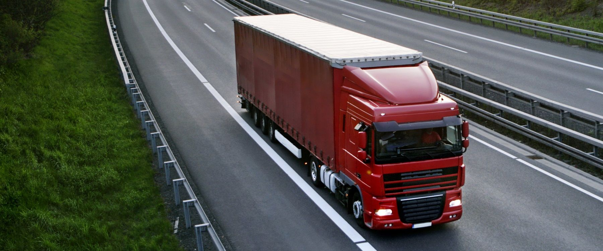
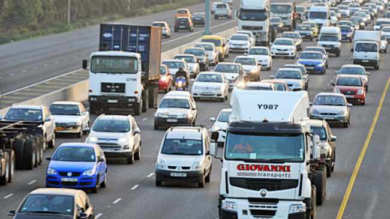
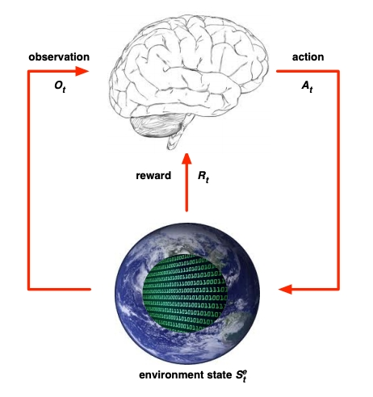

---
@import "newrizon.less"

id: "newrizon-id"
# class: "my-class1 my-class2"
title: "freight-data-analysis-optimization"
author: 
- Binjian Xin 
date: "April 22, 2021"

presentation:
  enableSpeakerNotes: true
  # width: 800px
  # height: 450px
  width: 1600
  height: 900
  shoNotes: true
  output: 
    beamer_presetnation:
      path: ./Exports/freight-data-analysis-optimization.pdf
      toc: true
toc:
  depth_from: 1
  depth_to: 1
  ordered: false
---

<!-- slide data-background-image="./Horizontal-Sea.jpg" -->

VEOS分析及优化
---
[ &nbsp; &emsp; 忻斌健](#VEOS分析及优化)
 2021年04月22日 

<!-- slide id="newrizon-id" -->
[TOC]

<!-- slide id="newrizon-id"　style="text-align: left;" class="my-class1 my-class2" -->

@import "newrizon.less"
# 货运规划场景
|卡车|路线|
|--|--|
|||
- 单车将货物从 A --> B（行程Trip有始有终的事件episodic） 
- 目标：快，安全，**经济（节能）**
- VEOS：
    - 纵向：结合车辆动态实时调整动力控制
    - 横向：司机/ADAS

<!-- slide id="newrizon-id"　style="text-align: left;" class="my-class1 my-class2" -->

# 模型特点

> - **随机**过程：
    - 状态，决策都是随机分布
    - 随机分布未知
> - 非平稳过程：
    - 环境非平稳，有突发事件
    - 策略优化过程导致策略非平稳
> - 时间序列：非 iid 分布，前后帧高度相关（数据方差大，学习收敛慢）

高维度环境$\rightarrow$无法使用基于规则方法：无法建模或者建模精度不够
非稳态随机过程$\rightarrow$不能使用模仿学习/监督学习

<!-- slide id="newrizon-id"　style="text-align: left;" class="my-class1 my-class2" -->
# 车辆动态场景 - 动态规划问题
|||||
|--|--|--|--|
|||||
- 系统状态 [state]
  - 其他交通参与者：其他车辆，行人 
  - 实时路况：拥堵，交通灯，潮汐车道
  - 道路属性：长度，曲率，坡度（地面/高架）
  - 实时位置，驾驶风格，载重
- 观测  [observation]
  - 车辆运动状态 $\longrightarrow$ $[v_t,a_t]_0^T$ 
  - 环境 $\longrightarrow$ 驾驶员油门踏板输入 $[pedal_t]_0^T$ 
- 决策 [action] $\longrightarrow$ 根据动态观测修改标定表  $[Calib\_Table_{（i,j）}]_{(0,0)}^{(M,N)} $

<!-- slide id="newrizon-id"　 class="my-class1 my-class2" -->
# 强化学习的特点
- 通过与环境交互学习最优策略（基于大数据）
- 积累经验（缓存在状态/行动价值函数中）
- 可以是无模型或动态建模
- 可以是在线算法
- 动态调整策略
- 适应部分可观测环境
- 适用非平稳随机过程
- 适应高维度环境，连续状态空间

<!-- slide id="newrizon-id" class="my-class1 my-class2" -->

# 建模

<ul><li>Agent: 主体，智能体/控制器,<b>系统</b></li><li>环境：客体，交互对象（产生观测量和奖励，接收行动）</li><li>信号：观测，行动，奖励</li></ul>

**SARP$\gamma$**
- **S**tate: 系统状态，对观测的最小充分描述（马尔可夫决策过程,当前的状态描述），环境状态（真实环境的全知模型）
- **A**ction: 行动 （加速度，刹车，转向，导航决策...)
- **R**eward：即时奖励（加权：车速，正标量；能耗，负标量）
- **P**robability： （Transition Probabiltiy）状态迁移概率，描述系统动态
- $\gamma$：即时奖励的时间折扣系数

<!-- slide id="newrizon-id" class="my-class1 my-class2" -->

# 商用车货运模型

<ul><li>Agent: 主体, 系统 ,<b>卡车</b></li><li>环境：客体，<b>道路+车辆状态</b></li><li>信号：观测，行动，奖励</li></ul>

$\Rightarrow$ **SARP**$\gamma$模型?

<!-- slide id="newrizon-id" style="text-align: left;"  class="my-class1 my-class2" -->

# 实现模型
**SARP$\gamma$**
- **S**tate: 系统状态（车辆运动状态+驾驶员油门输入）对观测的最小充分描述
- **A**ction: 行动 （修改VCU标定表)，**策略参数化**
- **R**eward：即时奖励（车速：正标量；能耗e：负数标量，通过加权转换成标量）**通过采样得到即时奖励**
- **P**robability： （Transition Probabiltiy）状态迁移概率，描述系统动态 **通过采样得到下一个状态**
- $\gamma$：即时奖励的时间折扣系数

> 给定环境：$P$ $R$ 
通过采样环境 $P$和$R$ 得到系统状态$S$与即时奖励$R$
选择最优策略（Policy）： 
    - 高斯策略 $\pi_{\theta}(a|S)=\mathbb{P}[A_t=a|S_t = s]$
    - 决策网络 (actor) $\vec{\theta} = (\vec{\mu}, \vec{\sigma})$
    - 评估网络 (critic)
时间折扣系数$\gamma$： 0.99, 0.05Hz, 时间地平线2h

<!-- slide data-background-image="./Horizontal-Sunrise.jpg" -->
谢谢！
