<!-- pandoc veos-report-2021-08.md --pdf-engine=xelatex -o veos-report-2021.08.pdf -V mainfont='Noto Sans CJK SC' -->
<!-- mainfont='Source Han Sans SC' -->
<!-- mainfont='Noto Serif CJK SC' -->
 <!-- pandoc veos-report-2021-08.md --pdf-engine=xelatex -o veos-report-2021.08.docx -V mainfont='Source Han Sans SC'  -->

# VEOS系统 

## 测试条件

-固定测试场景

-固定工况

-不开空调(减少空调能耗干扰)

-往返路线(减少地形差异干扰)

-观测噪声: 地形,压缩机,电池SOC,(大灯,tbox,...)

-测量驾驶风格:纵向控制问题中,特定工况下油门踏板(和刹车踏板)的使用情况

-通过独立的UDP数据记录交叉验证测量和性能

-总共实验1400次

### 驾驶风格

- 无AI和带AI的基准驾驶风格比较
  
|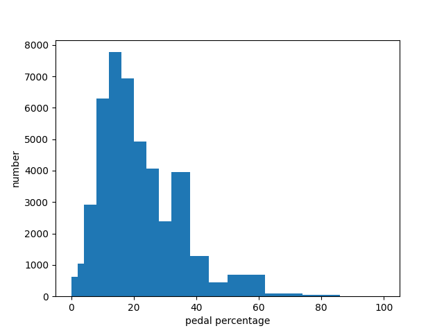{width=200px}|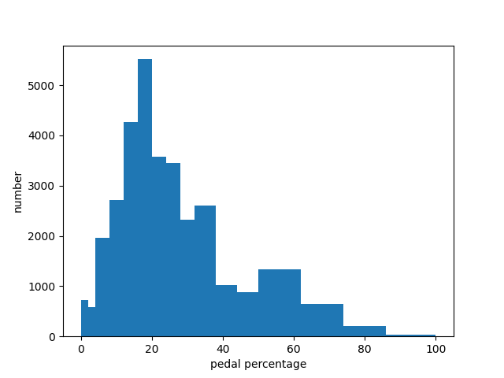{width=200px}|
|:--:|:--:|
|<b> 图1.1 无AI的基准风格分布</b>|<b>图1.2 带AI的基准风格总平均分布</b>|

- 驾驶风格按周期变化: 驾驶风格相对同一个司机是固定的
  
|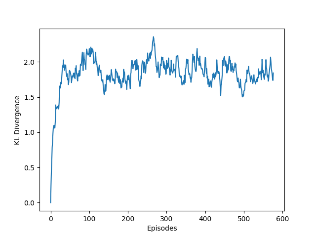{width=400px}|
|:--:|
|<b>图2 驾驶风格变化按KL散度评估, 风格相对固定</b>|

- 驾驶风格有AI和无AI比较

|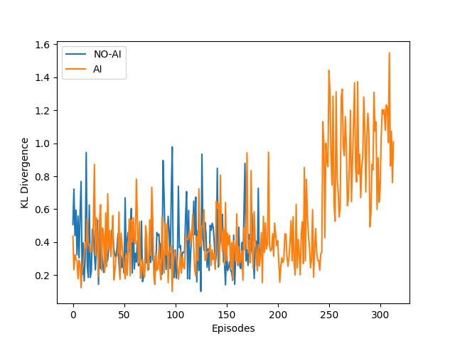{width=200px}|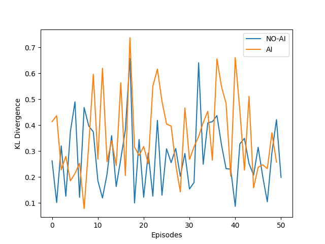{width=200px}|
|:--:|:--:|
|<b>图3.1 驾驶风格有AI和无AI比较,后面打开coastdown</b>|<b>图3.2 另一位驾驶员有AI与无AI比较</b>|

- 不同驾驶风格与SAC下驾驶风格总体比较:

| |SAC|DDPG-CD|SAC-CD|Gonghao-no CD|
|:--:|:--:|:--:|:--:|:--:|
|KL-D|0 |0.234|0.311 | 0.334|
### 能耗
  - 电动力默认Pedal Map (PM) vs 自建 Pedal Map
    - 默认PM:高速时请求力矩会降低
    - 自建PM:分段线性,请求力矩分段线性单调

|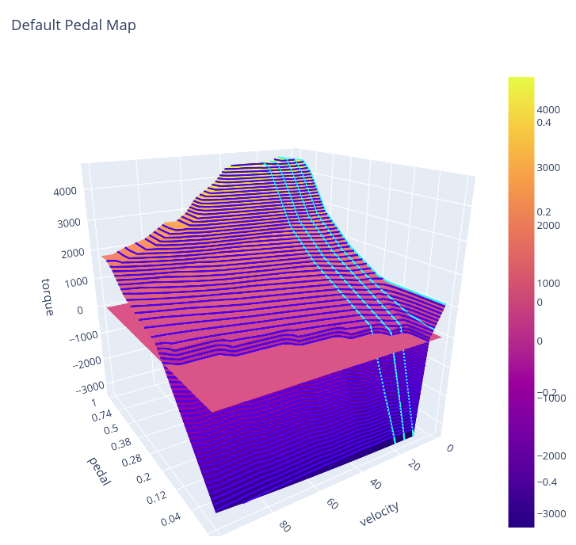{width=200px}|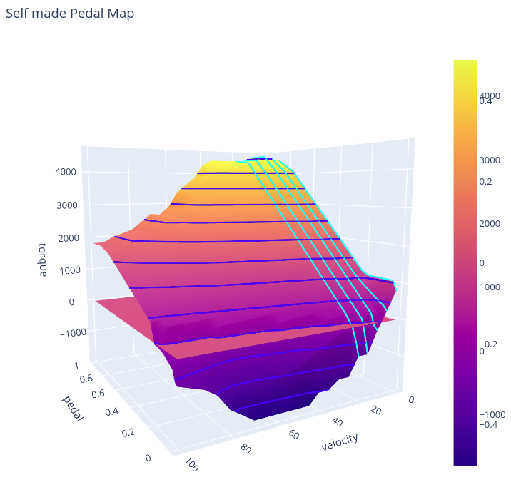{width=200px}|
|:--:|:--:|
|<b>图4.1 EP默认PM</b>|<b>图4.2 自建PM</b>| |

|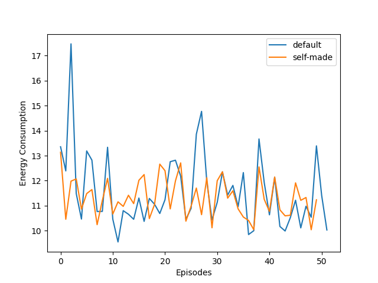|
|:--:|
|<b>图5 EP默认PM与自建PM能耗比较, </b>|

 - 具备较强能量回收的pedal map

### 能耗结果
历次带AI tensorboard
- 襄阳vs.上海(解决时间同步问题和漏帧问题)
  - 确认收敛过程
  - 能耗持续降低过程
  
|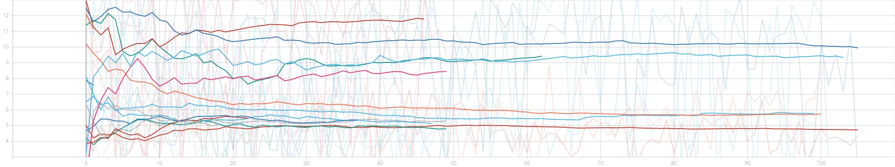{width=600px}|
|:--:|
|<b>图6 SAC算法襄阳和上海对比</b>|

- 上海优化改进过程
  - 能耗持续降低  

|{width=600px}|
|:--:|
|<b>图6 上海算法改进过程 </b>|

- SAC非持续模式

|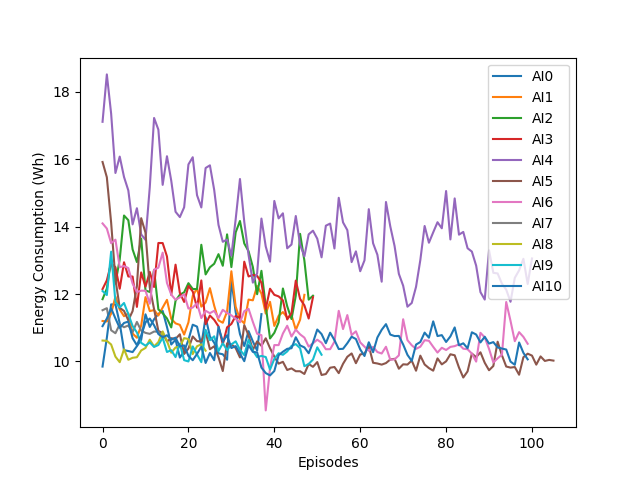{width=200px}|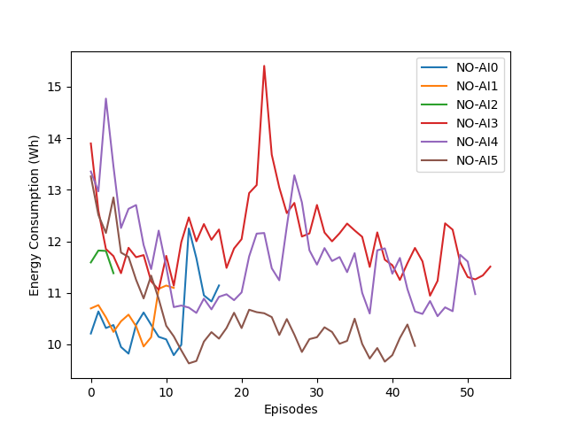{width=200px}|
|:--:|:--:|
|<b>图7.1 SAC非持续模式能耗变化,无coastdown</b>|<b>图7.2 无AI模式能耗变化</b>| |

- SAC持续模式
	- 趋近稳定
  
|{width=200px}|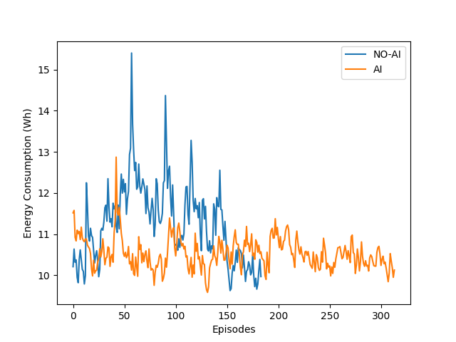{width=200px}|
|:--:|:--:|
|<b>图8.1 SAC持续模式下能耗变化,后面打开coastdown, 原始数据</b>|<b>图8.2 相同数据加平滑滤波</b>|

- SAC 对照组司机
	- 在驾驶风格不变的情况下,加入SAC算法使能耗降低

|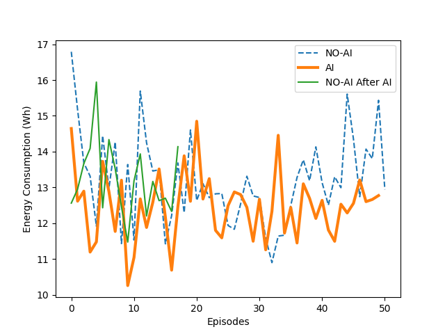{width=200px}|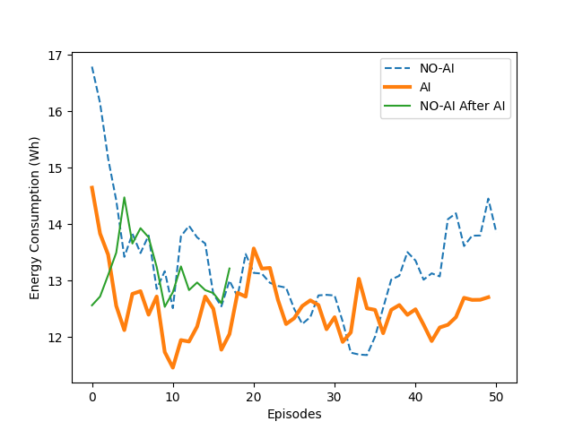{width=200px}|
|:--:|:--:|
|<b>图9.1 SAC对照组能耗变化,无coastdown, 原始数据</b>|<b>图9.2 相同数据加平滑滤波</b>|

- SAC 打开Coast Down

|{width=200px}|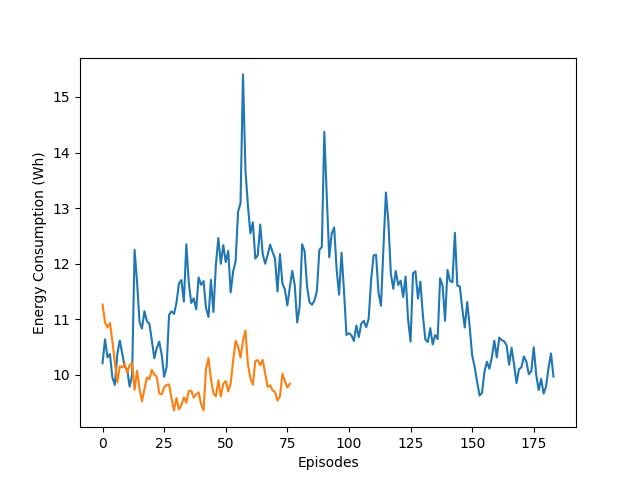{width=200px}|
|:--:|:--:|
|<b>图10.1 SAC打开coastdown, 原始数据</b>|<b>图10.2 相同数据加平滑滤波</b>|

- DDPG 打开Coast Down

|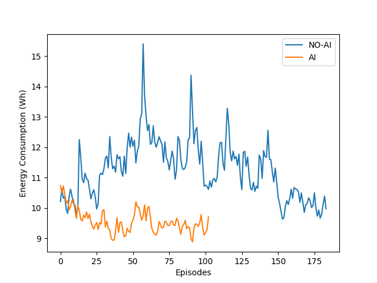{width=200px}|{width=200px}|
|:--:|:--:|
|<b>图11.1 DDPG打开coastdown, 带平滑</b>|<b>图11.2 对照组司机数据,带平滑</b>|

## 方法

强化学习方法, 以大数据为基础的奖励驱动优化方法

- **没有模型** 
  - 车辆动力学的模型和知识
  - 电机模型
  - 电源管理系统模型

- 符合学习直觉:
  - 利用大数据建立内部模型
  - 自适应动态过程
