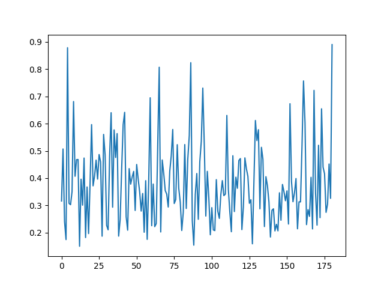
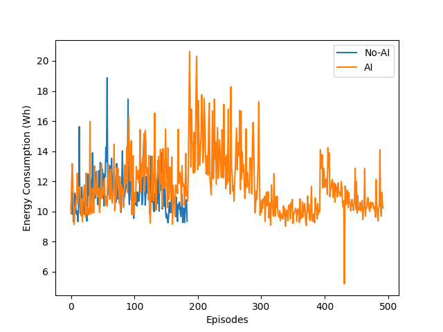

<!-- pandoc veos-report-2021-08.md --pdf-engine=xelatex -o veos-report-2021.08.pdf -V mainfont='Noto Sans CJK SC' -->
<!-- mainfont='Source Han Sans SC' -->
<!-- mainfont='Noto Serif CJK SC' -->
 <!-- pandoc veos-report-2021-08.md --pdf-engine=xelatex -o veos-report-2021.08.docx -V mainfont='Source Han Sans SC'  -->
# VEOS by Data Driven Planning

测试条件:

- 固定测试场景
- 不开空调(减少空调能耗干扰)
- 往返路线(减少地形差异干扰)

## 实验结果

0.驾驶风格比较:
  - 总分布和KL散度定量

 -按周期KL变化
 -default map vs self-made

1.无AI基准: 默认表 vs 手工表

2.不同驾驶员: 驾驶员 1 vs. 2. vs 3.

3.不同初始表

4.历次带AI tensorboard

5.(无AI vs.有AI)各50次
6.有AI持续模式
7.不同驾驶员带AI优化过程
8.怠速表关闭/打开
9.熵变小/策略趋向确定性

- baselines
  - driver styles analysis (analysis)
  - pedal map comparison
  - A2C
  - different initial map

- Declining in each epoch
  - RL agent cooperative / Human driver adapting?
  - Epoch tendcy
  - declining in total loss / inclining in total reward
  - entropy declining / becoming more and more deterministic
  - expected wh declining
  - seems cooperative, at least no conflict
  - baseline: strong regen --> higher efficiency
  - methods
  - achievements
  - status
- long-term in resume mode (model and table resumed)

- weak regen (fix coastdown / constrained action space)

- strong regen (exploit coastdown / relax action space)

## Analysis

weaker regen:  not stronger regen, but better motion control for the test case

- possible models

debug

- tools
  - **driving style analysis (quantitative)**
    - vehicle interfaces and systems (stable and reliable)
    - synchronization
    - data logging (for analysis and offline algo)
  - energy consumpt cross-check by UDP messages
  - model resume
  - udp episodic analysis
  - debug (latency analysis)
  - verifying DL algo with cpu only resources
  - analysis
  - optimal motion planning
  - exploit regen
  - better assistance for manual motion control for eco 
  - reward shaping (penalize braking could be cooperative)
  - need recurrency to encode system dynamics

## Theory

- not like this: big data --> NN --> label ==> good result
- learn from data (distribution) not label (label is supervision)
  - distribution, law of large number n>30, (multiplicity with samples)
  - dynamic environment --> drifting distribution
  - **advantages**: previously impossible cases can be solved elegantly by big data.
- basic observability/controllability
  - observation enough? fully observable --> which should I observe?
  - control signal sufficient/efficient? 
  - long-term dependency
- Model
  - Complete observable model (MDP)
  - human driver model $Th=Th(\mathbf{O_h})$
  - pedal map $\tilde{PM}(Th)=Trq$
  - $Trq=\tilde{PM}\circ Th=\tilde{PM}(Th(O_h))$
  - $\mathbf{O_h}=(vel, road, objects)$
  - Objective: Optimal Motion Planning 
    - $\min_{Trq}(\Sigma_{i}(u\cdot i)\cdot dt)$
      - follow the optimal motion planning (follow the optimal speed curve) 
      - reduce unnecessary large torque
      - maintain a speed when regenerative brake occurs (exploit regenerative brake)
  - Implementation, POMDP
    - $\mathbf{O_{rl}}=(vel, Th)$
    - $\mathbf{O_{rlx}}=(vel, Th, MotionPlan)$

## Outlook

### fully autonomous

1. optimal motion control/prediction

2. exploit regen

### assistance system

1. fix driving style and analysis

2. different reward

### Challenge

动态过程未知，奖励不完全知道，并非简单将数据灌入神经网络,需要考虑几个因素。

- sample efficiency 
- offline data utilization
- reward shaping
- memory

### Counter measures

