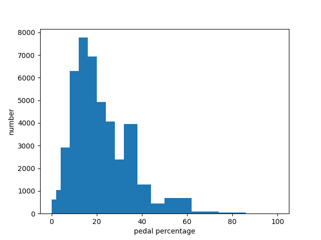
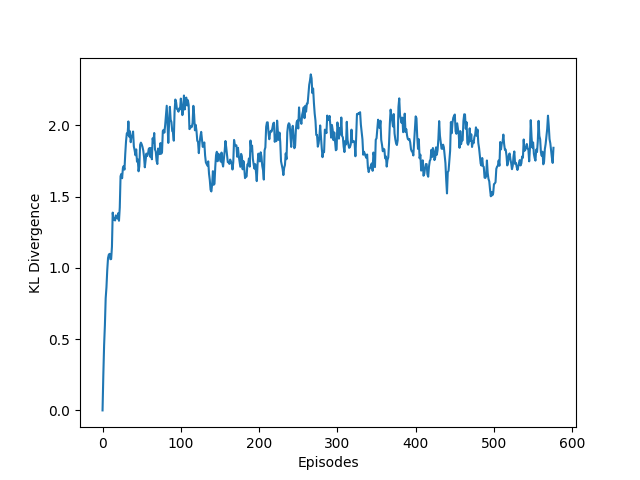
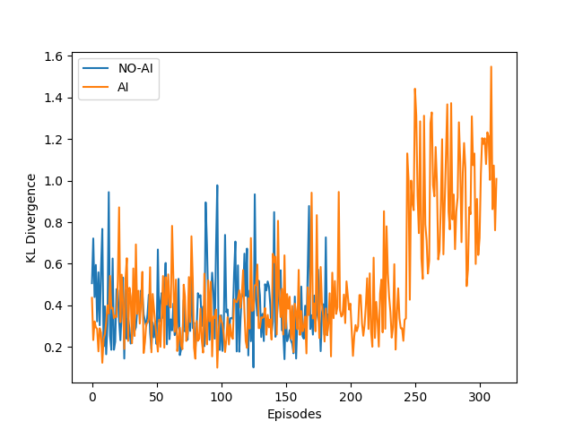

---
@import "newrizon.less"

id: "newrizon-id"
# class: "my-class1 my-class2"
title: "veos system assessment"
author: 
- Binjian Xin 
date: "Sep. 16, 2021"

presentation:
  enableSpeakerNotes: true
  # width: 800px
  # height: 450px
  width: 1600
  height: 900
  shoNotes: true
  output: 
    beamer_presetnation:
      path: ./Exports/veos system assessment.pdf
      toc: true
toc:
  depth_from: 1
  depth_to: 1
  ordered: false
---

<!-- slide data-background-image="./Horizontal-Sea.jpg" -->

VEOS系统评估
---
[ &nbsp; &emsp; 忻斌健](#VEOS系统评估)
 2021年09月15日 

<!-- slide id="newrizon-id" -->
[TOC]

<!-- slide id="newrizon-id"　style="text-align: left;" class="my-class1 my-class2" -->

@import "newrizon.less"
<!-- #+title: VEOS系统评估 -->
# 测试条件

- 固定测试场景
  - 静止到匀加速再匀减速到停止
- 固定工况
  - 不开空调(减少空调能耗干扰)
  - 往返路线(减少地形差异干扰)
- 不可控的观测噪声: 
  - 地形
  - 压缩机
  - 电池SOC
  - 大灯
  - tbox
- 测量驾驶风格
  - 纵向控制问题中,特定工况下油门踏板(和刹车踏板)的使用情况
- 通过独立的UDP数据记录交叉验证测量和性能
- 总共实验约2000次

<!-- slide id="newrizon-id"　style="text-align: left;" class="my-class1 my-class2" -->
# 驾驶风格

## 无AI和带AI的基准驾驶风格比较
  
|{width=200px}|{width=200px}|
|:--:|:--:|
|<b> 图1.1 无AI的基准风格分布</b>|<b>图1.2 带AI的基准风格总平均分布</b>|

<!-- slide id="newrizon-id"　style="text-align: left;" class="my-class1 my-class2" -->
## 驾驶风格按周期变化: 驾驶风格相对同一个司机是固定的
  
|{width=400px}|
|:--:|
|<b>图2 驾驶风格变化按KL散度评估, 风格相对固定</b>|

<!-- slide id="newrizon-id"　style="text-align: left;" class="my-class1 my-class2" -->
## 驾驶风格有AI和无AI比较

|{width=200px}|{width=200px}|
|:--:|:--:|
|<b>图3.1 驾驶风格有AI和无AI比较,后面打开coastdown</b>|<b>图3.2 另一位驾驶员有AI与无AI比较</b>|

<!-- slide id="newrizon-id"　style="text-align: left;" class="my-class1 my-class2" -->
## 不同驾驶员风格以及统一驾驶员在应用不同算法后风格的定量比较

| |SAC|DDPG-CD|SAC-CD|Driver 2-no CD|
|:--:|:--:|:--:|:--:|:--:|
|KLD|0 |0.234|0.311 | 0.334|

- 不同驾驶风格与SAC下驾驶风格总体比较:
  - KLD 可用于定量评估不同驾驶风格之间的差异
  - KLD 可用于监控训练过程中驾驶员风格和自己基准风格相比的变化

<!-- slide id="newrizon-id"　style="text-align: left;" class="my-class1 my-class2" -->
## 基准能耗
- 电动力默认Pedal Map (PM) vs 自建 Pedal Map
  - 默认PM:高速时请求力矩会降低
  - 自建PM:分段线性,请求力矩分段线性单调

|{width=200px}|{width=200px}|
|:--:|:--:|
|<b>图4.1 EP默认PM</b>|<b>图4.2 自建PM</b>| |

<!-- slide id="newrizon-id"　style="text-align: left;" class="my-class1 my-class2" -->
- 默认PM和自建PM能耗比较
  - 自建PM作为初始表在每个训练开始时用于初始化
  - 自建PM对应的能耗作为比较的基准

||
|:--:|
|<b>图5 EP默认PM与自建PM能耗比较, </b>|

 <!-- - 具备较强能量回收的pedal map -->

<!-- slide id="newrizon-id"　style="text-align: left;" class="my-class1 my-class2" -->
# 能耗结果
## 历次带AI的训练数据
- 襄阳vs.上海
  - 有时间同步问题,成比例漏帧,只影响测量,大致不影响决策算法
  - 确认收敛过程
  - 能耗持续降低过程
  
|{width=600px}|
|:--:|
|<b>图6 SAC算法襄阳和上海对比</b>|

<!-- slide id="newrizon-id"　style="text-align: left;" class="my-class1 my-class2" -->
- 上海优化改进过程
  - 修复时间同步问题和漏帧问题
  - 能耗持续降低  

|{width=600px}|
|:--:|
|<b>图6.1 上海算法改进过程 </b>|

<!-- slide id="newrizon-id"　style="text-align: left;" class="my-class1 my-class2" -->
|{width=600px}|
|:--:|
|<b>图6.2 上海算法持续改进过程 </b>|

<!-- slide id="newrizon-id"　style="text-align: left;" class="my-class1 my-class2" -->
## SAC  
- SAC (Stochastic Actor Critic) Pedal Map非持续模式: 
  - 每个epoch使用上次epoch的模型,
  - 开始pedal map用同一个默认表
  - 模型继承之前的经验,显示能耗持续降低

|{width=200px}|{width=200px}|
|:--:|:--:|
|<b>图7.1 SAC非持续模式能耗变化,无coastdown</b>|<b>图7.2 无AI模式能耗变化</b>| |

<!-- slide id="newrizon-id"　style="text-align: left;" class="my-class1 my-class2" -->

- SAC Pedal Map持续模式(resume):  
  - 每个epoch使用之前的模型
  - 开始pedal map用上一个epoch最后一个episode的表
  - 模型继承之前经验,且使用前一个训练周期的结果,能耗结果趋近稳定
  
|{width=200px}|{width=200px}|
|:--:|:--:|
|<b>图8.1 SAC持续模式下能耗变化,后面打开coastdown, 原始数据</b>|<b>图8.2 相同数据加平滑滤波</b>|

<!-- slide id="newrizon-id"　style="text-align: left;" class="my-class1 my-class2" -->
- SAC 对照组司机
	- 在驾驶风格不变的情况下,加入SAC算法使能耗降低
	- 未打开coastdown

|{width=200px}|{width=200px}|
|:--:|:--:|
|<b>图9.1 SAC对照组能耗变化,无coastdown, 原始数据</b>|<b>图9.2 相同数据加平滑滤波</b>|

<!-- slide id="newrizon-id"　style="text-align: left;" class="my-class1 my-class2" -->
- SAC 偶发陷于局部最优 
  - 未打开Coast Down
  - 相当于随机策略收敛到一个确定性策略
  - 行动损失由于确定性策略下计算logit值,趋向发散

|{width=400px height=300px}|
|:--:|
|<b>图10 SAC 陷于确定性策略的局部最优,随机策略的熵收敛到0</b>|

<!-- slide id="newrizon-id"　style="text-align: left;" class="my-class1 my-class2" -->
- SAC打开Coastdown
  - 只打开coastdown动作空间,并不使用专家知识有意利用REGEN
  - 驾驶员和agent的合作决策
  - 收敛较快

|{width=200px}|{width=200px}|
|:--:|:--:|
|<b>图10.1 SAC打开coastdown, 原始数据</b>|<b>图10.2 相同数据加平滑滤波</b>|

<!-- slide id="newrizon-id"　style="text-align: left;" class="my-class1 my-class2" -->
## DDPG
-DDPG-cd打开Coast Down
  - 收敛更快,大约是SAC的一倍
  - 同样的能耗改善结果,SAC需要约50个episode, DDPG-cd需要大约25个episodes

|{width=200px}|{width=200px}|
|:--:|:--:|
|<b>图11.1 DDPG打开coastdown, 带平滑</b>|<b>图11.2 对照组司机数据,带平滑</b>|

<!-- slide id="newrizon-id"　style="text-align: left;" class="my-class1 my-class2" -->
- DDPG-ao增加预期车速观测量
  - 能耗新低<8wh
  - 收敛更快更稳定
  - 司机驾驶风格有较大变化

|{width=200px}|{width=200px}|
|:--:|:--:|
|<b>图12.1 DDPG增加观测量与前两种方法比较, 带平滑</b>|<b>图12.2 驾驶风格变化,带平滑</b>|

<!-- slide id="newrizon-id"　style="text-align: left;" class="my-class1 my-class2" -->
- 平均驾驶风格比较,以NO-AI数据为基准

| |no-AI|SAC-CD|DDPG-CD|DDPG-ao|
|:--:|:--:|:--:|:--:|:--:|
|KLD|0 |0.532|0.323 | 0.530|
- DDPG Pedal Map变化
  - 随机采样策略现象
  - 对应能量回收的工况,请求负扭矩变大

<!-- slide id="newrizon-id"　style="text-align: left;" class="my-class1 my-class2" -->
<!--  -->
|{width=200px}|{width=200px}|{width=200px}|
|:--:|:--:|:--:|
|<b>图13.1 初始PM</b>|<b>图13.2 DDPG-cd节能周期典型PM </b>|<b>图13.3 DDPG-ao典型节能周期PM </b>|

<!-- slide id="newrizon-id"　style="text-align: left;" class="my-class1 my-class2" -->

- DDPG-ao PM变化过程

<!-- slide id="newrizon-id"　style="text-align: left;" class="my-class1 my-class2" -->
# 方法

强化学习方法, 以大数据为基础的奖励驱动优化方法

- **没有模型** 
  - 车辆动力学的模型和知识
  - 电机模型
  - 电源管理系统模型

- 符合学习直觉:
  - 利用大数据建立内部模型
  - 自适应动态过程

<!-- slide id="newrizon-id"　style="text-align: left;" class="my-class1 my-class2" -->
# 未来计划
  - 提高样本使用效率
    - 增加刹车观测
    - 奖励成形(reward shaping):增加未完成episode惩罚
    - 增加观测序列编码,有助于利用更长时间序列的观测
    - 增加运动规划预测
  - 增加数据采集与测试
    - 增加测试场景复杂度
      - 其他速度曲线场景
      - 限速作为观测量
    - 建立公共道路baseline(安亭新镇环路)
    - 使用以大数据为基础的离线强化学习算法
    - 增加测试车辆
  