<!-- pandoc veos-report-2021-08.md --pdf-engine=xelatex -o veos-report-2021.08.pdf -V mainfont='Noto Sans CJK SC' -->
<!-- mainfont='Source Han Sans SC' -->
<!-- mainfont='Noto Serif CJK SC' -->
<!-- pandoc veos-report-2021-08.md --pdf-engine=xelatex -o veos-report-2021.08.docx -V CJKmainfont='Source Han Sans SC' --wrap=preserve -->

# VEOS系统 

## 测试条件

- 固定测试场景

- 固定工况

- 不开空调(减少空调能耗干扰)

- 往返路线(减少地形差异干扰)

- 观测噪声: 地形,压缩机,电池SOC,(大灯,tbox,...)

- 测量驾驶风格:纵向控制问题中,特定工况下油门踏板(和刹车踏板)的使用情况

- 通过独立的UDP数据记录交叉验证测量和性能

- 总共实验1400次
- 道路实验三周（9天），安亭新镇

### 驾驶风格

- 无AI和带AI的基准驾驶风格比较
  
|{width=200px}|{width=200px}|
|:--:|:--:|
|<b> 图1.1 无AI的基准风格分布</b>|<b>图1.2 带AI的基准风格总平均分布</b>|

- 驾驶风格按周期变化: 驾驶风格相对同一个司机是固定的
  
|{width=400px}|
|:--:|
|<b>图2 驾驶风格变化按KL散度评估, 风格相对固定</b>|

- 驾驶风格有AI和无AI比较

|{width=200px}|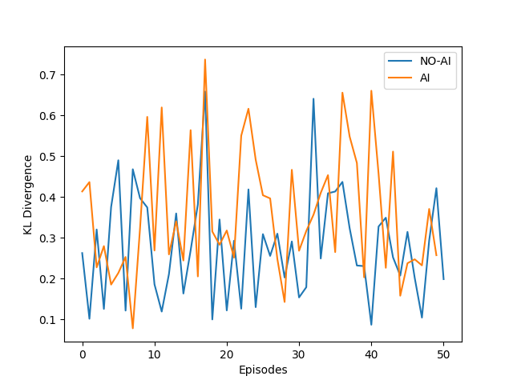{width=200px}|
|:--:|:--:|
|<b>图3.1 驾驶风格有AI和无AI比较,后面打开coastdown</b>|<b>图3.2 另一位驾驶员有AI与无AI比较</b>|

- 不同驾驶风格与SAC下驾驶风格总体比较:

| |SAC|DDPG-CD|SAC-CD|Gonghao-no CD|
|:--:|:--:|:--:|:--:|:--:|
|KL-D|0 |0.234|0.311 | 0.334|
### 能耗
  - 电动力默认Pedal Map (PM) vs 自建 Pedal Map
    - 默认PM:高速时请求力矩会降低
    - 自建PM:分段线性,请求力矩分段线性单调

|{width=200px}|{width=200px}|
|:--:|:--:|
|<b>图4.1 EP默认PM</b>|<b>图4.2 自建PM</b>| |

||
|:--:|
|<b>图5 EP默认PM与自建PM能耗比较, </b>|

 - 具备较强能量回收的pedal map

## 实验结果

### 封闭园区测试
历次带AI tensorboard
- 襄阳vs.上海(解决时间同步问题和漏帧问题)
  - 确认收敛过程
  - 能耗持续降低过程
  
|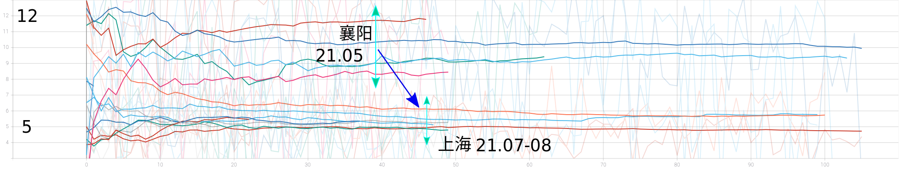{width=600px}|
|:--:|
|<b>图6 SAC算法襄阳和上海对比</b>|

- 上海优化改进过程
  - 能耗持续降低  

|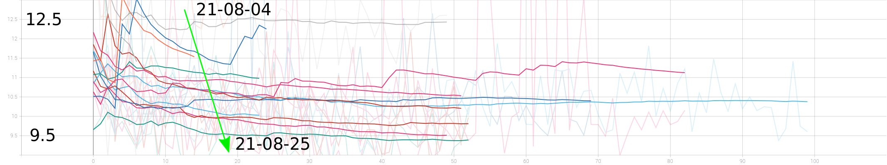{width=600px}|
|:--:|
|<b>图6 上海算法改进过程 </b>|

- SAC非持续模式

|{width=200px}|{width=200px}|
|:--:|:--:|
|<b>图7.1 SAC非持续模式能耗变化,无coastdown</b>|<b>图7.2 无AI模式能耗变化</b>| |

- SAC持续模式
	- 趋近稳定
  
|{width=200px}|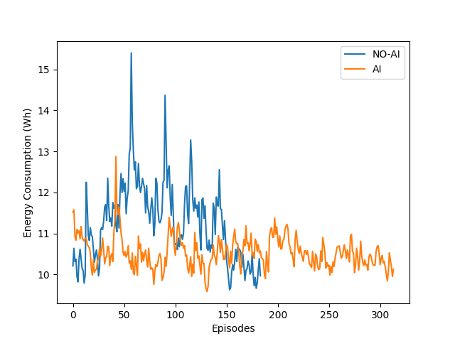{width=200px}|
|:--:|:--:|
|<b>图8.1 SAC持续模式下能耗变化,后面打开coastdown, 原始数据</b>|<b>图8.2 相同数据加平滑滤波</b>|

- SAC 对照组司机
	- 在驾驶风格不变的情况下,加入SAC算法使能耗降低

|{width=200px}|{width=200px}|
|:--:|:--:|
|<b>图9.1 SAC对照组能耗变化,无coastdown, 原始数据</b>|<b>图9.2 相同数据加平滑滤波</b>|

- SAC (未打开Coast Down)
  - 陷于局部最优,变成确定性策略

|{width=400px}|
|:--:|
|<b>图10 SAC 陷于确定性策略的局部最优,随机策略的熵收敛到0</b>|

- SAC 打开Coast Down

|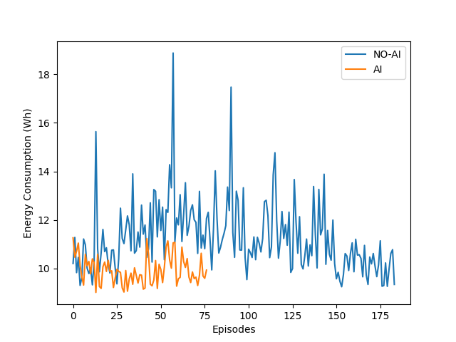{width=200px}|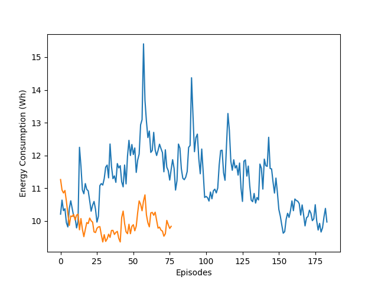{width=200px}|
|:--:|:--:|
|<b>图10.1 SAC打开coastdown, 原始数据</b>|<b>图10.2 相同数据加平滑滤波</b>|

- DDPG 打开Coast Down

|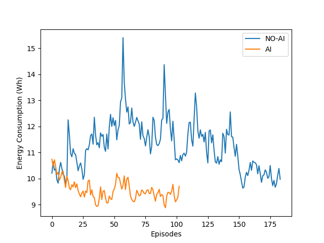{width=200px}|{width=200px}|
|:--:|:--:|
|<b>图11.1 DDPG打开coastdown, 不带平滑</b>|<b>图11.2 对照组司机数据,带平滑</b>|

DDPG Pedal Map变化表

#### 比较
- DDPG打开CoastDown

| |No-AI-AVG|AI-Last-Value|Save Percentage|
|:--:|:--:|:--:|:--:|
|路则鹏|11.53 | 11.71| -1.00% | 
|梁博之|12.87 | 11.43| 11.19% | 

|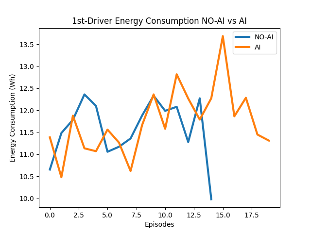{width=200px}|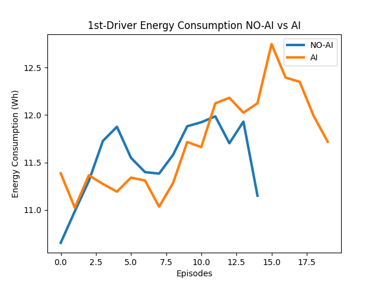{width=200px}|
|:--:|:--:|
|<b>图12.1 路则鹏DDPG打开coastdown, 不带带平滑</b>|<b>图12.2 路则鹏数据,带平滑</b>|

|{width=200px}|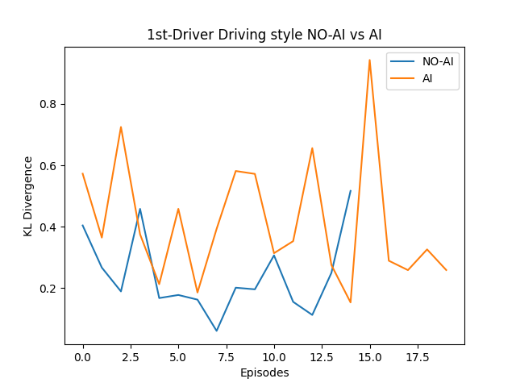{width=200px}|
|:--:|:--:|
|<b>图13.1 路则鹏DDPG打开coastdown, 不带平滑</b>|<b>图13.2 路则鹏驾驶风格</b>|

|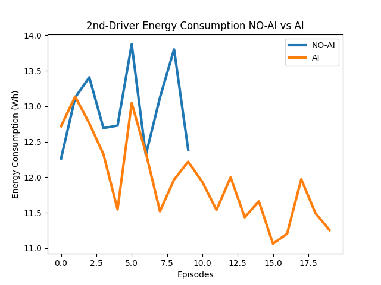{width=200px}|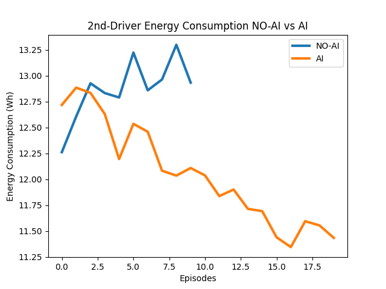{width=200px}|
|:--:|:--:|
|<b>图14.1 梁博之DDPG打开coastdown, 不带带平滑</b>|<b>图14.2 梁博之数据,带平滑</b>|

|{width=200px}|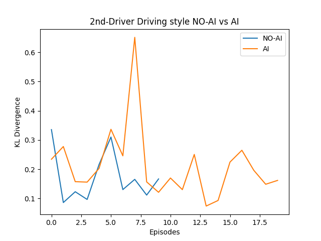{width=200px}|
|:--:|:--:|
|<b>图15.1 梁博之DDPG打开coastdown, 不带平滑</b>|<b>图15.2 梁博之驾驶风格</b>|

|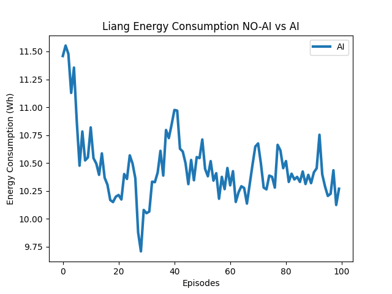{width=200px}|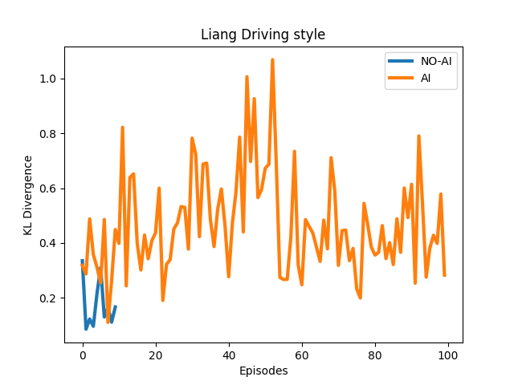{width=200px}|
|:--:|:--:|
|<b>图16.1 梁博之DDPG无预测车速观测量,带平滑</b>|<b>图16.2 梁博之驾驶风格</b>|

### 开放道路测试

#### 测试工况

|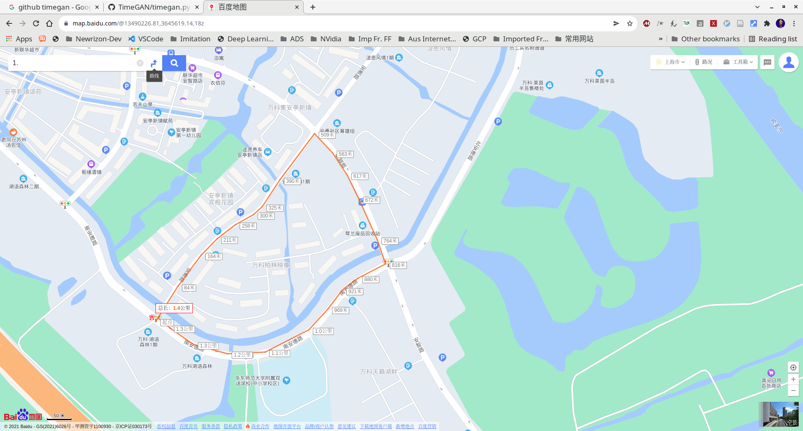{width=600px}|
|:--:|
|<b>图17 安亭新镇小环路a</b>|

 - 南安德路-->安勇路-->安智路-->南安德路
 - 1.4公里
 - 4分钟

|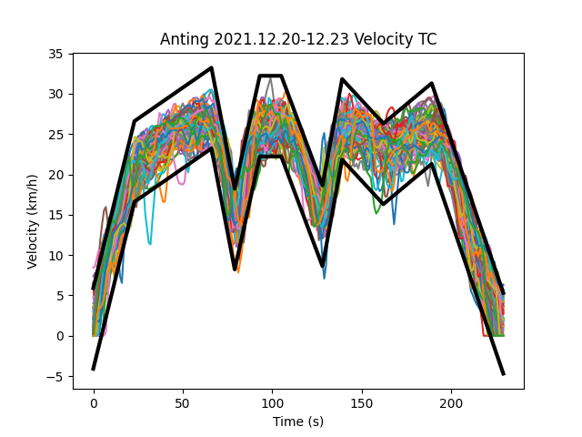{width=600px}|
|:--:|
|<b>图18 驾驶工况记录</b>|

#### 测试结果

##### 按周期测试结果
| |12.02-09|12.13-16 (降温)|12.20-23|
|:--:|:--:|:--:|:--:|
|无AI基准能耗|256.9|265.7|256.0| 
|AI平均能耗|245.0|251.9|243.7| 
|节省能量|21.0|20.1|18.0| 
|百分比|8.16% | 7.56%| 7.03% | 
 
##### 三周总趋势

|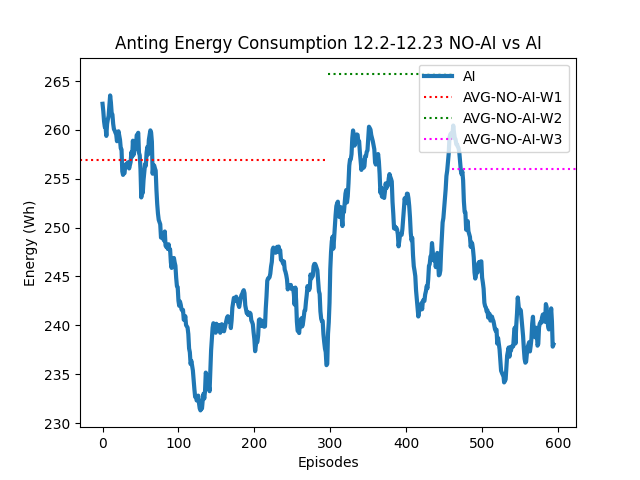{width=300px}|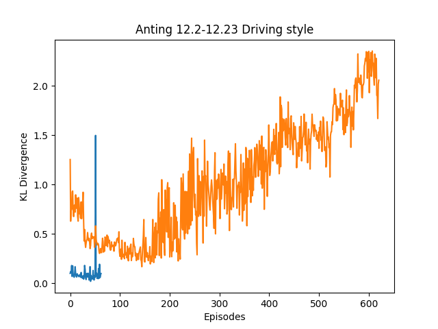{width=300px}|
|:--:|:--:|
|<b>图19.1 三周训练能耗变化 </b>|<b>图19.2 三周训练司机驾驶风格变化</b>|

##### 泛化测试
冻结小环路a上的模型（经验），迁移到小环路b上测试
 

|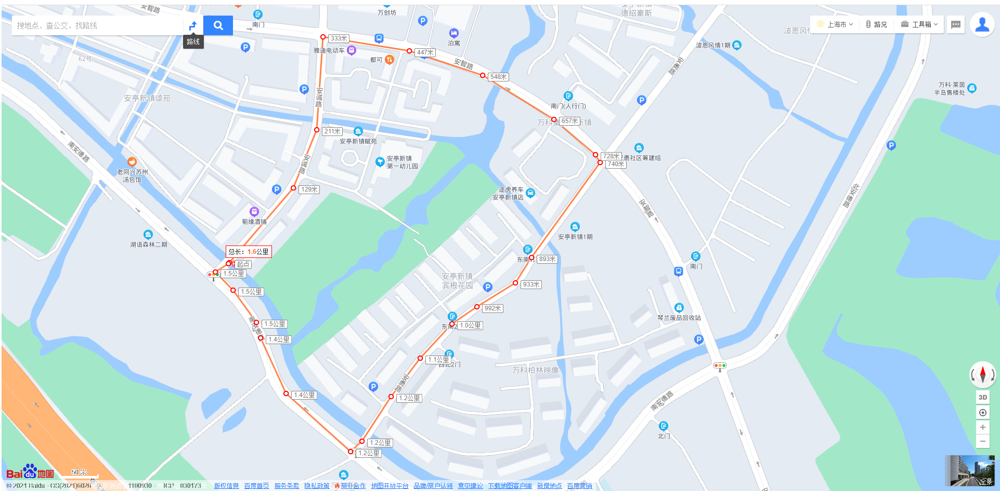{width=600px}|
|:--:|
|<b>图17 安亭新镇小环路b</b>|

|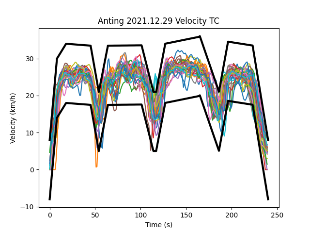{width=600px}|
|:--:|
|<b>图18 泛化驾驶工况记录</b>|

|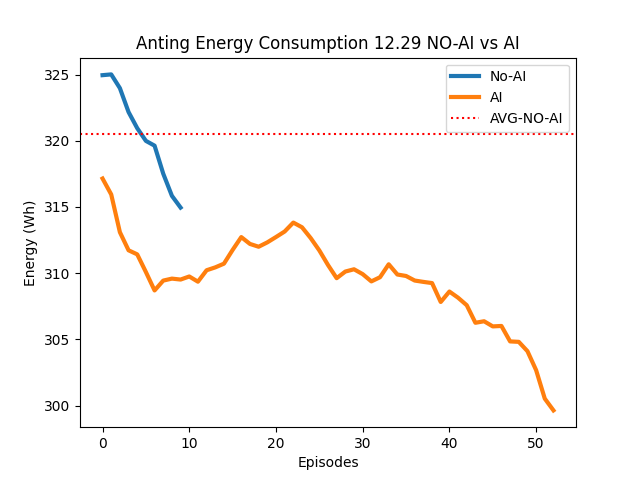{width=300px}|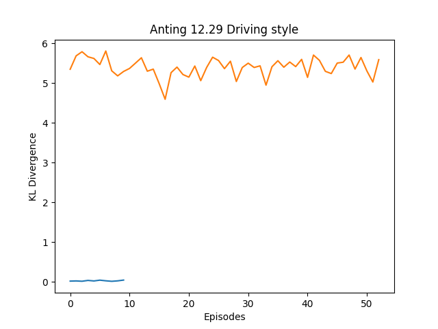{width=300px}|
|:--:|:--:|
|<b>图19.1 三周训练能耗变化 </b>|<b>图19.2 三周训练司机驾驶风格变化</b>|

| |12.29|
|:--:|:--:|
|无AI基准能耗|320.5 Wh|
|AI平均能耗|306.6 Wh|
|节省能量|20.8 Wh|
|百分比|6.5%|

好处：

- 不动态更新，不受场景段（episode）约束，模型不会发散
- 可以离线

## 方法

强化学习方法, 以大数据为基础的奖励驱动优化方法

- **没有模型** 
  - 无需车辆动力学的模型和知识
  - 无需电机模型
  - 无需电源管理系统模型
- 适度修改踏板响应
  - 司机完全控制车辆
  - 没有安全问题
- 动态自适应过程
  - 不受天气的影响-- 可以继续使用车辆模型
  - 不受车上用电设备（车载空调，灯光）开关的影响
  - 独立于其他车辆控制系统的二级控制系统
  - 一车一模型方式可适应不同司机的驾驶风格
- 符合学习直觉:
  - 利用大数据建立内部模型
  - 经验积累可改进模型
  

