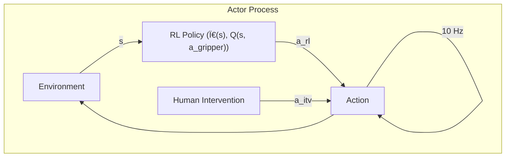
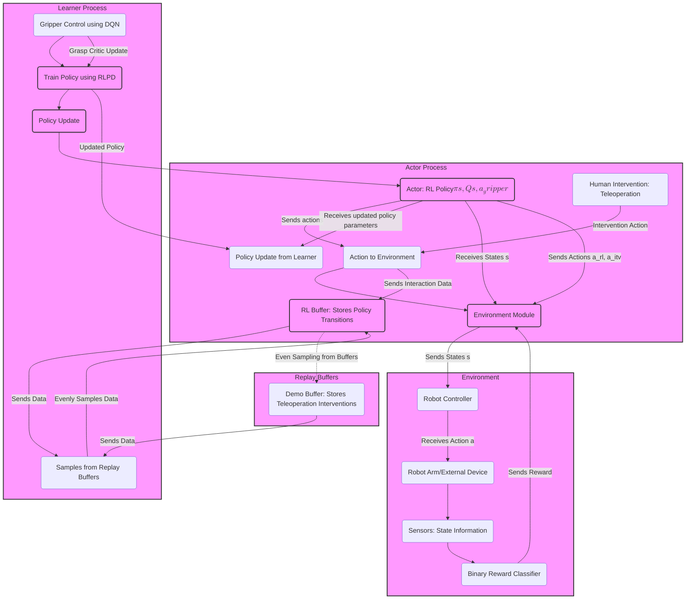

# ChatGPT code

```mermaid 
 flowchart TB
  subgraph Actor_Process["Actor Process"]
    env["Environment"]
    action["Action"]
    rl_policy["RL Policy (Ï€(s), Q(s, a_gripper))"]
    human_intervention["Human Intervention"]
    env -->|s| rl_policy
    rl_policy -->|a_rl| action
    human_intervention -->|a_itv| action
    action --> env
    action -- "10 Hz" --> action
  end
```

## more detailed

```mermaid
flowchart TB
    subgraph Actor_Process["Actor Process"]
        direction TB
        A1(Actor: RL Policy $$\pi s, Q s, a_gripper $$) -->|Sends actions| A2(Action to Environment)
        A2 --> E1(Environment)
        A1 -->|Receives updated policy parameters| A3(Policy Update from Learner)
        H1(Human Intervention: Teleoperation) -->|Intervention Action| A2
        A2 -->|Sends Interaction Data| B1(Replay Buffers)
    end

    subgraph Learner_Process["Learner Process"]
        direction TB
        L1(Samples from Replay Buffers) -->|Evenly Samples Data| B1
        L2(Train Policy using RLPD) --> L3(Policy Update)
        L3 --> A1
        L4(Gripper Control using DQN) --> L2
        L2 -->|Updated Policy| A3
        L4 -->|Grasp Critic Update| L2
    end

    subgraph Replay_Buffers["Replay Buffers"]
        direction TB
        B1(RL Buffer: Stores Policy Transitions) -->|Sends Data| L1
        B2(Demo Buffer: Stores Teleoperation Interventions) -->|Sends Data| L1
        B1 -.->|Even Sampling from Buffers| B2
    end

    subgraph Environment["Environment"]
        direction TB
        E1(Environment Module) -->|Sends States s| E2(Robot Controller)
        E2 -->|Receives Action a| E3(Robot Arm/External Device)
        E3 --> E4(Sensors: State Information)
        E4 --> E5(Binary Reward Classifier)
        E5 -->|Sends Reward| E1
    end

    A1 -->|Receives States s| E1
    A1 -->|Sends Actions a_rl, a_itv| E1

    classDef process fill:#f9f,stroke:#333,stroke-width:2px;
    class Actor_Process,Learner_Process,Replay_Buffers,Environment process;
    
    class A1,E1,L2,L3,B1 process
```