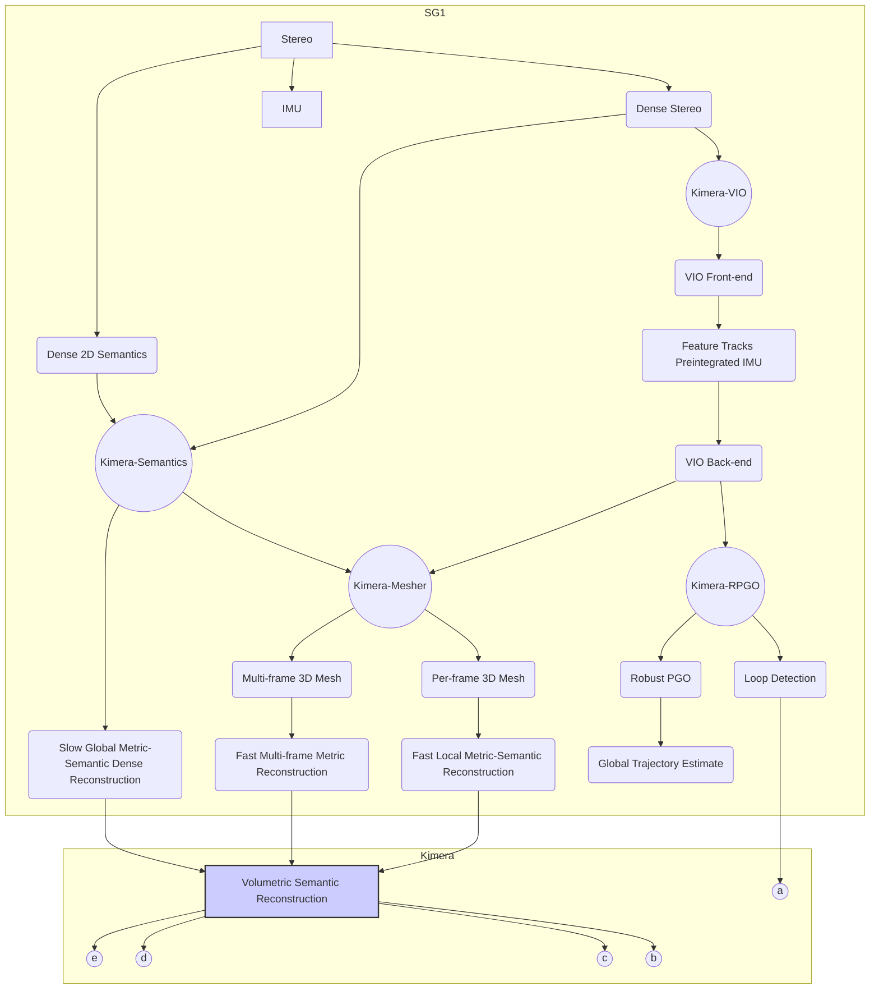
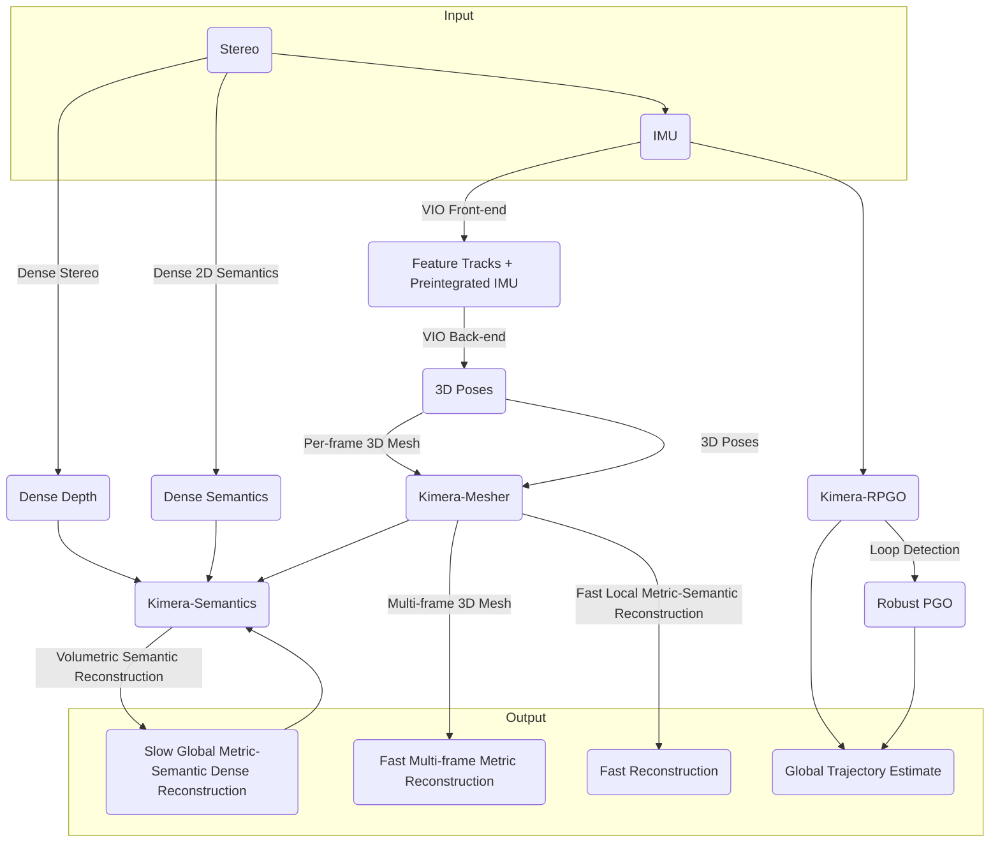
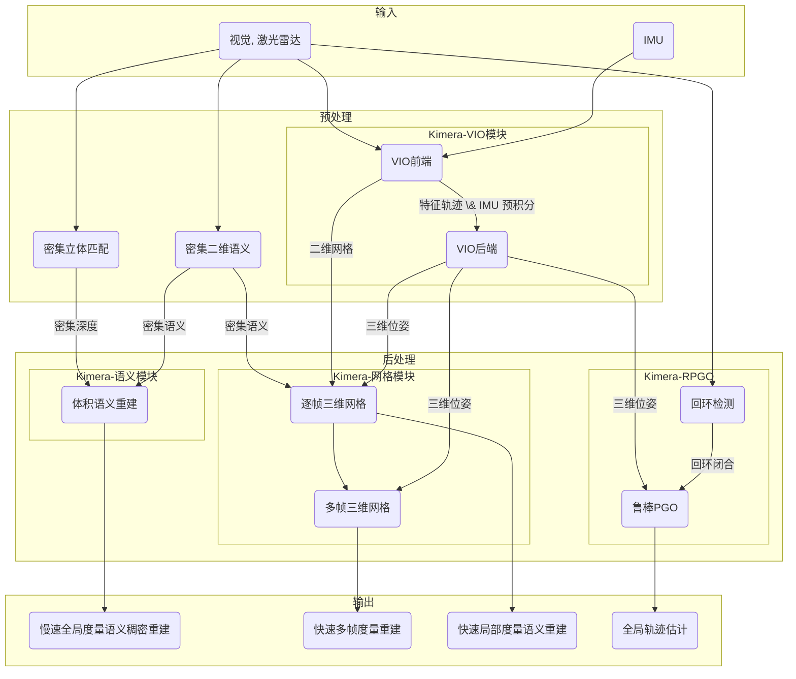
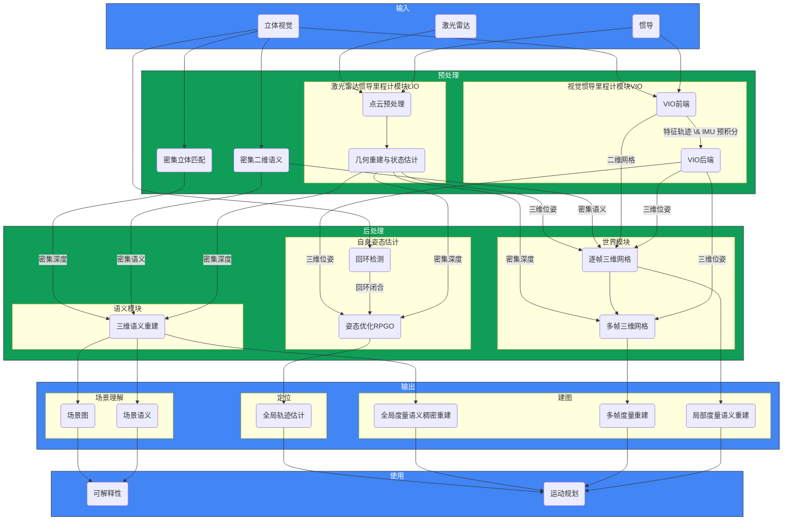

# Test

```mermaid
graph TD;
    A-->B;
    A-->C;
    B-->D;
    C-->D;
```

# Kimera flow chart (Gemini)

```mermaid
graph TD
subgraph "SG1"
    A[Stereo] --> B(Dense 2D Semantics);
    A --> C(Dense Stereo);
    A --> D[IMU];
    C --> E((Kimera-VIO));
    E --> F(VIO Front-end);
    F --> G(Feature Tracks Preintegrated IMU);
    G --> H(VIO Back-end);
    B --> I((Kimera-Semantics));
    C --> I;
    H --> J((Kimera-RPGO));
    J --> K(Loop Detection);
    J --> L(Robust PGO);
    I --> M((Kimera-Mesher));
    H --> M;
    M --> N(Multi-frame 3D Mesh);
    M --> O(Per-frame 3D Mesh);
    N --> P(Fast Multi-frame Metric Reconstruction);
    O --> Q(Fast Local Metric-Semantic Reconstruction);
    I --> R(Slow Global Metric-Semantic Dense Reconstruction);
    L --> S(Global Trajectory Estimate);
end

subgraph "Kimera"
    R --> T[Volumetric Semantic Reconstruction];
    P --> T;
    Q --> T;
    T --> U((e));
    T --> V((d));
    T --> W((c));
    T --> X((b));
    K --> Y((a));
    
    style T fill:#ccf,stroke:#333,stroke-width:2px
end
```
# Chart GPT

```mermaid
graph TD
    A(Stereo) -->|Dense 2D Semantics| B(Dense Semantics)
    A -->|Dense Stereo| C(Dense Depth)
    C --> D(Kimera-Semantics)
    B --> D
    D -->|Volumetric Semantic Reconstruction| E(Slow Global Metric-Semantic Dense Reconstruction)
    A --> F(Kimera-VIO)
    F -->|VIO Front-end| G(Feature Tracks + Preintegrated IMU)
    G -->|VIO Back-end| H(3D Poses)
    F --> I(Kimera-RPGO)
    H -->|Per-frame 3D Mesh| J(Kimera-Mesher)
    J -->|Multi-frame 3D Mesh| K(Fast Multi-frame Metric Reconstruction)
    J -->|Fast Local Metric-Semantic Reconstruction| L(Fast Reconstruction)
    I -->|Loop Detection| M(Robust PGO)
    I --> N(Global Trajectory Estimate)
    M --> N
    H -->|3D Poses| J
    J --> D
    E --> D
    subgraph Input
        A
        F(IMU)
    end
    subgraph Output
        E
        K
        L
        N
    end

```

# ChatGPT in Chinese

```mermaid
graph TD
    A(视觉, 激光雷达) --> A2(密集立体匹配) -->|密集深度| D1
    A --> A1(密集二维语义) -->|密集语义| D1(体积语义重建)
    D1 --> E(慢速全局度量语义稠密重建)
    A --> G1(VIO前端)
    F(IMU) --> G1 -->|特征轨迹 \& IMU 预积分| G2(VIO后端)
    G2 -->|三维位姿| M
    A1(密集二维语义) -->|密集语义| H1(逐帧三维网格)
    G1 -->|二维网格| H1 --> J1(多帧三维网格)
    A --> I(回环检测) 
    G2 -->|三维位姿| H1
    G2 -->|三维位姿| J1 --> K(快速多帧度量重建)
    H1 --> L(快速局部度量语义重建)
    I -->|回环闭合| M(鲁棒PGO)
    M --> N(全局轨迹估计)
    subgraph 预处理
        A1
        A2
        subgraph Kimera-VIO模块
            G1
            G2
        end
    end
    subgraph 后处理
        subgraph Kimera-网格模块
            H1
            J1
        end
        subgraph Kimera-语义模块
            D1
        end
        subgraph Kimera-RPGO
            I
            M
        end
    end
    subgraph 输入
        A
        F
    end
    subgraph 输出
        E
        K
        L
        N
    end
```

# Slide figure in Chinese

```mermaid
graph TD
    A(立体视觉) --> A2(密集立体匹配) -->|密集深度| D1
    B(激光雷达) --> C1(点云预处理) --> C2(几何重建与状态估计)-->|三维位姿| H1
    A --> A1(密集二维语义) -->|密集语义| D1(三维语义重建)
    C2 -->|密集深度| D1
    C2 -->|密集深度| J1
    D1 --> O1(场景图) 
    D1 --> O2(场景语义)
    O1 --> Q(可解释性)
    O2 --> Q(可解释性)
    D1 --> E(全局度量语义稠密重建)
    A --> G1(VIO前端)
    F(惯导) --> G1 -->|特征轨迹 \& IMU 预积分| G2(VIO后端)
    F --> C1
    G2 -->|三维位姿| M
    A1(密集二维语义) -->|密集语义| H1(逐帧三维网格)
    G1 -->|二维网格| H1 --> J1(多帧三维网格)
    A --> I(回环检测) 
    G2 -->|三维位姿| H1
    G2 -->|三维位姿| J1 --> K(多帧度量重建)
    H1 --> L(局部度量语义重建)
    I -->|回环闭合| M(姿态优化RPGO)
    C2 -->|密集深度| M
    M --> N(全局轨迹估计)
    N --> P(运动规划)
    E --> P
    K --> P
    L --> P
    subgraph 预处理
        A1
        A2
        subgraph 视觉惯导里程计模块VIO
            G1
            G2
        end
        subgraph 激光雷达惯导里程计模块LIO
            C1
            C2
        end
    end
    subgraph 后处理
        subgraph 世界模块
            H1
            J1
        end
        subgraph 语义模块
            D1
        end
        subgraph 自身姿态估计
            I
            M
        end
    end
    subgraph 输入
        A
        F
        B
    end
    subgraph 输出
        subgraph 场景理解
            O1
            O2
        end
        subgraph 建图
            E
            K
            L
        end
        subgraph 定位
            N
        end
    end
    subgraph 使用
        Q
        P
    end

%% Google brand
classDef blue fill:#4285f4,color:#fff,stroke:#333;
classDef red fill:#db4437,color:#fff,stroke:#333;
classDef yellow fill:#f4b400,color:#fff,stroke:#333;
classDef green fill:#0f9d58,color:#fff,stroke:#333;
class 预处理,后处理 green
class 输入,输出,使用 blue
```