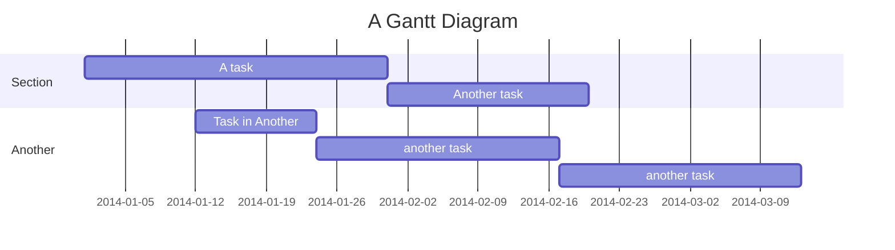
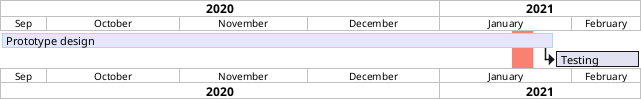

# mermaid code

```mermaid
gantt
    title A Gantt Diagram
    dateFormat YYYY-MM-DD
    section Section
        A task          :a1, 2014-01-01, 30d
        Another task    :after a1, 20d
    section Another
        Task in Another :2014-01-12, 12d
        another task    :24d
        another task    :24d
```

# plantuml

```plantuml
@startgantt

hide footbox

projectscale quarterly
Project starts the 1st of october 2020
[Prototype design] as [TASK1] requires 700 days
[TASK1] is colored in Lavender/LightBlue
[Testing] requires 200 days
[TASK1]->[Testing]

2021-01-18 to 2021-03-22 are colored in salmon 
@endgantt

```

```plantuml
@startgantt
printscale weekly zoom 4
projectscale monthly
Project starts the 20th of september 2020
[Prototype design] as [TASK1] requires 130 days
[TASK1] is colored in Lavender/LightBlue
[Testing] requires 20 days
[TASK1]->[Testing]

2021-01-18 to 2021-01-22 are named [End's committee]
2021-01-18 to 2021-01-22 are colored in salmon 
@endgantt
```