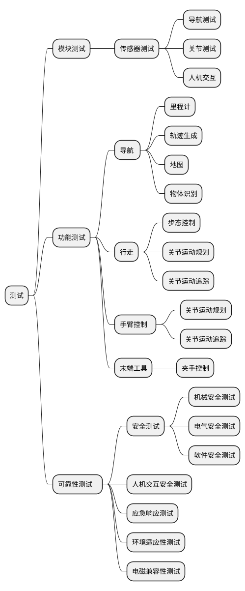
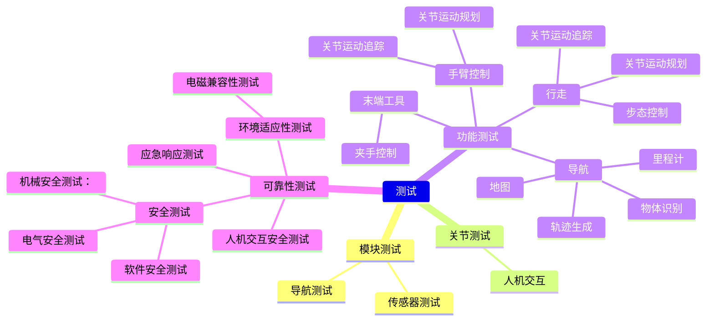

| 测试   |    |    |   |
|---|---|---|---|
| 模块测试  |   |    |   |
|   |   |    |   |

：
                       导航测试
                关节测试                       
                人机交互
功能测试：
            智能功能测试            
            导航 
                   里程计
                   轨迹生成
                   地图
                   物体识别
              行走
                    步态控制
                    关节运动规划
                    关节运动追踪
              手臂控制 
                    关节运动规划
                    关节运动追踪
              末端工具
                    夹手控制

可靠性测试：安全测试
                           机械安全测试：
                            电气安全测试
                            软件安全测试
                                       人机交互安全测试
                   应急响应测试                           
                   环境适应性测试
                           电磁兼容性测试
