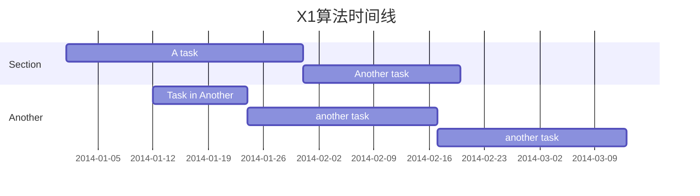
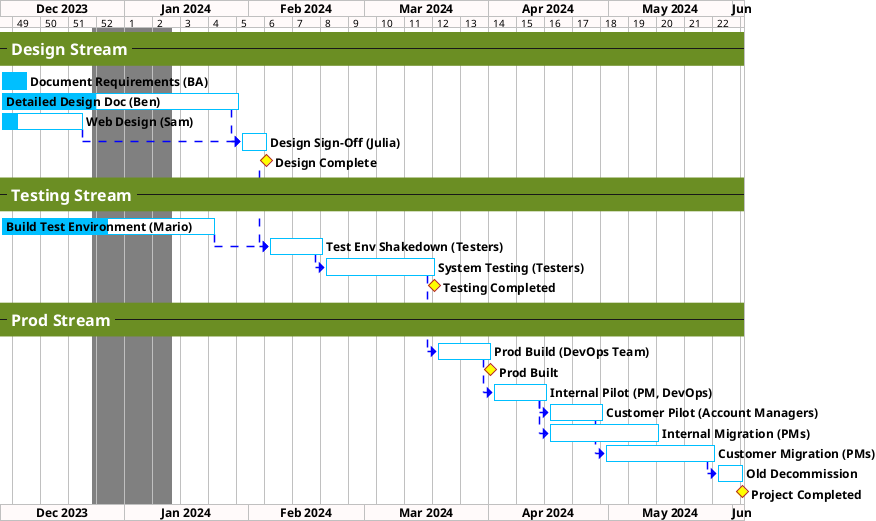

# mermaid code

```mermaid
gantt
    title X1算法时间线
    dateFormat YYYY-MM-DD
    section Section
        A task          :a1, 2014-01-01, 30d
        Another task    :after a1, 20d
    section Another
        Task in Another :2014-01-12, 12d
        another task    :24d
        another task    :24d
```

# plantuml

```plantuml
@startgantt
printscale quarterly zoom 2

Project starts the 1st of january 2025
[软件与算法 MVP1.0] as [TASK1] starts the 1st of january 2025
' [TASK1] ends the 31st of december 2025
[TASK1] requires 350 days 
[TASK1] is colored in Beige/SeaGreen
-- 仿真  --
[机械臂，传感器模型与工况仿真环境搭建] as [sim-setup] requires 60 days
[sim-setup] is colored in Beige/SeaGreen
[sim-setup] starts at [TASK1]'s start
[仿真环境测试与训练数据收集] as [sim-test] requires 30 days
[sim-test] is colored in Beige/SeaGreen
[sim-test] starts at [sim-setup]'s end
[设计冻结] as [design] happens at 2025-03-31
[design] is colored in MediumBlue
-- 机械臂运动规划与控制 --
[基于动力学模型最优控制] as [oc] requires 60 days
[oc] is colored in Beige/SeaGreen
[oc] starts at [sim-test]'s end
[基于离策略强化学习灵巧控制] as [rl] requires 60 days
[rl] is colored in Beige/SeaGreen
[rl] starts at [sim-test]'s end
-- 步态运动规划与控制 --
[基于双足行走动力学模型] as [dynamics model] requires 60 days
[dynamics model] is colored in Beige/SeaGreen
[dynamics model] starts at [sim-test]'s end
[基于生成模型的行走策略学习] as [generative policy] requires 60 days
[generative policy] is colored in Beige/SeaGreen
[generative policy] starts at [sim-test]'s end
[模型微调] as [fine-tuning] requires 30 days
[fine-tuning] is colored in Beige/SeaGreen
[fine-tuning] starts at [generative policy]'s end
[样件v1] as [samplev1] happens at 2025-06-30
[samplev1] is colored in MediumBlue
[仿真到现实] as [sim2real] requires 120 days
[sim2real] is colored in Beige/SeaGreen
[sim2real] starts at [samplev1]'s start
-- 感知 --
[激光与视觉惯导里程计] as [odometry] requires 60 days
[odometry] is colored in Beige/SeaGreen
[odometry] starts at [sim-test]'s end
[自身位姿与全局轨迹估计] as [pose] requires 60 days
[pose] is colored in Beige/SeaGreen
[pose] starts at [odometry]'s start
[局部度量重建] as [local metrics] requires 40 days
[local metrics] is colored in Beige/SeaGreen
[local metrics] starts at [pose]'s end
[局部场景理解] as [local scene] requires 30 days
[local scene] is colored in Beige/SeaGreen
[local scene] starts at [local metrics]'s end
-- 导航规划 --
[导航行为规划] as [navigation] requires 120 days
[navigation] is colored in Beige/SeaGreen
[navigation] starts at [local metrics]'s end
[路由轨迹规划] as [trajectory] requires 120 days
[trajectory] is colored in Beige/SeaGreen
[trajectory] starts at [local metrics]'s end
[移动机械臂联合控制] as [control] requires 150 days
[control] is colored in Beige/SeaGreen
[control] starts at [local metrics]'s end

[2025工博会] as [pwee] happens at 2025-09-23
[pwee] lasts 5 days
[pwee] is colored in Magenta 

' 2025-01-18 to 2025-08-22 are named [Pilot Project]
' 2025-01-18 to 2025-08-22 are colored in salmon 

[软件与算法 MVP2.0] as [TASK2] starts the 1st of january 2026
' [TASK2] ends the 31st of may 2026
[TASK2] requires 180 days
[TASK2] is colored in BurlyWood/SeaGreen
[TASK1]->[TASK2]
[TASK2] displays on same row as [TASK1]

[多工况扩展] as [sim-extension] requires 90 days
[sim-extension] is colored in BurlyWood/SeaGreen
[sim-extension] starts at [TASK2]'s start
[sim-extension] displays on same row as [sim-setup]
[扩展集成] as [sim-extension-test] requires 80 days
[sim-extension-test] is colored in BurlyWood/SeaGreen
[sim-extension-test] starts at [sim-extension]'s end
[sim-extension-test] displays on same row as [sim-test]

[感知嵌入式移植] as [embedded perception] requires 170 days
[embedded perception] is colored in BurlyWood/SeaGreen
[embedded perception] starts at [TASK2]'s start
[embedded perception] displays on same row as [odometry]
[三维语义理解] as [semantics] requires 120 days
[semantics] is colored in BurlyWood/SeaGreen
[semantics] starts at [TASK2]'s start
[semantics] displays on same row as [pose]
[全局度量重建] as [global metrics] requires 100 days
[global metrics] is colored in BurlyWood/SeaGreen
[global metrics] starts at [TASK2]'s start
[global metrics] displays on same row as [local metrics]
[全局场景图] as [global scene] requires 90 days
[global scene] is colored in BurlyWood/SeaGreen
[global scene] starts at [global metrics]'s end
[global scene] displays on same row as [local scene]

[规控嵌入式移植] as [embedded control] requires 170 days
[embedded control] is colored in BurlyWood/SeaGreen
[embedded control] starts at [TASK2]'s start
[embedded control] displays on same row as [dynamics model]
[实体步态优化] as [real-trajectory] requires 160 days
[real-trajectory] is colored in BurlyWood/SeaGreen
[real-trajectory] starts at [TASK2]'s start
[real-trajectory] displays on same row as [generative policy]
[实体机械臂控制优化] as [real-control] requires 160 days
[real-control] is colored in BurlyWood/SeaGreen
[real-control] displays on same row as [oc]
[real-control] starts at [TASK2]'s start

[多任务多形态学习] as [multi-tasking] requires 150 days
[multi-tasking] is colored in BurlyWood/SeaGreen
[multi-tasking] starts at [TASK2]'s start
[multi-tasking] displays on same row as [rl]
[场景级仿真到现实] as [sim-scene] requires 150 days
[sim-scene] is colored in BurlyWood/SeaGreen
[sim-scene] starts at [TASK2]'s start
[sim-scene] displays on same row as [sim2real]

[智能体任务规划] as [agentic planning] requires 120 days
[agentic planning] is colored in BurlyWood/SeaGreen
[agentic planning] starts at [TASK2]'s start
[agentic planning] displays on same row as [navigation]

[2026工博会] as [pwee26] happens at 2026-09-23
[pwee26] lasts 5 days
[pwee26] is colored in Magenta 
[pwee26] displays on same row as [pwee]

[软件与算法 MVP3.0] as [TASK3] starts the 20th of july 2026
[TASK3] ends the 15th of june 2027
[TASK3] is colored in RosyBrown/SeaGreen
[TASK2]->[TASK3]
[TASK3] displays on same row as [TASK2]

[大规模并行仿真] as [sim-parallel] requires 180 days
[sim-parallel] is colored in RosyBrown/SeaGreen
[sim-parallel] starts at [TASK3]'s start
[sim-parallel] displays on same row as [sim-setup]

[基于合成数据的训练] as [sim-synthesis] requires 180 days
[sim-synthesis] is colored in RosyBrown/SeaGreen
[sim-synthesis] starts at [TASK3]'s start
[sim-synthesis] displays on same row as [sim-test]

[持续学习与联邦学习] as [sim-federated] requires 180 days
[sim-federated] is colored in RosyBrown/SeaGreen
[sim-federated] starts at [TASK3]'s start
[sim-federated] displays on same row as [design]

[跨域学习] as [cross-domain] requires 120 days
[cross-domain] is colored in RosyBrown/SeaGreen
[cross-domain] starts at [TASK3]'s start
[cross-domain] displays on same row as [rl]

[样件v2] as [samplev2] happens at 2027-04-15
[samplev2] is colored in MediumBlue
[samplev2] displays on same row as [pwee26]

[高效后期训练] as [post-training] requires 180 days
[post-training] is colored in RosyBrown/SeaGreen
[post-training] starts at [TASK3]'s start 
[post-training] displays on same row as [generative policy]

[因果推理与反事实推理] as [causal] requires 200 days
[causal] is colored in RosyBrown/SeaGreen
[causal] starts at [TASK3]'s start
[causal] displays on same row as [semantics]


[安全探索策略] as [safe exploration] requires 100 days
[safe exploration] is colored in RosyBrown/SeaGreen
[safe exploration] starts at [TASK3]'s start
[safe exploration] displays on same row as [global metrics]


[常识与可操作性推理] as [common-sense] requires 180 days
[common-sense] is colored in RosyBrown/SeaGreen
[common-sense] starts at [TASK3]'s start 
[common-sense] displays on same row as [navigation]
[多层级策略模型] as [hierarchical] requires 180 days
[hierarchical] is colored in RosyBrown/SeaGreen
[hierarchical] starts at [TASK3]'s start 
[hierarchical] displays on same row as [trajectory]
@endgantt
```

# styles plantum

```plantuml
@startgantt
<style>
ganttDiagram {
    unstartedTask {
        FontName Helvetica
        FontColor Black
        FontSize 12
        FontStyle bold
        BackGroundColor DeepSkyBlue
        LineColor DeepSkyBlue
    }
    task {
        FontName Helvetica
        FontColor Black
        FontSize 12
        FontStyle bold
        BackGroundColor DeepSkyBlue
        LineColor DeepSkyBlue
    }
    milestone {
        FontColor black
        FontSize 12
        FontStyle bold
        BackGroundColor yellow
        LineColor FireBrick
    }
    note {
        FontColor DarkGreen
        FontSize 10
        LineColor OrangeRed
    }
    arrow {
        FontName Helvetica
        FontColor red
        FontSize 18
        FontStyle bold
        BackGroundColor GreenYellow
        LineColor blue
        LineStyle 8.0;13.0
        LineThickness 3.0
    }
    separator {
        BackgroundColor OliveDrab
        LineStyle 8.0;3.0
        LineColor Gray
        LineThickness 1.0
        FontSize 16
        FontStyle bold
        FontColor White
        Margin 5
        Padding 6
    }
    timeline {
        BackgroundColor Snow
    }
    closed {
        BackgroundColor pink
        FontColor red
    }
}
</style>
projectscale weekly
Project starts the 1st of December 2023
' saturday are closed
' sunday are closed
2023/12/24 to 2024/01/12 are colored in grey

-- Design Stream --

[Document Requirements (BA)] as [design-reqs] lasts 7 days and is 100% completed
[Detailed Design Doc (Ben)] as [design-doc] lasts 60 days and is 40% completed
[Web Design (Sam)] as [design-ui] lasts 21 days and is 20% completed
[Design Sign-Off (Julia)] as [design-signoff] lasts 7 days and starts after [design-ui]'s end and is 0% completed
[design-signoff] starts after [design-doc]'s end
[Design Complete] as [design-complete] happens at [design-signoff]'s end

-- Testing Stream -- 

[Build Test Environment (Mario)] as [test-build] lasts 54 days and is 50% completed
[Test Env Shakedown (Testers)] as [test-shakedown] lasts 14 days and starts at [test-build]'s end and is 0% completed
[test-shakedown] starts at [design-complete]'s end 
[System Testing (Testers)] as [testing] lasts 28 days and starts at [test-shakedown]'s end and is 0% completed
[Testing Completed] happens at [testing]'s end

-- Prod Stream --
[Prod Build (DevOps Team)] as [prod-build] lasts 14 days and starts at [testing]'s end and is 0% completed
[Prod Built] happens at [prod-build]'s end
[Internal Pilot (PM, DevOps)] as [prod-internal-pilot] lasts 14 days and starts at [prod-build]'s end and is 0% completed
[Customer Pilot (Account Managers)] as [prod-customer-pilot] lasts 14 days and starts at [prod-internal-pilot]'s end and is 0% completed
[Internal Migration (PMs)] as [prod-internal-migrate] lasts 28 days and starts at [prod-internal-pilot]'s end and is 0% completed
[Customer Migration (PMs)] as [prod-customer-migrate] lasts 28 days and starts at [prod-customer-pilot]'s end and is 0% completed
[Old Decommission] as [decom] lasts 7 days and starts at [prod-customer-migrate]'s end and is 0% completed
[Project Completed] happens at [decom]'s end
@endgantt
```